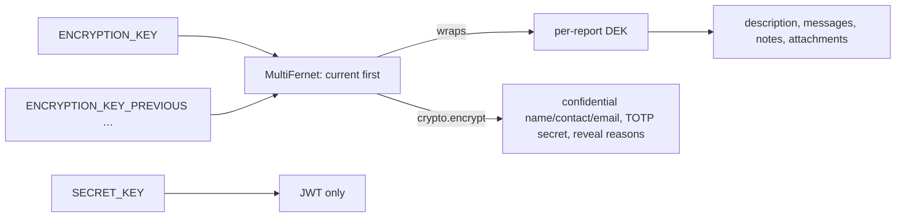
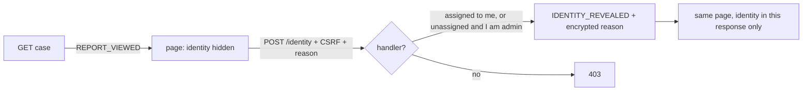
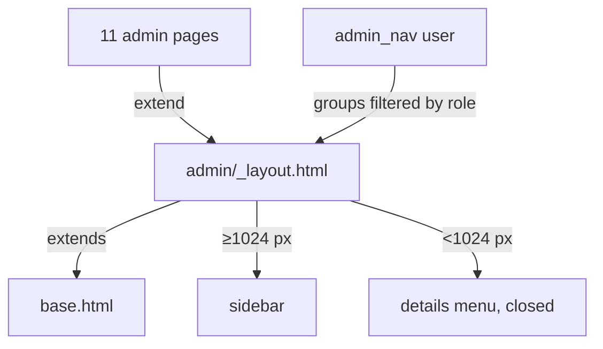

# v1.6.0 "Hardening" Implementation Plan

> **For agentic workers:** REQUIRED SUB-SKILL: Use superpowers:subagent-driven-development (recommended) or
superpowers:executing-plans to implement this plan task-by-task. Steps use checkbox (`- [ ]`) syntax for tracking.

**Goal:** Close every finding of the v1.5.0 assessment — security, privacy, design, responsiveness, process, the
former "out of scope" items and every carried-forward limit — in one release.

**Architecture:** Changes stay in the layer that owns them: encryption in `app/services/crypto.py` /
`encryption.py` (plus one SQLAlchemy type), session rules in `app/services/auth.py`, authorization in
`app/api/admin.py` helpers, whistleblower-time privacy in `app/services/report.py`, the admin shell in one
shared template. Five PR branches, then a release PR.

**Tech Stack:** FastAPI, SQLAlchemy 2 async + Alembic, PostgreSQL 18, Redis 8, Jinja2, cryptography
(Fernet/MultiFernet, x509), python-ldap, boto3, fpdf2, pypdf, pytest + httpx, Playwright + axe.

**Spec:** `docs-tech/specs/2026-09-24-v1.6-hardening-design.md` (Task 0 widens it: package C, the former
out-of-scope table and `docs-tech/carried-forward.md` all become in scope).

## Global Constraints

- English only in code, comments, locales keys' English text, docs, commit messages.
- No AI/Claude attribution in commit messages or PR bodies (project `CLAUDE.md` overrides the harness default).
- Every new env var: `app/config.py`, `docs/docs.html` env table, `README.md`, `docker-compose.prod.yml`
  (`VAR: "${VAR:-default}"`) and, where it applies, `charts/openwhistle/values.yaml` + `configmap.yaml`/`secret.yaml`
  — **same commit**.
- Every new locale key goes into `en.json`, `de.json`, `fr.json`, `pt-br.json` in the same commit
  (German/French/Portuguese text written, not English copies).
- Coverage stays ≥ 90 % (`--cov-fail-under=90`). Run the suite against real PostgreSQL + Redis:
  `podman run -d --rm -p 5432:5432 -e POSTGRES_USER=openwhistle -e POSTGRES_PASSWORD=openwhistle -e
  POSTGRES_DB=openwhistle_test postgres:18-alpine`
  and `podman run -d --rm -p 6379:6379 redis:8-alpine`, then `uv sync --extra dev --all-extras && uv run pytest`.
- After any `pyproject.toml` edit: `uv lock`, commit both files (CI runs `uv lock --check`).
- Markdown passes markdownlint (`npx markdownlint-cli2 "**/*.md"`).
- Strict CSP: no inline `on*=` handlers, every inline `<style>`/`<script>` carries `nonce="{{ request.state.csp_nonce
  }}"`.
- No external resources in pages (fonts from `/static/fonts`, no CDN).
- No IP address, whistleblower identity or report content in any log line, webhook or notification.
- Stateless app: any cross-request state lives in Redis; any job that must run once across replicas takes a Redis `SET
  NX` lock.
- Migrations are idempotent where they touch data and never fail on a single bad row (log by id, continue).
- Every new guard gets a mutation entry in `docs-tech/mutations/v1.6.0.json` (Task 36) and must go RED.

## Review Focus

1. **Redis lost the setup token before anyone opened `/setup`** (restart without persistence): `GET /setup`
   must create and log a new one — test `test_get_setup_recreates_a_lost_token` (Task 1).
2. **Upgrading an existing install**: plaintext TOTP secrets become ciphertext and those users still log in;
   an install with no `ENCRYPTION_KEY` still decrypts everything — tests
   `test_migration_004_encrypts_plaintext_secrets_once` (Task 2),
   `test_without_encryption_key_secret_key_still_decrypts` (Task 7).
3. **Admin clicks "extend session" at hour 11:59 of 12**: the new session must not outlive the absolute limit —
   `test_refresh_never_extends_past_the_absolute_limit` (Task 3).
4. **Whistleblower replies later the same day an admin answered**: day-rounded times must keep the thread in
   order — `test_same_day_whistleblower_reply_stays_after_the_admin_reply` (Task 15).
5. **ClamAV configured but down**: uploads are refused, never stored unscanned —
   `test_upload_is_refused_when_the_scanner_is_unreachable` (Task 20).

## Branches and order

| Branch | Tasks | Migrations |
|---|---|---|
| `docs/v1.6-spec` (current) | 0 | — |
| `fix/v1.6-security` | 1–10 | `004` TOTP, `005` audit org |
| `fix/v1.6-privacy` | 11–20 | `006` day-rounded times |
| `feat/v1.6-design` | 21–29 | — |
| `chore/v1.6-process` | 30–35 | — |
| `release/v1.6.0` | 36 | — |

Each branch starts from `main` after the previous one merged. PR per branch (`gh pr create`), merge when green.

---

## Package 0 — Scope

### Task 0: Widen the spec, retire "carried forward"

**Files:**

- Modify: `docs-tech/specs/2026-09-24-v1.6-hardening-design.md`
- Delete: `docs-tech/carried-forward.md`
- Modify: `CLAUDE.md` (project)
- Modify: every file that links `carried-forward.md` (`grep -rln "carried-forward" --include=*.md .`)

**Interfaces:** none (documentation).

- [ ] **Step 1: Rewrite the spec header and the two deferral sections**

Replace line 4 (`Design and responsiveness (package C) are **not** in this release…`) with:

```markdown
Every finding is fixed in this release, whatever its size: packages A–E, the items formerly listed as out of
scope, and the limits formerly kept in `docs-tech/carried-forward.md`. There is no carried-forward list.
```

Replace the whole `## Out of scope` section with:

```markdown
## Formerly out of scope, now in

| Item | Task in the plan |
|---|---|
| Separate keys for JWT and encryption, rotation | 7 |
| Whistleblower-originated timestamps rounded to the day | 15 |
| TLS on by default in the bundled nginx | 9 |
| ldap3 (unmaintained) replaced by python-ldap; ldap/s3 as extras | 10 |
| Design and responsiveness (package C) | 21–29 |
| Excel comment author inside the comment text | 16 |
| S3 objects stored before v1.5.0 under filename keys | 17 |
| Search limited to case numbers | 18 |
| Employer network sees the site was visited (Tor onion address) | 19 |
| Per-case identity access (only the handler) | 11 |
| Virus scan of uploads (ClamAV) | 20 |
| Audit rows never carried `org_id` (found while planning) | 6 |
```

Add a row to the B table:

```markdown
| B5 | Identity may be shown only to the assigned handler; an unassigned case only to admin/superadmin | admin not assigned → 403 on reveal |
```

- [ ] **Step 2: Delete `docs-tech/carried-forward.md` and fix links**

Run: `git rm docs-tech/carried-forward.md && grep -rn "carried-forward" --include=*.md . | grep -v plans/`
Expected: every hit is edited so that it no longer links the file (remove the sentence or the list item).

- [ ] **Step 3: Add the rule to project `CLAUDE.md`**

Append under the first bullet list:

```markdown
- Every finding — design, security, privacy, process, any size — is fixed in the work that found it. There is
  no "carried forward" or "out of scope" list; a finding too big for one task is split, never postponed.
```

- [ ] **Step 4: Lint and commit**

Run: `npx markdownlint-cli2 CLAUDE.md docs-tech/**/*.md && uv run pytest tests/test_docs_boundary.py -q`
Expected: no lint errors, 1 passed.

```bash
git add -A CLAUDE.md docs-tech
git commit -m "docs(tech): v1.6 fixes every finding, no carried-forward list"
```

---

## Package A — Security (`fix/v1.6-security`)

### Task 1: Setup token (A1)

**Files:**

- Create: `app/services/setup_token.py`
- Modify: `app/config.py` (add `setup_token`), `app/main.py` (lifespan), `app/api/wizard.py`,
  `app/templates/wizard/setup.html`, `app/locales/{en,de,fr,pt-br}.json`
- Modify: `tests/conftest.py` (helper), every test that POSTs `/setup`
- Modify: `docs/docs.html`, `README.md`, `docker-compose.prod.yml`, `charts/openwhistle/values.yaml`,
  `charts/openwhistle/templates/secret.yaml`
- Test: `tests/test_v160_security.py` (new, shared by Tasks 1–6)

**Interfaces:**

- Produces: `SETUP_TOKEN_KEY: str`, `async ensure_setup_token(redis: Redis) -> None`,
  `async check_setup_token(redis: Redis, supplied: str) -> bool`, `async delete_setup_token(redis: Redis) -> None`;
  test helper `async setup_token() -> str` in `tests/conftest.py`.

- [ ] **Step 1: Write the failing tests**

Create `tests/test_v160_security.py`:

```python
"""v1.6.0 security: one test per guard (setup token, TOTP at rest, sessions, roles, audit scope)."""

from __future__ import annotations

import re
import uuid

import pyotp
import pytest
from httpx import AsyncClient
from sqlalchemy import select, text
from sqlalchemy.ext.asyncio import AsyncSession

from app.config import settings
from app.models.setup import SetupStatus
from app.models.user import AdminRole, AdminUser
from app.services.auth import hash_password
from tests.conftest import setup_token

_PASSWORD = "V160-Test-Password"  # noqa: S105


async def _csrf(client: AsyncClient, path: str) -> str:
    await client.get(path)
    return client.cookies.get("ow_csrf") or ""


async def _reset_setup(db: AsyncSession) -> None:
    """Make the instance look freshly installed for one test."""
    await db.execute(text("UPDATE setup_status SET completed = false WHERE id = 1"))
    await db.commit()


async def _restore_setup(db: AsyncSession) -> None:
    await db.execute(text("UPDATE setup_status SET completed = true WHERE id = 1"))
    await db.commit()


def _setup_form(csrf: str, token: str | None) -> dict[str, str]:
    secret = pyotp.random_base32()
    form = {
        "csrf_token": csrf,
        "username": f"setup_{uuid.uuid4().hex[:8]}",
        "password": _PASSWORD,
        "password_confirm": _PASSWORD,
        "totp_secret": secret,
        "totp_code": pyotp.TOTP(secret).now(),
    }
    if token is not None:
        form["setup_token"] = token
    return form


@pytest.mark.asyncio
@pytest.mark.parametrize("token", [None, "wrong-token"])
async def test_setup_without_the_right_token_is_refused(
    client: AsyncClient, db_session: AsyncSession, token: str | None
) -> None:
    await _reset_setup(db_session)
    try:
        csrf = await _csrf(client, "/setup")
        form = _setup_form(csrf, token)
        resp = await client.post("/setup", data=form, follow_redirects=False)
        assert resp.status_code == 403
        created = await db_session.scalar(
            select(AdminUser).where(AdminUser.username == form["username"])
        )
        assert created is None
    finally:
        await _restore_setup(db_session)


@pytest.mark.asyncio
async def test_setup_with_the_token_creates_the_admin_and_deletes_the_token(
    client: AsyncClient, db_session: AsyncSession
) -> None:
    from app.redis_client import get_redis
    from app.services.setup_token import SETUP_TOKEN_KEY

    await _reset_setup(db_session)
    try:
        csrf = await _csrf(client, "/setup")
        form = _setup_form(csrf, await setup_token())
        resp = await client.post("/setup", data=form, follow_redirects=False)
        assert resp.status_code == 302
        assert await db_session.scalar(
            select(AdminUser).where(AdminUser.username == form["username"])
        ) is not None
        assert await (await get_redis()).get(SETUP_TOKEN_KEY) is None
    finally:
        await _restore_setup(db_session)


@pytest.mark.asyncio
async def test_get_setup_recreates_a_lost_token(
    client: AsyncClient, db_session: AsyncSession
) -> None:
    from app.redis_client import get_redis
    from app.services.setup_token import SETUP_TOKEN_KEY

    await _reset_setup(db_session)
    try:
        redis = await get_redis()
        await redis.delete(SETUP_TOKEN_KEY)
        await client.get("/setup")
        assert await redis.get(SETUP_TOKEN_KEY) is not None
    finally:
        await _restore_setup(db_session)


@pytest.mark.asyncio
async def test_configured_setup_token_is_used(
    monkeypatch: pytest.MonkeyPatch,
) -> None:
    from app.redis_client import get_redis
    from app.services.setup_token import SETUP_TOKEN_KEY, check_setup_token, ensure_setup_token

    monkeypatch.setattr(settings, "setup_token", "operator-chosen-token-123456")
    redis = await get_redis()
    await redis.delete(SETUP_TOKEN_KEY)
    await ensure_setup_token(redis)
    assert await check_setup_token(redis, "operator-chosen-token-123456")
    await redis.delete(SETUP_TOKEN_KEY)
```

`_reset_setup` requires a `setup_status` row with `id = 1`; tests in `tests/test_v150_auth.py` already
create it. If `UPDATE` hits no row on a fresh test DB, insert it first:
`INSERT INTO setup_status (id, completed) VALUES (1, true) ON CONFLICT (id) DO NOTHING` at the top of
`_reset_setup`.

Add to `tests/conftest.py` (after `wizard_submit`):

```python
async def setup_token() -> str:
    """The current one-time setup token, created if missing (as GET /setup does)."""
    from app.redis_client import get_redis
    from app.services.setup_token import SETUP_TOKEN_KEY, ensure_setup_token

    redis = await get_redis()
    await ensure_setup_token(redis)
    raw = await redis.get(SETUP_TOKEN_KEY)
    return raw.decode() if isinstance(raw, bytes) else str(raw)
```

- [ ] **Step 2: Run the tests to verify they fail**

Run: `uv run pytest tests/test_v160_security.py -q`
Expected: FAIL / ERROR with `ModuleNotFoundError: No module named 'app.services.setup_token'`.

- [ ] **Step 3: Implement**

`app/config.py`, after `secure_cookies`:

```python
    # First-run setup: whoever opens /setup must also know this token. Empty =
    # a random one is created at startup and logged once at WARNING.
    setup_token: str = ""
```

Create `app/services/setup_token.py`:

```python
"""One-time setup token: reaching /setup first is not enough to become admin."""

from __future__ import annotations

import logging
import secrets

from redis.asyncio import Redis

from app.config import settings

log = logging.getLogger(__name__)

SETUP_TOKEN_KEY = "openwhistle:setup-token"


def _text(raw: bytes | str | None) -> str | None:
    return raw.decode() if isinstance(raw, bytes) else raw


async def ensure_setup_token(redis: Redis) -> None:
    """Create the token unless one exists. Only the caller whose SET won logs it,
    so a scaled deployment prints it once."""
    token = settings.setup_token or secrets.token_urlsafe(32)
    if not await redis.set(SETUP_TOKEN_KEY, token, nx=True):
        return
    if settings.setup_token:
        log.warning("Setup is open: enter the SETUP_TOKEN from the environment on /setup.")
    else:
        log.warning("Setup is open. Setup token for /setup: %s", token)


async def check_setup_token(redis: Redis, supplied: str) -> bool:
    stored = _text(await redis.get(SETUP_TOKEN_KEY))
    if not stored or not supplied:
        return False
    return secrets.compare_digest(stored.encode(), supplied.encode())


async def delete_setup_token(redis: Redis) -> None:
    await redis.delete(SETUP_TOKEN_KEY)
```

`app/main.py`, in `lifespan` right after `_run_alembic_upgrade()`:

```python
    if not settings.demo_mode:
        from app.api.wizard import _is_setup_complete  # noqa: PLC0415
        from app.database import AsyncSessionLocal  # noqa: PLC0415
        from app.redis_client import get_redis  # noqa: PLC0415
        from app.services.setup_token import ensure_setup_token  # noqa: PLC0415

        async with AsyncSessionLocal() as db:
            if not await _is_setup_complete(db):
                await ensure_setup_token(await get_redis())
```

`app/api/wizard.py`:

```python
from redis.asyncio import Redis

from app.redis_client import get_redis
from app.services.setup_token import check_setup_token, delete_setup_token, ensure_setup_token
```

`setup_get` gains `redis: Redis = Depends(get_redis)` and, after the "complete" redirect,
`await ensure_setup_token(redis)`.

`setup_post` gains `setup_token: str = Form("")` and `redis: Redis = Depends(get_redis)`. Directly after the
"complete" redirect:

```python
    if not await check_setup_token(redis, setup_token.strip()):
        return render(
            request,
            "wizard/setup.html",
            {
                "totp_secret": totp_secret,
                "qr_code": generate_qr_code_base64(totp_secret, username or "admin"),
                "field_errors": {"setup_token": "wizard.error.setup_token"},
                "username": username,
            },
            status_code=403,
        )
```

and replace the last two lines with:

```python
    if await create_initial_admin(db, username, password, totp_secret):
        await delete_setup_token(redis)
    return RedirectResponse("/admin/login", status_code=302)
```

`app/templates/wizard/setup.html`, first field inside the form (after the hidden inputs):

```html
            <div class="form-group">
                <label class="form-label" for="setup_token">{{ t('wizard.setup_token') }}</label>
                <input type="text" class="form-control mono" id="setup_token" name="setup_token"
                       required autocomplete="off" spellcheck="false"{{ field.attrs('setup_token', 'setup-token-hint') }}>
                {{ field.error('setup_token') }}
                <div class="form-hint" id="setup-token-hint">{{ t('wizard.setup_token.hint') }}</div>
            </div>
```

Locale keys (all four files):

| Key | en | de | fr | pt-br |
|---|---|---|---|---|
| `wizard.setup_token` | Setup token | Einrichtungs-Token | Jeton d'installation | Token de configuração |
| `wizard.setup_token.hint` | Printed once in the application log at startup, or the SETUP_TOKEN you configured. | Wird beim Start einmal ins Anwendungslog geschrieben, oder das konfigurierte SETUP_TOKEN. | Écrit une fois dans le journal de l'application au démarrage, ou le SETUP_TOKEN configuré. | Escrito uma vez no log da aplicação ao iniciar, ou o SETUP_TOKEN configurado. |
| `wizard.error.setup_token` | The setup token is missing or wrong. | Das Einrichtungs-Token fehlt oder ist falsch. | Le jeton d'installation est absent ou incorrect. | O token de configuração está ausente ou incorreto. |

- [ ] **Step 4: Give every existing `/setup` POST a token**

Run: `grep -rn 'post(\s*"/setup"' tests | cut -d: -f1 | sort -u`
In each listed file add `from tests.conftest import setup_token` and, in every `data={...}` sent to
`"/setup"`, the entry `"setup_token": await setup_token(),`. Tests that assert a refusal for another reason
(short password, bad TOTP, CSRF) keep asserting that reason — the token must not be the thing that fails them.

- [ ] **Step 5: Run the suite**

Run: `uv run pytest tests/test_v160_security.py tests/test_wizard.py tests/test_v150_auth.py tests/test_csrf.py
tests/test_coverage_gaps.py -q`
Expected: all pass.

- [ ] **Step 6: Docs in the same commit**

- `docs/docs.html` env table, after `SECRET_KEY`:

```html
            <tr>
              <td><code class="env-key">SETUP_TOKEN</code></td>
              <td><span class="env-required env-req-no">Optional</span></td>
              <td>Token the first-run wizard at <code>/setup</code> asks for. Unset: a random token is created at startup and written once to the log (<code>docker compose logs app | grep "Setup token"</code>).</td>
              <td>random</td>
            </tr>
```

  Check the class name used for optional rows (`grep -n "env-req-" docs/docs.html | head`) and use it.
  In the installation how-to, add a step before "open /setup": read the token from the log.

- `README.md` quick start: same step, one line.
- `docker-compose.prod.yml` app env: `SETUP_TOKEN: "${SETUP_TOKEN:-}"`.
- Helm: `secrets.setupToken: ""` in `values.yaml`; in `secret.yaml`:

```yaml
  {{- if .Values.secrets.setupToken }}
  SETUP_TOKEN: {{ .Values.secrets.setupToken | quote }}
  {{- end }}
```

- [ ] **Step 7: Commit**

```bash
git add -A app tests docs README.md docker-compose.prod.yml charts
git commit -m "fix(setup): first-run wizard requires a one-time setup token"
```

### Task 2: TOTP secret encrypted at rest (A2)

**Files:**

- Create: `app/models/types.py`, `migrations/versions/004_encrypt_totp_secrets.py`
- Modify: `app/models/user.py:37`
- Test: `tests/test_v160_security.py`

**Interfaces:**

- Produces: `EncryptedText` (SQLAlchemy `TypeDecorator[str]`): Python side plaintext, DB side
  `app.services.crypto.encrypt` token. Migration revision `a1c6e0f4b201`, down `7d4e2b9c1a05`, with pure helper
  `_is_token(value: str) -> bool`.

- [ ] **Step 1: Write the failing tests**

Append to `tests/test_v160_security.py`:

```python
@pytest.mark.asyncio
async def test_totp_secret_is_stored_encrypted(db_session: AsyncSession) -> None:
    from app.services.crypto import decrypt

    secret = pyotp.random_base32()
    user = AdminUser(
        id=uuid.uuid4(), username=f"totp_{uuid.uuid4().hex[:8]}",
        password_hash=hash_password(_PASSWORD), totp_secret=secret, totp_enabled=True,
    )
    db_session.add(user)
    await db_session.commit()

    raw = await db_session.scalar(
        text("SELECT totp_secret FROM admin_users WHERE id = :id"), {"id": user.id}
    )
    assert raw != secret
    assert decrypt(raw) == secret
    db_session.expire_all()
    loaded = await db_session.get(AdminUser, user.id)
    assert loaded is not None and loaded.totp_secret == secret


def test_migration_004_encrypts_plaintext_secrets_once() -> None:
    import importlib

    from app.services.crypto import encrypt

    mig = importlib.import_module("migrations.versions.004_encrypt_totp_secrets")
    assert not mig._is_token("JBSWY3DPEHPK3PXPJBSWY3DPEHPK3PXP")
    assert mig._is_token(encrypt("JBSWY3DPEHPK3PXP"))
```

`migrations/versions` must be importable for the second test: if `migrations/__init__.py` or
`migrations/versions/__init__.py` is missing, load the file instead with
`importlib.util.spec_from_file_location("m004", "migrations/versions/004_encrypt_totp_secrets.py")`.
Check how `tests/test_privacy_v150.py::test_migration_encrypts_existing_filenames_idempotently` loads 003 and do the
same.

- [ ] **Step 2: Run to verify failure**

Run: `uv run pytest tests/test_v160_security.py -k "totp or migration_004" -q`
Expected: FAIL (`raw == secret`) and ERROR (migration module missing).

- [ ] **Step 3: Implement**

Create `app/models/types.py`:

```python
"""Column types shared by the models."""

from __future__ import annotations

from typing import Any

from sqlalchemy.types import Text, TypeDecorator


class EncryptedText(TypeDecorator[str]):
    """Plaintext in Python, a Fernet token (app.services.crypto) in the database."""

    impl = Text
    cache_ok = True

    def process_bind_param(self, value: str | None, dialect: Any) -> str | None:
        from app.services.crypto import encrypt  # noqa: PLC0415

        return None if value is None else encrypt(value)

    def process_result_value(self, value: str | None, dialect: Any) -> str | None:
        from app.services.crypto import decrypt  # noqa: PLC0415

        return None if value is None else decrypt(value)
```

`app/models/user.py`: `from app.models.types import EncryptedText` and

```python
    # TOTP (mandatory). Encrypted at rest: a database dump alone must not yield
    # the second factor of every account.
    totp_secret: Mapped[str] = mapped_column(EncryptedText, nullable=False)
```

Create `migrations/versions/004_encrypt_totp_secrets.py`:

```python
"""TOTP secrets are stored encrypted.

Revision ID: a1c6e0f4b201
Revises: 7d4e2b9c1a05
Create Date: 2026-09-24

The column becomes Text (a Fernet token is longer than 32 characters) and every
plaintext secret is encrypted in place. Idempotent: a value that already
decrypts is left alone. Downgrade decrypts and narrows the column again.
"""

from collections.abc import Sequence

import sqlalchemy as sa
from alembic import context, op

revision: str = "a1c6e0f4b201"
down_revision: str | None = "7d4e2b9c1a05"
branch_labels: str | Sequence[str] | None = None
depends_on: str | Sequence[str] | None = None


def _is_token(value: str) -> bool:
    from app.services.crypto import decrypt

    try:
        decrypt(value)
    except Exception:  # noqa: BLE001 — anything that does not decrypt is plaintext
        return False
    return True


def _rows() -> list[tuple[object, str]]:
    return list(op.get_bind().execute(sa.text("SELECT id, totp_secret FROM admin_users")).tuples())


def _set(user_id: object, value: str) -> None:
    op.get_bind().execute(
        sa.text("UPDATE admin_users SET totp_secret = :v WHERE id = :i"), {"v": value, "i": user_id}
    )


def upgrade() -> None:
    op.alter_column("admin_users", "totp_secret", type_=sa.Text(), existing_nullable=False)
    if context.is_offline_mode():
        return
    from app.services.crypto import encrypt

    for user_id, secret in _rows():
        if not _is_token(secret):
            _set(user_id, encrypt(secret))


def downgrade() -> None:
    if not context.is_offline_mode():
        from app.services.crypto import decrypt

        for user_id, secret in _rows():
            if _is_token(secret):
                _set(user_id, decrypt(secret))
    op.alter_column(
        "admin_users", "totp_secret", type_=sa.String(32), existing_nullable=False
    )
```

- [ ] **Step 4: Run tests**

Run: `uv run pytest tests/test_v160_security.py tests/test_mfa_setup.py tests/test_v150_auth.py -q`
Expected: all pass (existing tests insert plaintext through the ORM, which now encrypts).

- [ ] **Step 5: Verify upgrade/downgrade on a real DB**

Run: `uv run alembic downgrade 7d4e2b9c1a05 && uv run alembic upgrade head`
Expected: both succeed; `psql … -c "select length(totp_secret) from admin_users"` shows lengths > 32 after upgrade.

- [ ] **Step 6: Commit**

```bash
git add app/models migrations tests/test_v160_security.py
git commit -m "fix(auth): store TOTP secrets encrypted (migration 004)"
```

### Task 3: Session refresh needs CSRF; absolute session lifetime (A3)

**Files:**

- Modify: `app/config.py`, `app/services/auth.py`, `app/api/deps.py`, `app/api/auth.py:272-436`,
  `app/static/js/site.js` (`sessionExtend`), docs set (`docs/docs.html`, `README.md`, `docker-compose.prod.yml`, Helm)
- Test: `tests/test_v160_security.py`

**Interfaces:**

- Produces (services/auth): `create_access_token(user_id: str, role: str = "admin", auth_time: int | None = None) ->
  str`;
  `decode_access_token_claims(token: str) -> dict[str, Any] | None`; `session_started_at(claims) -> int`;
  `session_too_old(claims) -> bool`; `store_session` TTL now follows the token's `exp`.
- Produces (api/auth): `async _start_session(redis, db, user) -> RedirectResponse`,
  `_set_session_cookie(response, token) -> None`. Task 4 adds a guard inside `_start_session`.

- [ ] **Step 1: Write the failing tests**

```python
def _use_session(client: AsyncClient, token: str) -> None:
    """Replace the session cookie; keep the CSRF cookie the header is checked against."""
    csrf = client.cookies.get("ow_csrf") or ""
    client.cookies.clear()
    client.cookies.set("ow_csrf", csrf)
    client.cookies.set("ow_session", token)


async def _logged_in_admin(client: AsyncClient, db: AsyncSession) -> AdminUser:
    secret = pyotp.random_base32()
    user = AdminUser(
        id=uuid.uuid4(), username=f"sess_{uuid.uuid4().hex[:8]}",
        password_hash=hash_password(_PASSWORD), totp_secret=secret, totp_enabled=True,
        role=AdminRole.admin,
    )
    db.add(user)
    await db.commit()
    csrf = await _csrf(client, "/admin/login")
    r = await client.post("/admin/login", data={
        "username": user.username, "password": _PASSWORD, "csrf_token": csrf})
    temp = re.search(r'name="temp_token" value="([^"]+)"', r.text)
    assert temp
    await client.post("/admin/login/mfa", data={
        "csrf_token": client.cookies.get("ow_csrf"), "temp_token": temp.group(1),
        "totp_code": pyotp.TOTP(secret).now()})
    assert client.cookies.get("ow_session")
    return user


@pytest.mark.asyncio
async def test_session_refresh_without_csrf_header_is_refused(
    client: AsyncClient, db_session: AsyncSession
) -> None:
    await _logged_in_admin(client, db_session)
    resp = await client.post("/admin/session/refresh")
    assert resp.status_code == 403
    ok = await client.post(
        "/admin/session/refresh", headers={"X-CSRF-Token": client.cookies.get("ow_csrf") or ""}
    )
    assert ok.status_code == 200


@pytest.mark.asyncio
async def test_session_older_than_the_absolute_limit_is_rejected(
    client: AsyncClient, db_session: AsyncSession
) -> None:
    import time

    import jwt

    from app.redis_client import get_redis

    user = await _logged_in_admin(client, db_session)
    now = int(time.time())
    stale = jwt.encode(
        {"sub": str(user.id), "role": "admin", "iat": now, "exp": now + 3600,
         "auth_time": now - (settings.session_max_hours * 3600 + 60), "jti": "x"},
        settings.secret_key, algorithm=settings.algorithm,
    )
    await (await get_redis()).setex(f"openwhistle:session:{stale}", 3600, str(user.id))
    _use_session(client, stale)
    resp = await client.post(
        "/admin/session/refresh", headers={"X-CSRF-Token": client.cookies.get("ow_csrf") or ""},
        follow_redirects=False,
    )
    assert resp.status_code == 401


@pytest.mark.asyncio
async def test_refresh_never_extends_past_the_absolute_limit(
    client: AsyncClient, db_session: AsyncSession
) -> None:
    import time

    from app.redis_client import get_redis
    from app.services.auth import create_access_token, decode_access_token_exp

    user = await _logged_in_admin(client, db_session)
    started = int(time.time()) - settings.session_max_hours * 3600 + 120  # 2 min left
    token = create_access_token(str(user.id), "admin", auth_time=started)
    await (await get_redis()).setex(f"openwhistle:session:{token}", 120, str(user.id))
    _use_session(client, token)
    resp = await client.post(
        "/admin/session/refresh", headers={"X-CSRF-Token": client.cookies.get("ow_csrf") or ""}
    )
    assert resp.status_code == 200
    new_exp = decode_access_token_exp(client.cookies.get("ow_session") or "")
    assert new_exp is not None
    assert int(new_exp.timestamp()) <= started + settings.session_max_hours * 3600
```

- [ ] **Step 2: Run to verify failure**

Run: `uv run pytest tests/test_v160_security.py -k session -q`
Expected: 3 FAIL (refresh without header returns 200; stale token accepted; `auth_time` unknown kwarg).

- [ ] **Step 3: Implement**

`app/config.py` after `access_token_expire_minutes`:

```python
    # Absolute admin session lifetime, counted from login and never extended by
    # "stay signed in": after this a fresh password + TOTP login is required.
    session_max_hours: int = Field(default=12, ge=1)
```

`app/services/auth.py` (add `import time`, `from typing import Any`) — replace `create_access_token` and
`store_session`, add the three helpers:

```python
def create_access_token(user_id: str, role: str = "admin", auth_time: int | None = None) -> str:
    """A session JWT. ``auth_time`` (login time, epoch seconds) survives refreshes,
    so ``exp`` never passes auth_time + SESSION_MAX_HOURS."""
    now = datetime.now(UTC)
    started = auth_time if auth_time is not None else int(now.timestamp())
    expire = min(
        now + timedelta(minutes=settings.access_token_expire_minutes),
        datetime.fromtimestamp(started, tz=UTC) + timedelta(hours=settings.session_max_hours),
    )
    payload = {
        "sub": user_id,
        "role": role,
        "exp": expire,
        "iat": now,
        "auth_time": started,
        "jti": str(uuid.uuid4()),
    }
    return str(jwt.encode(payload, settings.secret_key, algorithm=settings.algorithm))


def decode_access_token_claims(token: str) -> dict[str, Any] | None:
    try:
        claims: dict[str, Any] = jwt.decode(
            token, settings.secret_key, algorithms=[settings.algorithm]
        )
    except jwt.PyJWTError:
        return None
    return claims


def session_started_at(claims: dict[str, Any]) -> int:
    """Login time; tokens issued before v1.6.0 carry only ``iat``."""
    return int(claims.get("auth_time", claims.get("iat", 0)))


def session_too_old(claims: dict[str, Any]) -> bool:
    return time.time() - session_started_at(claims) > settings.session_max_hours * 3600


async def store_session(redis: Redis, user_id: str, token: str) -> None:
    """Store session token in Redis; it lives exactly as long as the JWT."""
    exp = decode_access_token_exp(token)
    ttl = int((exp - datetime.now(UTC)).total_seconds()) if exp else 0
    await redis.setex(f"{_SESSION_PREFIX}{token}", max(1, ttl), user_id)
```

`app/api/deps.py`, in `get_current_admin` replace the `decode_access_token` block:

```python
    claims = auth_service.decode_access_token_claims(session_token)
    if not claims or auth_service.session_too_old(claims):
        raise HTTPException(status_code=status.HTTP_401_UNAUTHORIZED)
    user_id = claims.get("sub")
    if not user_id:
        raise HTTPException(status_code=status.HTTP_401_UNAUTHORIZED)
```

and set `request.state.session_expires_at = int(claims["exp"])` (drop the second decode).

`app/api/auth.py`: import `validate_csrf_header`; add helpers above `login_get`:

```python
def _set_session_cookie(response: Response, token: str) -> None:
    exp = auth_service.decode_access_token_exp(token)
    max_age = max(1, int((exp - datetime.now(UTC)).total_seconds())) if exp else 1
    response.set_cookie(
        key="ow_session", value=token, httponly=True, samesite="lax",
        secure=settings.secure_cookies, max_age=max_age,
    )


async def _start_session(redis: Redis, db: AsyncSession, user: AdminUser) -> RedirectResponse:
    """The only place a login becomes a session (TOTP verify and TOTP setup)."""
    token = auth_service.create_access_token(str(user.id), role=user.role.value)
    await auth_service.store_session(redis, str(user.id), token)
    user.last_login_at = datetime.now(UTC)
    await db.commit()
    response = RedirectResponse("/admin/dashboard", status_code=302)
    _set_session_cookie(response, token)
    return response
```

(`from fastapi.responses import Response` joins the existing import.) In `login_mfa_post` replace everything
from `token = auth_service.create_access_token(…)` to the end with
`return await _start_session(redis, db, user)` (the re-`select` of the user goes). In `mfa_setup_post`, after
`await db.commit()` of the audit entry, `return await _start_session(redis, db, user)`.

`session_refresh`:

```python
@router.post("/session/refresh")
async def session_refresh(
    request: Request,
    redis: Redis = Depends(get_redis),
    current_user: AdminUser = Depends(get_current_admin),
    session_token: str | None = Cookie(default=None, alias="ow_session"),
    _csrf: None = Depends(validate_csrf_header),
) -> JSONResponse:
    """New JWT + Redis session up to the full TTL, never past the absolute limit."""
    claims = auth_service.decode_access_token_claims(session_token or "") or {}
    if session_token:
        await auth_service.revoke_session(redis, session_token)
    new_token = auth_service.create_access_token(
        str(current_user.id), role=current_user.role.value,
        auth_time=auth_service.session_started_at(claims) or None,
    )
    await auth_service.store_session(redis, str(current_user.id), new_token)
    new_exp = auth_service.decode_access_token_exp(new_token)
    expires_at = int(new_exp.timestamp()) if new_exp else 0
    ttl = max(0, expires_at - int(datetime.now(UTC).timestamp()))
    response = JSONResponse({"ttl_seconds": ttl, "expires_at": expires_at})
    _set_session_cookie(response, new_token)
    return response
```

Dependency order matters: `get_current_admin` runs before `validate_csrf_header`, so a stale session answers
401 and a fresh one without header answers 403 — both tests hold.

`app/static/js/site.js`, in `window.sessionExtend`:

```js
            const res = await fetch('/admin/session/refresh', {
                method: 'POST',
                headers: { 'X-CSRF-Token': csrfToken() },
            });
```

- [ ] **Step 4: Run tests**

Run: `uv run pytest tests/test_v160_security.py tests/test_session_expiry.py tests/test_mfa_setup.py
tests/test_v150_auth.py tests/test_coverage_auth.py tests/test_coverage_auth_extended.py -q`
Expected: all pass. A pre-existing test that POSTs `/admin/session/refresh` without the header now gets 403:
add `headers={"X-CSRF-Token": client.cookies.get("ow_csrf") or ""}` there.

- [ ] **Step 5: Docs (same commit)** — `SESSION_MAX_HOURS` row in `docs/docs.html` ("Absolute admin session
lifetime in hours, counted from login; extending a session never passes it", default `12`), README config
list, compose `SESSION_MAX_HOURS: "${SESSION_MAX_HOURS:-12}"`, Helm `config.sessionMaxHours: "12"` +
`SESSION_MAX_HOURS: {{ .Values.config.sessionMaxHours | quote }}` in `configmap.yaml`.

- [ ] **Step 6: Commit**

```bash
git add -A app tests docs README.md docker-compose.prod.yml charts
git commit -m "fix(auth): CSRF on session refresh, absolute 12 h session lifetime"
```

### Task 4: Deactivated accounts never reach the second factor (A5)

**Files:** Modify `app/api/auth.py` (`_second_factor`, `_start_session`, `mfa_setup_get`). Test:
`tests/test_v160_security.py`.

**Interfaces:** Consumes `_start_session` from Task 3.

- [ ] **Step 1: Failing test**

```python
@pytest.mark.asyncio
async def test_deactivated_user_never_reaches_the_totp_step(
    client: AsyncClient, db_session: AsyncSession
) -> None:
    user = AdminUser(
        id=uuid.uuid4(), username=f"inactive_{uuid.uuid4().hex[:8]}",
        password_hash=hash_password(_PASSWORD), totp_secret=pyotp.random_base32(),
        totp_enabled=True, is_active=False,
    )
    db_session.add(user)
    await db_session.commit()
    csrf = await _csrf(client, "/admin/login")
    resp = await client.post("/admin/login", data={
        "username": user.username, "password": _PASSWORD, "csrf_token": csrf})
    assert resp.status_code == 401
    assert 'name="temp_token"' not in resp.text


@pytest.mark.asyncio
async def test_user_deactivated_between_password_and_totp_gets_no_session(
    client: AsyncClient, db_session: AsyncSession
) -> None:
    secret = pyotp.random_base32()
    user = AdminUser(
        id=uuid.uuid4(), username=f"late_{uuid.uuid4().hex[:8]}",
        password_hash=hash_password(_PASSWORD), totp_secret=secret, totp_enabled=True,
    )
    db_session.add(user)
    await db_session.commit()
    csrf = await _csrf(client, "/admin/login")
    r = await client.post("/admin/login", data={
        "username": user.username, "password": _PASSWORD, "csrf_token": csrf})
    temp = re.search(r'name="temp_token" value="([^"]+)"', r.text)
    assert temp
    user.is_active = False
    await db_session.commit()
    await client.post("/admin/login/mfa", data={
        "csrf_token": client.cookies.get("ow_csrf"), "temp_token": temp.group(1),
        "totp_code": pyotp.TOTP(secret).now()})
    assert not client.cookies.get("ow_session")
```

- [ ] **Step 2: Run** `uv run pytest tests/test_v160_security.py -k deactivated -q` → both FAIL.

- [ ] **Step 3: Implement**

At the top of `_second_factor`:

```python
    if not user.is_active:
        return render(request, "login.html", _login_ctx({
            "error": "login.error.deactivated",
        }), status_code=401)
```

Delete the now-duplicate `is_active` checks in the LDAP and OIDC branches (they end in `_second_factor`).
At the top of `_start_session`:

```python
    if not user.is_active:
        return RedirectResponse("/admin/login", status_code=302)
```

In `mfa_setup_get` after loading the user: `if not user or not user.is_active: return RedirectResponse("/admin/login",
status_code=302)`.

- [ ] **Step 4: Run** the same command plus `tests/test_oidc.py tests/test_auth_hardening.py` → pass.

- [ ] **Step 5: Commit** `git commit -am "fix(auth): check is_active before TOTP and before any session"`

### Task 5: Unknown role refused; IP-warning dismissal admin-only (A4, A6)

**Files:** Modify `app/api/admin.py:752-774` and `:1121-1127`. Test: `tests/test_v160_security.py`.

- [ ] **Step 1: Failing tests**

```python
@pytest.mark.asyncio
async def test_unknown_role_creates_no_user(
    client: AsyncClient, db_session: AsyncSession
) -> None:
    await _logged_in_admin(client, db_session)
    name = f"role_{uuid.uuid4().hex[:8]}"
    resp = await client.post("/admin/users", data={
        "username": name, "password": _PASSWORD, "role": "root",
        "csrf_token": client.cookies.get("ow_csrf")}, follow_redirects=False)
    assert resp.status_code == 422
    assert await db_session.scalar(select(AdminUser).where(AdminUser.username == name)) is None


@pytest.mark.asyncio
async def test_case_manager_cannot_dismiss_the_ip_warning(
    client: AsyncClient, db_session: AsyncSession
) -> None:
    user = await _logged_in_admin(client, db_session)
    user.role = AdminRole.case_manager
    await db_session.commit()
    resp = await client.post(
        "/admin/ip-warning/dismiss", headers={"X-CSRF-Token": client.cookies.get("ow_csrf") or ""}
    )
    assert resp.status_code == 403
```

- [ ] **Step 2: Run** `-k "unknown_role or ip_warning"` → FAIL (302 / 200).

- [ ] **Step 3: Implement** — in `create_user`: `role: str = Form(default=AdminRole.case_manager.value)` and

```python
    try:
        role_enum = AdminRole(role)
    except ValueError as exc:
        raise HTTPException(status_code=422, detail="Unknown role.") from exc
```

In `dismiss_ip_warning`: `current_user: AdminUser = Depends(require_admin),`. In the dashboard template the
dismiss button renders only ``.

- [ ] **Step 4: Run** `uv run pytest tests/test_v160_security.py tests/test_coverage_admin.py
      tests/test_coverage_admin_extended.py -q` → pass.

- [ ] **Step 5: Commit** `git commit -am "fix(admin): refuse unknown roles, IP-warning dismissal admin-only"`

### Task 6: Audit rows carry their organisation

Found while planning: `audit_service.log()` never sets `org_id`, so with `MULTI_TENANCY_ENABLED` an
organisation's admin sees none of their own audit rows, and an org-less admin sees every organisation's.

**Files:**

- Modify: `app/services/audit.py` (`log`)
- Create: `migrations/versions/005_audit_org_backfill.py` (revision `b2d7f1a5c302`, down `a1c6e0f4b201`)
- Test: `tests/test_multitenancy_scoping.py`

**Interfaces:** `log()` signature unchanged; it now fills `AuditLog.org_id`.

- [ ] **Step 1: Failing test** — append to `tests/test_multitenancy_scoping.py` (reuse its org/user helpers; read the
      file first and use its fixture names):

```python
@pytest.mark.asyncio
async def test_audit_rows_carry_the_report_org_and_else_the_actor_org(
    db_session: AsyncSession,
) -> None:
    from app.models.organisation import Organisation
    from app.services import audit as audit_service
    from app.services.report import create_report

    org = Organisation(id=uuid.uuid4(), name="Org A", slug=f"a-{uuid.uuid4().hex[:6]}")
    db_session.add(org)
    await db_session.flush()
    actor = AdminUser(
        id=uuid.uuid4(), username=f"aud_{uuid.uuid4().hex[:8]}", password_hash=None,
        totp_secret="JBSWY3DPEHPK3PXP", totp_enabled=True, org_id=org.id,
    )
    db_session.add(actor)
    report, _ = await create_report(db_session, "corruption", "Audit org test report text.")
    report.org_id = org.id
    await db_session.commit()

    with_report = await audit_service.log(db_session, actor, "report.viewed", report_id=report.id)
    without = await audit_service.log(db_session, actor, "admin.created")
    await db_session.commit()
    assert with_report.org_id == org.id
    assert without.org_id == org.id
```

- [ ] **Step 2: Run** → FAIL (`None != org.id`).

- [ ] **Step 3: Implement** in `log()` before building the entry:

```python
    org_id = actor.org_id
    if report_id is not None:
        from app.models.report import Report  # noqa: PLC0415

        org_id = await db.scalar(select(Report.org_id).where(Report.id == report_id))
```

and pass `org_id=org_id` to `AuditLog(...)`.

Migration `005_audit_org_backfill.py`:

```python
"""Audit rows get the organisation they belong to.

Revision ID: b2d7f1a5c302
Revises: a1c6e0f4b201
Create Date: 2026-09-24

Before v1.6.0 only retention rows carried org_id, so organisation-scoped audit
pages showed nothing. Rows about a report take the report's organisation, other
rows the acting admin's. Downgrade keeps the values (they are correct).
"""

from collections.abc import Sequence

import sqlalchemy as sa
from alembic import op

revision: str = "b2d7f1a5c302"
down_revision: str | None = "a1c6e0f4b201"
branch_labels: str | Sequence[str] | None = None
depends_on: str | Sequence[str] | None = None


def upgrade() -> None:
    op.execute(sa.text(
        "UPDATE audit_log a SET org_id = r.org_id FROM reports r "
        "WHERE a.report_id = r.id AND a.org_id IS NULL"
    ))
    op.execute(sa.text(
        "UPDATE audit_log a SET org_id = u.org_id FROM admin_users u "
        "WHERE a.admin_id = u.id AND a.report_id IS NULL AND a.org_id IS NULL"
    ))


def downgrade() -> None:
    pass
```

- [ ] **Step 4: Run** `uv run pytest tests/test_multitenancy_scoping.py tests/test_v160_security.py -q && uv run
      alembic downgrade a1c6e0f4b201 && uv run alembic upgrade head` → pass.

- [ ] **Step 5: Commit** `git add -A app migrations tests && git commit -m "fix(audit): audit rows carry org_id,
      backfill existing rows (migration 005)"`

### Task 7: Separate encryption key, rotation without data loss

One `SECRET_KEY` signs JWTs **and** is the root of all encryption; nothing can be rotated. After this task
`SECRET_KEY` signs sessions only, `ENCRYPTION_KEY` is the encryption root, `ENCRYPTION_KEY_PREVIOUS` keeps old
keys readable, and a script re-encrypts everything under the current key. Report data stays under its per-report
DEK; only the DEK wrappers and the few directly encrypted fields change.



**Files:**

- Modify: `app/config.py`, `app/services/crypto.py`, `app/services/encryption.py`, every caller of
  `encrypt_dek` / `decrypt_dek` / `make_report_fernet` / `make_mek_fernet`
  (`grep -rn "secret_key)" app migrations scripts | grep -v "s3_\|notify"`): `app/services/report.py`,
  `app/services/attachment.py`, `app/services/demo_seed.py`, `migrations/versions/003_encrypt_attachment_filenames.py`
- Modify: `app/main.py` (startup warning)
- Create: `scripts/rotate_encryption_key.py`
- Modify: docs set + Helm `secret.yaml`
- Test: `tests/test_v160_keys.py`

**Interfaces:**

- Produces (encryption.py): `encryption_keys() -> list[str]`, `make_mek_fernet() -> MultiFernet`,
  `encrypt_dek(dek_raw: bytes) -> str`, `decrypt_dek(encrypted_dek: str) -> bytes`,
  `make_report_fernet(encrypted_dek: str) -> Fernet`, `rotate_dek(encrypted_dek: str) -> str`.
  `derive_mek(secret_key: str) -> bytes` keeps its parameter.
- Produces (crypto.py): `encrypt`, `decrypt`, `decrypt_or_none` unchanged; new `rotate(token: str) -> str`.
- Every later task calls `make_report_fernet(report.encrypted_dek)` with **one** argument.

- [ ] **Step 1: Failing tests** — create `tests/test_v160_keys.py`:

```python
"""v1.6.0: encryption has its own key, and old keys can be rotated out."""

from __future__ import annotations

import pytest
from cryptography.fernet import InvalidToken

from app.config import settings

_A = "a" * 40
_B = "b" * 40


def test_encryption_does_not_depend_on_secret_key(monkeypatch: pytest.MonkeyPatch) -> None:
    from app.services import crypto

    monkeypatch.setattr(settings, "encryption_key", _A)
    token = crypto.encrypt("identity")
    monkeypatch.setattr(settings, "secret_key", "another-jwt-signing-key-0123456789")
    assert crypto.decrypt(token) == "identity"


def test_without_encryption_key_secret_key_still_decrypts(monkeypatch: pytest.MonkeyPatch) -> None:
    from app.services import crypto, encryption

    monkeypatch.setattr(settings, "encryption_key", "")
    old_field = crypto.encrypt("identity")
    old_dek = encryption.encrypt_dek(b"k" * 32)
    monkeypatch.setattr(settings, "encryption_key", _A)
    monkeypatch.setattr(settings, "encryption_key_previous", settings.secret_key)
    assert crypto.decrypt(old_field) == "identity"
    assert encryption.decrypt_dek(old_dek) == b"k" * 32


def test_rotation_moves_data_to_the_current_key(monkeypatch: pytest.MonkeyPatch) -> None:
    from app.services import crypto, encryption

    monkeypatch.setattr(settings, "encryption_key", _A)
    monkeypatch.setattr(settings, "encryption_key_previous", "")
    field, dek = crypto.encrypt("identity"), encryption.encrypt_dek(b"k" * 32)

    monkeypatch.setattr(settings, "encryption_key", _B)
    monkeypatch.setattr(settings, "encryption_key_previous", _A)
    field, dek = crypto.rotate(field), encryption.rotate_dek(dek)

    monkeypatch.setattr(settings, "encryption_key_previous", "")
    assert crypto.decrypt(field) == "identity"
    assert encryption.decrypt_dek(dek) == b"k" * 32


def test_a_key_that_was_dropped_no_longer_decrypts(monkeypatch: pytest.MonkeyPatch) -> None:
    from app.services import crypto

    monkeypatch.setattr(settings, "encryption_key", _A)
    token = crypto.encrypt("identity")
    monkeypatch.setattr(settings, "encryption_key", _B)
    monkeypatch.setattr(settings, "encryption_key_previous", "")
    with pytest.raises(InvalidToken):
        crypto.decrypt(token)


def test_short_encryption_key_is_refused() -> None:
    from pydantic import ValidationError

    from app.config import Settings

    with pytest.raises(ValidationError):
        Settings(secret_key="s" * 40, encryption_key="short")  # type: ignore[call-arg]
```

- [ ] **Step 2: Run** `uv run pytest tests/test_v160_keys.py -q` → FAIL (`encryption_key` attribute missing).

- [ ] **Step 3: Implement**

`app/config.py`, after the `secret_key` validator:

```python
    # Root of all at-rest encryption. Empty = SECRET_KEY (pre-v1.6.0 behaviour,
    # warned at startup). Old keys go in ENCRYPTION_KEY_PREVIOUS (comma-separated)
    # until scripts/rotate_encryption_key.py has re-encrypted everything.
    encryption_key: str = ""
    encryption_key_previous: str = ""

    @field_validator("encryption_key")
    @classmethod
    def _validate_encryption_key(cls, v: str) -> str:
        if v and len(v) < _MIN_SECRET_KEY_LEN:
            raise ValueError(f"ENCRYPTION_KEY must be at least {_MIN_SECRET_KEY_LEN} characters.")
        return v
```

Update the module comment at the top of `config.py`: SECRET_KEY now signs admin JWTs; ENCRYPTION_KEY (falling
back to SECRET_KEY) is the encryption root.

`app/services/encryption.py` — replace the MEK/DEK functions (keep `derive_mek`, `generate_dek`, field helpers):

```python
from cryptography.fernet import Fernet, InvalidToken, MultiFernet


def encryption_keys() -> list[str]:
    """Current key first, then every key still accepted for decryption."""
    from app.config import settings  # noqa: PLC0415

    current = settings.encryption_key or settings.secret_key
    previous = [k.strip() for k in settings.encryption_key_previous.split(",") if k.strip()]
    return [current, *previous]


def make_mek_fernet() -> MultiFernet:
    """Encrypts with the current MEK, decrypts with any configured one."""
    return MultiFernet(
        [Fernet(base64.urlsafe_b64encode(derive_mek(k))) for k in encryption_keys()]
    )


def encrypt_dek(dek_raw: bytes) -> str:
    return make_mek_fernet().encrypt(dek_raw).decode("utf-8")


def decrypt_dek(encrypted_dek: str) -> bytes:
    return make_mek_fernet().decrypt(encrypted_dek.encode("utf-8"))


def rotate_dek(encrypted_dek: str) -> str:
    """Re-wrap a DEK under the current MEK. The data it protects is untouched."""
    return make_mek_fernet().rotate(encrypted_dek.encode("utf-8")).decode("utf-8")


def make_report_fernet(encrypted_dek: str) -> Fernet:
    return Fernet(base64.urlsafe_b64encode(decrypt_dek(encrypted_dek)))
```

Update the module docstring (MEK from ENCRYPTION_KEY, rotation via MultiFernet). In `decrypt_field_safe`,
the warning text says "ENCRYPTION_KEY/SECRET_KEY".

`app/services/crypto.py`:

```python
from cryptography.fernet import Fernet, MultiFernet


def _make_fernet() -> MultiFernet:
    from app.services.encryption import encryption_keys  # noqa: PLC0415

    return MultiFernet([
        Fernet(base64.urlsafe_b64encode(hashlib.sha256(k.encode()).digest()))
        for k in encryption_keys()
    ])


def rotate(token: str) -> str:
    """Re-encrypt a token under the current key."""
    return _make_fernet().rotate(token.encode()).decode()
```

(`encrypt`/`decrypt` keep their bodies; update the module docstring: key = SHA-256 of ENCRYPTION_KEY, falling
back to SECRET_KEY.)

Every call site drops the `settings.secret_key` argument, e.g. `app/services/report.py:97-98`:

```python
    encrypted_dek = encrypt_dek(dek_raw)
    report_fernet = make_report_fernet(encrypted_dek)
```

Do the same at `report.py:159,185,199,258`, `attachment.py:363,422,433`, `demo_seed.py:235-236` and in
migration `003` (`return make_report_fernet(dek)`). Remove imports of `settings` that become unused (ruff says which).

`app/main.py` lifespan, first line:

```python
    if not settings.encryption_key:
        logger.warning(
            "ENCRYPTION_KEY is not set: SECRET_KEY is used for both session signing and "
            "encryption. See 'Rotating the encryption key' in the documentation."
        )
```

Create `scripts/rotate_encryption_key.py`:

```python
"""Re-encrypt everything under the current ENCRYPTION_KEY.

Run after moving the old key into ENCRYPTION_KEY_PREVIOUS and restarting:

    docker compose exec app python scripts/rotate_encryption_key.py

Only the per-report key wrappers and the directly encrypted fields change;
report content, messages, notes and attachments stay under their report key.
Safe to run twice. Afterwards ENCRYPTION_KEY_PREVIOUS can be emptied.
"""

from __future__ import annotations

import asyncio
import json
import sys
from pathlib import Path

sys.path.insert(0, str(Path(__file__).resolve().parents[1]))

_FIELDS = {
    "reports": ("confidential_name", "confidential_contact", "secure_email"),
    "admin_users": ("totp_secret",),
}


async def main() -> int:
    from sqlalchemy import text
    from sqlalchemy.ext.asyncio import create_async_engine

    from app.config import settings
    from app.services.crypto import rotate
    from app.services.encryption import rotate_dek

    engine = create_async_engine(settings.database_url)
    changed = 0
    async with engine.begin() as conn:
        for row_id, dek in (await conn.execute(text("SELECT id, encrypted_dek FROM reports"))).tuples():
            await conn.execute(
                text("UPDATE reports SET encrypted_dek = :v WHERE id = :i"),
                {"v": rotate_dek(dek), "i": row_id},
            )
            changed += 1
        for table, columns in _FIELDS.items():
            for column in columns:
                rows = await conn.execute(
                    text(f"SELECT id, {column} FROM {table} WHERE {column} IS NOT NULL")  # noqa: S608
                )
                for row_id, value in rows.tuples():
                    await conn.execute(
                        text(f"UPDATE {table} SET {column} = :v WHERE id = :i"),  # noqa: S608
                        {"v": rotate(value), "i": row_id},
                    )
                    changed += 1
        audit = await conn.execute(
            text("SELECT id, detail FROM audit_log WHERE detail LIKE '%\"reason\"%'")
        )
        for row_id, detail in audit.tuples():
            data = json.loads(detail)
            data["reason"] = rotate(data["reason"])
            await conn.execute(
                text("UPDATE audit_log SET detail = :v WHERE id = :i"),
                {"v": json.dumps(data), "i": row_id},
            )
            changed += 1
    await engine.dispose()
    print(f"Re-encrypted {changed} values under the current ENCRYPTION_KEY.")
    return 0


if __name__ == "__main__":
    raise SystemExit(asyncio.run(main()))
```

(The audit `reason` values appear in Task 11; the loop is harmless before then.)

- [ ] **Step 4: Run** `uv run pytest -q` (full suite: every encryption caller changed) → all pass, coverage ≥ 90 %.

- [ ] **Step 5: Script test** — append to `tests/test_v160_keys.py`:

```python
@pytest.mark.asyncio
async def test_rotation_script_rewraps_report_keys(
    db_session, monkeypatch: pytest.MonkeyPatch  # type: ignore[no-untyped-def]
) -> None:
    import importlib.util

    from sqlalchemy import text

    from app.services.encryption import decrypt_dek
    from app.services.report import create_report

    spec = importlib.util.spec_from_file_location("rot", "scripts/rotate_encryption_key.py")
    assert spec and spec.loader
    rot = importlib.util.module_from_spec(spec)
    spec.loader.exec_module(rot)

    report, _ = await create_report(db_session, "corruption", "Rotation script test report.")
    # The script rewrites every row of the shared test DB: rotate to _B, check,
    # then rotate back to the default key so later tests read their rows.
    monkeypatch.setattr(settings, "encryption_key", _B)
    monkeypatch.setattr(settings, "encryption_key_previous", settings.secret_key)
    try:
        assert await rot.main() == 0
        monkeypatch.setattr(settings, "encryption_key_previous", "")
        dek = await db_session.scalar(
            text("SELECT encrypted_dek FROM reports WHERE id = :i"), {"i": report.id}
        )
        assert len(decrypt_dek(dek)) == 32
    finally:
        monkeypatch.setattr(settings, "encryption_key", "")
        monkeypatch.setattr(settings, "encryption_key_previous", _B)
        assert await rot.main() == 0
```

Run: `uv run pytest tests/test_v160_keys.py -q` → pass.

- [ ] **Step 6: Docs (same commit)**

- `docs/docs.html` env rows: `ENCRYPTION_KEY` (Recommended; "Root key for all encryption at rest, ≥ 32
  characters. Unset: SECRET_KEY is used for encryption too."), `ENCRYPTION_KEY_PREVIOUS` (Optional;
  "Comma-separated keys still accepted for decryption during a rotation."). Change the `SECRET_KEY` row to
  "Signs admin sessions (and encrypts data when ENCRYPTION_KEY is unset)".
- New how-to section `Rotating the encryption key` (numbered):
  1. Set `ENCRYPTION_KEY_PREVIOUS` to the key in use (the old `ENCRYPTION_KEY`, or `SECRET_KEY` on an install that
     never set one).
  2. Set `ENCRYPTION_KEY` to a new value (`openssl rand -hex 32`), restart.
  3. `docker compose exec app python scripts/rotate_encryption_key.py`.
  4. Empty `ENCRYPTION_KEY_PREVIOUS`, restart.
- `README.md`: configuration list gets both variables.
- `docker-compose.prod.yml`: `ENCRYPTION_KEY: "${ENCRYPTION_KEY:-}"`, `ENCRYPTION_KEY_PREVIOUS:
  "${ENCRYPTION_KEY_PREVIOUS:-}"`.
- Helm `values.yaml` `secrets.encryptionKey: ""`, `secrets.encryptionKeyPrevious: ""`; `secret.yaml` adds both
  behind `{{- if … }}` like `SETUP_TOKEN`.

- [ ] **Step 7: Commit**

```bash
git add -A app scripts migrations tests docs README.md docker-compose.prod.yml charts
git commit -m "feat(crypto): ENCRYPTION_KEY separate from SECRET_KEY, key rotation script"
```

### Task 8: Container hardening (A7)

**Files:**

- Modify: `Dockerfile`, `.dockerignore`, `docker-compose.prod.yml`,
  `ansible/roles/openwhistle/templates/docker-compose.yml.j2`,
  `charts/openwhistle/templates/deployment.yaml`, `renovate.json`
- Test: `tests/test_build_pins.py`

**Interfaces:** none.

- [ ] **Step 1: Failing tests** — append to `tests/test_build_pins.py`:

```python
def _final_stage() -> str:
    return (ROOT / "Dockerfile").read_text().split("AS final", 1)[1]


def test_base_images_are_pinned_by_digest() -> None:
    froms = re.findall(r"^FROM (\S+)", (ROOT / "Dockerfile").read_text(), re.M)
    assert froms, "no FROM line"
    assert all(re.search(r"@sha256:[0-9a-f]{64}$", f) for f in froms), froms


def test_runtime_image_has_no_curl_and_a_python_healthcheck() -> None:
    final = _final_stage()
    assert "curl" not in final
    assert re.search(r"HEALTHCHECK .*\n?.*python", final)


def test_compose_app_is_read_only_without_capabilities() -> None:
    for path in ("docker-compose.prod.yml", "ansible/roles/openwhistle/templates/docker-compose.yml.j2"):
        app = (ROOT / path).read_text().split("\n  nginx:", 1)[0]
        for needle in ("read_only: true", "- /tmp", "cap_drop:", "- ALL", "no-new-privileges:true"):
            assert needle in app, f"{path}: app service lacks {needle!r}"


def test_prod_compose_pins_the_image_version() -> None:
    text = (ROOT / "docker-compose.prod.yml").read_text()
    assert "openwhistle:latest" not in text
    assert re.search(r"openwhistle:\$\{OPENWHISTLE_VERSION:-\d+\.\d+\.\d+\}", text)


def test_helm_container_security_context() -> None:
    deploy = (ROOT / "charts/openwhistle/templates/deployment.yaml").read_text()
    for needle in ("readOnlyRootFilesystem: true", "allowPrivilegeEscalation: false", "- ALL"):
        assert needle in deploy


def test_ansible_directory_is_kept_out_of_the_build_context() -> None:
    lines = (ROOT / ".dockerignore").read_text().split()
    assert "ansible" in lines
```

- [ ] **Step 2: Run** `uv run pytest tests/test_build_pins.py -q` → the six new tests FAIL.

- [ ] **Step 3: Implement**

Digest: `skopeo inspect --format '{{.Digest}}' docker://docker.io/library/python:3.14-alpine` (multi-arch
index digest). Both `FROM` lines:

```dockerfile
FROM python:3.14-alpine@sha256:<digest> AS builder
FROM python:3.14-alpine@sha256:<digest> AS final
```

The `uv` `COPY --from=ghcr.io/astral-sh/uv:0.12.18` is not a `FROM`; leave it. In the final stage drop `curl`
from `apk add` and replace the healthcheck:

```dockerfile
HEALTHCHECK --interval=30s --timeout=10s --start-period=60s --retries=3 \
    CMD ["python", "-c", "import sys, urllib.request; sys.exit(urllib.request.urlopen('http://127.0.0.1:4009/health', timeout=5).status != 200)"]
```

`.dockerignore`: add a line `ansible`.

`renovate.json`, add to `packageRules`:

```json
    {
      "description": "Base images are pinned by digest; Renovate keeps the digest current (digest updates auto-merge like patches).",
      "matchManagers": ["dockerfile"],
      "pinDigests": true
    }
```

`docker-compose.prod.yml`, app service:

```yaml
  app:
    image: ghcr.io/openwhistle/openwhistle:${OPENWHISTLE_VERSION:-1.6.0}
    read_only: true
    tmpfs:
      - /tmp
    cap_drop:
      - ALL
    security_opt:
      - no-new-privileges:true
```

nginx service (master process needs these four capabilities to bind 80/443 and drop to the nginx user):

```yaml
    read_only: true
    tmpfs:
      - /tmp
      - /var/cache/nginx
      - /var/run
    cap_drop:
      - ALL
    cap_add:
      - CHOWN
      - SETGID
      - SETUID
      - NET_BIND_SERVICE
    security_opt:
      - no-new-privileges:true
```

db and redis: `security_opt: [no-new-privileges:true]` only. Same blocks in the Ansible template (its app image
line stays templated). Add `OPENWHISTLE_VERSION` to `.env.example` with a comment. The release checklist
(`docs-tech/release.md`, Task 36) bumps the default.

Helm `deployment.yaml`, inside the container (after `imagePullPolicy`):

```yaml
          securityContext:
            readOnlyRootFilesystem: true
            allowPrivilegeEscalation: false
            capabilities:
              drop: ["ALL"]
          volumeMounts:
            - name: tmp
              mountPath: /tmp
```

and at pod level next to `containers:`:

```yaml
      volumes:
        - name: tmp
          emptyDir: {}
```

(If the deployment already has `volumeMounts`/`volumes`, merge instead of duplicating keys.)

- [ ] **Step 4: Run** `uv run pytest tests/test_build_pins.py tests/test_renovate.py -q` → pass. `helm lint
      charts/openwhistle --set secrets.secretKey=x --set secrets.databaseUrl=x --set secrets.redisUrl=x` → 0 failures
      (skip with a note if helm is not installed; CI lints nothing here).

- [ ] **Step 5: Smoke the hardened stack**

```bash
podman build -t openwhistle:hardened .
podman run --rm openwhistle:hardened sh -c 'command -v curl || echo no-curl'   # → no-curl
OPENWHISTLE_VERSION=hardened SECRET_KEY=$(openssl rand -hex 32) POSTGRES_USER=ow POSTGRES_PASSWORD=ow REDIS_PASSWORD=ow \
  DATABASE_URL=postgresql+asyncpg://ow:ow@db:5432/openwhistle REDIS_URL=redis://:ow@redis:6379/0 \
  podman compose -f docker-compose.prod.yml up -d
podman compose -f docker-compose.prod.yml ps        # app healthy, nginx up
podman compose -f docker-compose.prod.yml down -v
```

The compose file references `ghcr.io/openwhistle/openwhistle:${OPENWHISTLE_VERSION}`; tag the local build
`ghcr.io/openwhistle/openwhistle:hardened` for this smoke. Expected: `app` reaches `healthy` (the Python
healthcheck works on a read-only root).

- [ ] **Step 6: Commit** `git add -A Dockerfile .dockerignore .env.example docker-compose.prod.yml ansible charts
      renovate.json tests && git commit -m "build: digest-pinned base, no curl, read-only containers without
      capabilities"`

### Task 9: TLS on by default in the bundled nginx

`docker-compose.prod.yml` publishes 80/443 but nginx only listens on 80 while `SECURE_COOKIES=true` is the
default — a fresh install cannot log in over plain HTTP. After this task nginx serves 443 with the operator's
certificate from `nginx/certs/`, or a self-signed one generated on first start, and 80 redirects.

**Files:**

- Create: `scripts/ensure_tls_cert.py`, `tests/test_tls.py`
- Modify: `nginx/nginx.conf`, `docker-compose.prod.yml`, `docs/docs.html` (deployment how-to), `README.md`

**Interfaces:** `ensure(src: Path, dst: Path, hostname: str) -> str` returning `"provided" | "kept" | "self-signed"`.

- [ ] **Step 1: Failing tests** — `tests/test_tls.py`:

```python
"""The bundled nginx always has a certificate and never serves the app over plain HTTP."""

from __future__ import annotations

import importlib.util
import re
from pathlib import Path

from cryptography import x509

ROOT = Path(__file__).parents[1]


def _ensure():  # type: ignore[no-untyped-def]
    spec = importlib.util.spec_from_file_location("tls", ROOT / "scripts/ensure_tls_cert.py")
    assert spec and spec.loader
    mod = importlib.util.module_from_spec(spec)
    spec.loader.exec_module(mod)
    return mod.ensure


def test_self_signed_certificate_is_created_once(tmp_path: Path) -> None:
    ensure = _ensure()
    assert ensure(tmp_path / "none", tmp_path / "tls", "whistle.example.org") == "self-signed"
    cert = x509.load_pem_x509_certificate((tmp_path / "tls/fullchain.pem").read_bytes())
    san = cert.extensions.get_extension_for_class(x509.SubjectAlternativeName).value
    assert "whistle.example.org" in san.get_values_for_type(x509.DNSName)
    assert ensure(tmp_path / "none", tmp_path / "tls", "whistle.example.org") == "kept"


def test_operator_certificate_wins(tmp_path: Path) -> None:
    ensure = _ensure()
    src = tmp_path / "certs"
    src.mkdir()
    (src / "fullchain.pem").write_text("CERT")
    (src / "privkey.pem").write_text("KEY")
    assert ensure(src, tmp_path / "tls", "x") == "provided"
    assert (tmp_path / "tls/fullchain.pem").read_text() == "CERT"


def test_nginx_redirects_http_and_strips_ip_headers_on_https() -> None:
    conf = (ROOT / "nginx/nginx.conf").read_text()
    servers = re.findall(r"\n    server \{.*?\n    \}", conf, re.S)
    plain = next(s for s in servers if "listen 80;" in s)
    tls = next(s for s in servers if "listen 443 ssl" in s)
    assert "return 301 https://$host$request_uri;" in plain
    assert "proxy_pass" not in plain
    for header in ("X-Forwarded-For", "X-Real-IP", "Forwarded", "CF-Connecting-IP", "True-Client-IP"):
        assert f'proxy_set_header {header}' in tls
```

- [ ] **Step 2: Run** `uv run pytest tests/test_tls.py -q` → FAIL (script missing, no 443 server).

- [ ] **Step 3: Implement** — `scripts/ensure_tls_cert.py`:

```python
"""Give nginx a certificate: the operator's from nginx/certs, else a self-signed one.

    python scripts/ensure_tls_cert.py <operator-cert-dir> <nginx-cert-dir> <hostname>

Runs as the one-shot `tls-init` service before nginx starts. Imports no app
settings, so it needs no SECRET_KEY.
"""

from __future__ import annotations

import datetime
import shutil
import sys
from pathlib import Path

from cryptography import x509
from cryptography.hazmat.primitives import hashes, serialization
from cryptography.hazmat.primitives.asymmetric import ec
from cryptography.x509.oid import NameOID

_CERT, _KEY = "fullchain.pem", "privkey.pem"


def _self_signed(hostname: str) -> tuple[bytes, bytes]:
    key = ec.generate_private_key(ec.SECP256R1())
    name = x509.Name([x509.NameAttribute(NameOID.COMMON_NAME, hostname)])
    now = datetime.datetime.now(datetime.UTC)
    cert = (
        x509.CertificateBuilder()
        .subject_name(name).issuer_name(name).public_key(key.public_key())
        .serial_number(x509.random_serial_number())
        .not_valid_before(now - datetime.timedelta(minutes=5))
        .not_valid_after(now + datetime.timedelta(days=825))
        .add_extension(
            x509.SubjectAlternativeName([x509.DNSName(hostname), x509.DNSName("localhost")]),
            critical=False,
        )
        .sign(key, hashes.SHA256())
    )
    key_pem = key.private_bytes(
        serialization.Encoding.PEM, serialization.PrivateFormat.PKCS8, serialization.NoEncryption()
    )
    return cert.public_bytes(serialization.Encoding.PEM), key_pem


def ensure(src: Path, dst: Path, hostname: str) -> str:
    dst.mkdir(parents=True, exist_ok=True)
    if (src / _CERT).is_file() and (src / _KEY).is_file():
        shutil.copyfile(src / _CERT, dst / _CERT)
        shutil.copyfile(src / _KEY, dst / _KEY)
        return "provided"
    if (dst / _CERT).is_file() and (dst / _KEY).is_file():
        return "kept"
    cert, key = _self_signed(hostname)
    (dst / _KEY).write_bytes(key)
    (dst / _KEY).chmod(0o600)
    (dst / _CERT).write_bytes(cert)
    return "self-signed"


if __name__ == "__main__":
    result = ensure(Path(sys.argv[1]), Path(sys.argv[2]), sys.argv[3] if len(sys.argv) > 3 else "localhost")
    print(f"TLS certificate: {result}")
```

A copied operator key may be `0600` owned by root on the host; `tls-init` runs as root for that reason.

`nginx/nginx.conf`: the existing `server { listen 80; … }` becomes the TLS server:

```nginx
    server {
        listen 443 ssl;
        http2 on;
        server_name _;

        ssl_certificate     /etc/nginx/tls/fullchain.pem;
        ssl_certificate_key /etc/nginx/tls/privkey.pem;
        ssl_protocols TLSv1.2 TLSv1.3;
        ssl_prefer_server_ciphers off;
        ssl_session_cache shared:ow_tls:10m;
        ssl_session_tickets off;

        # (the existing IP-stripping proxy_set_header lines, proxy headers and both locations, unchanged)
    }

    # Plain HTTP only redirects; nothing is proxied without TLS. HSTS is set by the app.
    server {
        listen 80;
        server_name _;
        return 301 https://$host$request_uri;
    }
```

Delete the commented-out HTTPS example block.

`docker-compose.prod.yml`:

```yaml
  tls-init:
    image: ghcr.io/openwhistle/openwhistle:${OPENWHISTLE_VERSION:-1.6.0}
    command: ["python", "scripts/ensure_tls_cert.py", "/certs-in", "/tls", "${TLS_HOSTNAME:-localhost}"]
    user: "0:0"
    read_only: true
    cap_drop:
      - ALL
    security_opt:
      - no-new-privileges:true
    volumes:
      - ./nginx/certs:/certs-in:ro
      - tls:/tls
    restart: "no"
    network_mode: none
```

nginx: replace `./nginx/certs:/etc/nginx/certs:ro` with `tls:/etc/nginx/tls:ro`; `depends_on` becomes

```yaml
    depends_on:
      tls-init:
        condition: service_completed_successfully
      app:
        condition: service_started
```

`volumes:` gets `tls:`. `./nginx/certs` must exist for the bind mount: add `nginx/certs/.gitkeep` and a
`.gitignore` line `nginx/certs/*.pem`.

- [ ] **Step 4: Run** `uv run pytest tests/test_tls.py -q` → pass; repeat the Task 8 smoke and
`curl -skI https://localhost/ | head -1` → `HTTP/2 200`, `curl -sI http://localhost/ | grep -i location` →
`https://localhost/`.

- [ ] **Step 5: Docs** — deployment how-to: "TLS is on by default. Put `fullchain.pem` and `privkey.pem` in
`nginx/certs/` (e.g. from certbot) and restart; without them a self-signed certificate for `TLS_HOSTNAME` is
generated." `TLS_HOSTNAME` is a compose variable (not an app setting): document it in the deployment section of
`docs/docs.html` and in `README.md`, and in `.env.example`.

- [ ] **Step 6: Commit** `git add -A scripts nginx docker-compose.prod.yml .gitignore .env.example docs README.md
      tests && git commit -m "feat(deploy): bundled nginx serves TLS by default, HTTP redirects"`

### Task 10: python-ldap instead of ldap3; ldap and s3 as extras

`ldap3` has had no release since 2021. `python-ldap` wraps the maintained OpenLDAP client.

**Files:**

- Modify: `app/services/ldap_auth.py` (rewrite), `app/services/storage.py` (clear error without boto3),
  `pyproject.toml`, `uv.lock`, `Dockerfile`, `.github/workflows/{ci,e2e}.yml`, `renovate.json`
- Create: `tests/test_ldap.py`
- Delete tests that patch `ldap3`: `tests/test_auth_hardening.py::test_ldap_filter_escapes_username`,
  `::test_ldaps_verifies_server_certificate`; the LDAP class in `tests/test_v050.py` (lines ~545–630, every
  test patching `ldap3`); `tests/test_v150_auth.py::test_ldap_start_tls_verifies_the_certificate`,
  `::test_ldap_start_tls_happens_before_any_bind`, `::test_ldap_without_start_tls_binds_plainly`.
  Keep tests that patch `app.services.ldap_auth.authenticate_ldap` (they test the login route).

**Interfaces:** `authenticate_ldap(username: str, password: str) -> LDAPUserInfo` and `LDAPAuthError` unchanged.

- [ ] **Step 1: Dependencies**

```bash
uv remove ldap3 boto3
uv add --optional ldap python-ldap
uv add --optional s3 "boto3>=1.43.0"
uv lock
```

System packages first if the build fails locally: `sudo rpm-ostree`-free route — build inside a container
(`podman run --rm -v $PWD:/w -w /w python:3.14 bash -c "apt-get update && apt-get install -y libldap2-dev libsasl2-dev
&& pip install uv && uv sync --all-extras"`).
mypy: in `pyproject.toml` overrides replace `"ldap3.*"` with `"ldap", "ldap.*"` (python-ldap ships no stubs).

- [ ] **Step 2: Failing tests** — `tests/test_ldap.py`:

```python
"""LDAP login via python-ldap: TLS verified, StartTLS before any bind, filter escaped."""

from __future__ import annotations

from unittest.mock import MagicMock, patch

import ldap
import pytest

from app.config import settings
from app.services import ldap_auth


@pytest.fixture
def ldap_on(monkeypatch: pytest.MonkeyPatch) -> None:
    for name, value in {
        "ldap_enabled": True, "ldap_server": "dir.example.org", "ldap_port": 389,
        "ldap_use_ssl": False, "ldap_start_tls": False, "ldap_bind_dn": "cn=svc",
        "ldap_bind_password": "svc-pw", "ldap_base_dn": "dc=example,dc=org",
        "ldap_user_filter": "(uid={username})", "ldap_attr_username": "uid",
        "ldap_attr_email": "mail",
    }.items():
        monkeypatch.setattr(settings, name, value)


def _conn(entries: list[tuple[str | None, dict[str, list[bytes]]]] | None = None) -> MagicMock:
    conn = MagicMock()
    conn.search_s.return_value = entries if entries is not None else [
        ("uid=alice,dc=example,dc=org", {"uid": [b"alice"], "mail": [b"alice@example.org"]})
    ]
    return conn


def test_disabled_raises(monkeypatch: pytest.MonkeyPatch) -> None:
    monkeypatch.setattr(settings, "ldap_enabled", False)
    with pytest.raises(ldap_auth.LDAPAuthError):
        ldap_auth._authenticate_ldap_sync("alice", "pw")


def test_success_returns_directory_attributes(ldap_on: None) -> None:
    conn = _conn()
    with patch("ldap.initialize", return_value=conn):
        info = ldap_auth._authenticate_ldap_sync("alice", "pw")
    assert (info.username, info.email) == ("alice", "alice@example.org")
    assert conn.simple_bind_s.call_args_list[-1].args == ("uid=alice,dc=example,dc=org", "pw")


def test_filter_escapes_the_username(ldap_on: None) -> None:
    conn = _conn()
    with patch("ldap.initialize", return_value=conn):
        ldap_auth._authenticate_ldap_sync("a*)(uid=*", "pw")
    assert conn.search_s.call_args.args[2] == r"(uid=a\2a\29\28uid=\2a)"


def test_empty_password_never_binds(ldap_on: None) -> None:
    with patch("ldap.initialize") as init, pytest.raises(ldap_auth.LDAPAuthError):
        ldap_auth._authenticate_ldap_sync("alice", "")
    init.assert_not_called()


@pytest.mark.parametrize("error", [ldap.INVALID_CREDENTIALS, ldap.SERVER_DOWN])
def test_bind_errors_become_auth_errors(ldap_on: None, error: type[Exception]) -> None:
    conn = _conn()
    conn.simple_bind_s.side_effect = error({"desc": "x"})
    with patch("ldap.initialize", return_value=conn), pytest.raises(ldap_auth.LDAPAuthError):
        ldap_auth._authenticate_ldap_sync("alice", "pw")


def test_unknown_user_is_refused(ldap_on: None) -> None:
    with patch("ldap.initialize", return_value=_conn([(None, {})])), \
         pytest.raises(ldap_auth.LDAPAuthError):
        ldap_auth._authenticate_ldap_sync("nobody", "pw")


def test_ldaps_demands_a_valid_certificate(ldap_on: None, monkeypatch: pytest.MonkeyPatch) -> None:
    monkeypatch.setattr(settings, "ldap_use_ssl", True)
    conn = _conn()
    with patch("ldap.initialize", return_value=conn) as init:
        ldap_auth._authenticate_ldap_sync("alice", "pw")
    assert init.call_args.args[0] == "ldaps://dir.example.org:389"
    conn.set_option.assert_any_call(ldap.OPT_X_TLS_REQUIRE_CERT, ldap.OPT_X_TLS_DEMAND)
    conn.start_tls_s.assert_not_called()


def test_start_tls_happens_before_any_bind(ldap_on: None, monkeypatch: pytest.MonkeyPatch) -> None:
    monkeypatch.setattr(settings, "ldap_start_tls", True)
    calls: list[str] = []
    conn = _conn()
    conn.start_tls_s.side_effect = lambda: calls.append("starttls")
    conn.simple_bind_s.side_effect = lambda *a: calls.append("bind")
    with patch("ldap.initialize", return_value=conn):
        ldap_auth._authenticate_ldap_sync("alice", "pw")
    assert calls[0] == "starttls" and calls.count("starttls") == 2
    conn.set_option.assert_any_call(ldap.OPT_X_TLS_REQUIRE_CERT, ldap.OPT_X_TLS_DEMAND)


def test_plain_ldap_does_not_start_tls(ldap_on: None) -> None:
    conn = _conn()
    with patch("ldap.initialize", return_value=conn):
        ldap_auth._authenticate_ldap_sync("alice", "pw")
    conn.start_tls_s.assert_not_called()


@pytest.mark.asyncio
async def test_authenticate_ldap_runs_in_a_thread(ldap_on: None) -> None:
    from unittest.mock import AsyncMock

    to_thread = AsyncMock(return_value=ldap_auth.LDAPUserInfo("alice", None))
    with patch("asyncio.to_thread", new=to_thread):
        await ldap_auth.authenticate_ldap("alice", "pw")
    assert to_thread.call_args.args[0] is ldap_auth._authenticate_ldap_sync
```

- [ ] **Step 3: Run** `uv run pytest tests/test_ldap.py -q` → FAIL (module still uses ldap3).

- [ ] **Step 4: Rewrite `app/services/ldap_auth.py`** (keep the module docstring, dataclass and exception):

```python
def _connect(cfg: Settings) -> Any:
    """A connection with certificate verification; StartTLS done before any bind."""
    import ldap  # noqa: PLC0415

    scheme = "ldaps" if cfg.ldap_use_ssl else "ldap"
    conn = ldap.initialize(f"{scheme}://{cfg.ldap_server}:{cfg.ldap_port}")
    conn.set_option(ldap.OPT_PROTOCOL_VERSION, 3)
    conn.set_option(ldap.OPT_REFERRALS, 0)
    conn.set_option(ldap.OPT_NETWORK_TIMEOUT, 10)
    if cfg.ldap_use_ssl or cfg.ldap_start_tls:
        # System CA store; a private CA via the standard LDAPTLS_CACERT variable.
        conn.set_option(ldap.OPT_X_TLS_REQUIRE_CERT, ldap.OPT_X_TLS_DEMAND)
        conn.set_option(ldap.OPT_X_TLS_NEWCTX, 0)  # must follow the other TLS options
    if cfg.ldap_start_tls and not cfg.ldap_use_ssl:
        conn.start_tls_s()
    return conn


def _first(attrs: dict[str, list[bytes]], name: str) -> str | None:
    values = attrs.get(name)
    return values[0].decode() if values else None


def _authenticate_ldap_sync(username: str, password: str) -> LDAPUserInfo:
    import ldap  # noqa: PLC0415
    from ldap.filter import escape_filter_chars  # noqa: PLC0415

    from app.config import settings  # noqa: PLC0415

    if not settings.ldap_enabled:
        raise LDAPAuthError("LDAP is not enabled")
    if not password:
        # A simple bind with an empty password is an anonymous bind and succeeds.
        raise LDAPAuthError("Empty password")

    try:
        service = _connect(settings)
        service.simple_bind_s(settings.ldap_bind_dn, settings.ldap_bind_password)
        found = service.search_s(
            settings.ldap_base_dn,
            ldap.SCOPE_SUBTREE,
            settings.ldap_user_filter.replace("{username}", escape_filter_chars(username)),
            [settings.ldap_attr_username, settings.ldap_attr_email],
        )
        service.unbind_s()
    except ldap.LDAPError as exc:
        log.error("LDAP service bind or search failed: %s", type(exc).__name__)
        raise LDAPAuthError("LDAP service bind failed") from exc

    entries = [(dn, attrs) for dn, attrs in found if dn]  # referrals have no DN
    if not entries:
        raise LDAPAuthError("LDAP user not found")
    user_dn, attrs = entries[0]

    try:
        user_conn = _connect(settings)
        user_conn.simple_bind_s(user_dn, password)
        user_conn.unbind_s()
    except ldap.LDAPError as exc:
        raise LDAPAuthError("Invalid LDAP credentials") from exc

    return LDAPUserInfo(
        username=_first(attrs, settings.ldap_attr_username) or username,
        email=_first(attrs, settings.ldap_attr_email),
    )
```

Delete `_make_server` and `_auto_bind`. Imports: `from typing import TYPE_CHECKING, Any`; `if TYPE_CHECKING: from
app.config import Settings`.
Note the old code logged `LDAP user not found: {username}`; the new message carries no username.
Docs: `docs/docs.html` LDAP section, "private CA via `SSL_CERT_FILE`" becomes `LDAPTLS_CACERT`.

`app/services/storage.py`, in `S3StorageBackend._client` wrap the import:

```python
        try:
            import boto3  # noqa: PLC0415
        except ImportError as exc:
            raise RuntimeError("STORAGE_BACKEND=s3 needs the 's3' extra (boto3).") from exc
```

and the same pattern for `import ldap` in `_connect` ("LDAP_ENABLED needs the 'ldap' extra (python-ldap).").

- [ ] **Step 5: Build files**

`Dockerfile` builder `apk add`: add `openldap-dev cyrus-sasl-dev`; the sync line:

```dockerfile
RUN UV_PROJECT_ENVIRONMENT=/venv UV_PYTHON_DOWNLOADS=never uv sync --frozen --no-dev --no-install-project --no-cache --extra ldap --extra s3
```

final stage `apk add`: `libldap libsasl`.

Workflows: in `ci.yml` (both jobs) and `e2e.yml`, before "Install dependencies":

```yaml
      - name: OpenLDAP headers (python-ldap builds from source)
        run: sudo apt-get update && sudo apt-get install -y --no-install-recommends libldap2-dev libsasl2-dev
```

and every `uv export --frozen --extra dev` gains `--extra ldap --extra s3`.
`renovate.json`: in the security-relevant rule replace `"ldap3"` with `"python-ldap"`.
`tests/test_renovate.py` may assert the list — update it to match.

- [ ] **Step 6: Run** `uv run pytest -q` → all pass; `uv run mypy app/ --strict` → no errors; `podman build -t ow:ldap
      . && podman run --rm ow:ldap python -c "import ldap, boto3; print(ldap.__version__)"` → prints a version.

- [ ] **Step 7: Docs** — `README.md` and `docs/docs.html` dependency/installation notes: "LDAP uses python-ldap
(OpenLDAP client); installing from source needs `libldap2-dev libsasl2-dev` and `pip install .[ldap,s3]`. The
container image includes both." `docs-tech/dependencies.md`: replace the ldap3 entry (why python-ldap, and that
ldap3 was unmaintained since 2021).

- [ ] **Step 8: Commit** `git add -A && git commit -m "build(ldap): python-ldap replaces unmaintained ldap3; ldap and
      s3 extras"`

- [ ] **Step 9: Open the PR** — `git push -u origin fix/v1.6-security && gh pr create --title "fix: v1.6 security"
      --body "<task list 1–10 with the test for each>"`; merge when green.

---

## Package B — Privacy (`fix/v1.6-privacy`)

### Task 11: Identity hidden by default, shown only to the handler, every view audited (B1, B2, B5)



**Files:**

- Modify: `app/api/admin.py` (`report_detail` → shared `_render_report`, new `reveal_identity` route,
  `can_reveal_identity`), `app/services/audit.py` (action, `exclude_action`), `app/templating.py`
  (`audit_detail` decrypts `reason`), `app/api/admin.py:audit_log_csv`, `app/templates/admin/report.html`,
  locales ×4
- Test: `tests/test_v160_privacy.py` (new, shared by Tasks 11–20)

**Interfaces:**

- Produces: `can_reveal_identity(user: AdminUser, report: Report) -> bool`;
  `_validated_reason(raw: str) -> str | None` (10–500 chars after strip, else None);
  `AuditAction.IDENTITY_REVEALED = "report.identity_revealed"`;
  `get_audit_log(..., exclude_action: str | None = None)`;
  `async _render_report(request, db, report, user, *, identity=None, field_errors=None, status_code=200) ->
  HTMLResponse`.
  Task 12 uses `can_reveal_identity`, `_validated_reason` and the audit action.

- [ ] **Step 1: Failing tests** — create `tests/test_v160_privacy.py`:

```python
"""v1.6.0 privacy: one test per guard."""

from __future__ import annotations

import re
import uuid

import pyotp
import pytest
from httpx import AsyncClient
from sqlalchemy import func, select
from sqlalchemy.ext.asyncio import AsyncSession

from app.models.audit import AuditLog
from app.models.report import Report, SubmissionMode
from app.models.user import AdminRole, AdminUser
from app.services.audit import AuditAction
from app.services.auth import hash_password
from app.services.crypto import encrypt
from app.services.report import create_report

_PASSWORD = "V160-Privacy-Password"  # noqa: S105
_NAME = "Erika Musterfrau"
_REASON = "Needed to arrange the protected interview."


async def _login(client: AsyncClient, db: AsyncSession, role: AdminRole) -> AdminUser:
    secret = pyotp.random_base32()
    user = AdminUser(
        id=uuid.uuid4(), username=f"priv_{uuid.uuid4().hex[:8]}",
        password_hash=hash_password(_PASSWORD), totp_secret=secret, totp_enabled=True, role=role,
    )
    db.add(user)
    await db.commit()
    await client.get("/admin/login")
    r = await client.post("/admin/login", data={
        "username": user.username, "password": _PASSWORD,
        "csrf_token": client.cookies.get("ow_csrf")})
    temp = re.search(r'name="temp_token" value="([^"]+)"', r.text)
    assert temp
    await client.post("/admin/login/mfa", data={
        "csrf_token": client.cookies.get("ow_csrf"), "temp_token": temp.group(1),
        "totp_code": pyotp.TOTP(secret).now()})
    return user


async def _confidential_report(db: AsyncSession, assigned: AdminUser | None = None) -> Report:
    report, _ = await create_report(
        db, "corruption", "Confidential identity test report.",
        submission_mode=SubmissionMode.confidential,
        confidential_name_enc=encrypt(_NAME), confidential_contact_enc=encrypt("+49 30 1234"),
    )
    report.assigned_to_id = assigned.id if assigned else None
    await db.commit()
    return report


async def _audit_count(db: AsyncSession, report: Report, action: str) -> int:
    return int(await db.scalar(
        select(func.count()).select_from(AuditLog)
        .where(AuditLog.report_id == report.id, AuditLog.action == action)
    ) or 0)


@pytest.mark.asyncio
async def test_case_page_hides_identity_and_records_the_view(
    client: AsyncClient, db_session: AsyncSession
) -> None:
    user = await _login(client, db_session, AdminRole.admin)
    report = await _confidential_report(db_session, assigned=user)
    resp = await client.get(f"/admin/reports/{report.id}")
    assert resp.status_code == 200
    assert _NAME not in resp.text and "+49 30 1234" not in resp.text
    await client.get(f"/admin/reports/{report.id}")
    assert await _audit_count(db_session, report, AuditAction.REPORT_VIEWED) == 2


@pytest.mark.asyncio
@pytest.mark.parametrize("reason", ["", "too short"])
async def test_reveal_without_a_reason_is_refused(
    client: AsyncClient, db_session: AsyncSession, reason: str
) -> None:
    user = await _login(client, db_session, AdminRole.case_manager)
    report = await _confidential_report(db_session, assigned=user)
    resp = await client.post(f"/admin/reports/{report.id}/identity", data={
        "reason": reason, "csrf_token": client.cookies.get("ow_csrf")})
    assert resp.status_code == 422
    assert _NAME not in resp.text
    assert await _audit_count(db_session, report, AuditAction.IDENTITY_REVEALED) == 0


@pytest.mark.asyncio
async def test_handler_reveal_shows_identity_once_and_audits_the_reason(
    client: AsyncClient, db_session: AsyncSession
) -> None:
    from app.services.crypto import decrypt

    user = await _login(client, db_session, AdminRole.case_manager)
    report = await _confidential_report(db_session, assigned=user)
    resp = await client.post(f"/admin/reports/{report.id}/identity", data={
        "reason": _REASON, "csrf_token": client.cookies.get("ow_csrf")})
    assert resp.status_code == 200
    assert _NAME in resp.text
    assert resp.headers["cache-control"] == "no-store"
    row = await db_session.scalar(select(AuditLog).where(
        AuditLog.report_id == report.id, AuditLog.action == AuditAction.IDENTITY_REVEALED))
    assert row is not None and row.admin_id == user.id
    assert _REASON not in (row.detail or "")
    import json
    assert decrypt(json.loads(row.detail or "{}")["reason"]) == _REASON
    again = await client.get(f"/admin/reports/{report.id}")
    assert _NAME not in again.text


@pytest.mark.asyncio
async def test_admin_who_is_not_the_handler_cannot_reveal(
    client: AsyncClient, db_session: AsyncSession
) -> None:
    other = AdminUser(
        id=uuid.uuid4(), username=f"handler_{uuid.uuid4().hex[:8]}", password_hash=None,
        totp_secret=pyotp.random_base32(), totp_enabled=True, role=AdminRole.case_manager,
    )
    db_session.add(other)
    await db_session.commit()
    await _login(client, db_session, AdminRole.admin)
    report = await _confidential_report(db_session, assigned=other)
    resp = await client.post(f"/admin/reports/{report.id}/identity", data={
        "reason": _REASON, "csrf_token": client.cookies.get("ow_csrf")})
    assert resp.status_code == 403
    assert _NAME not in resp.text


@pytest.mark.asyncio
async def test_unassigned_case_admin_may_reveal_case_manager_may_not_see_it(
    client: AsyncClient, db_session: AsyncSession
) -> None:
    await _login(client, db_session, AdminRole.admin)
    report = await _confidential_report(db_session, assigned=None)
    resp = await client.post(f"/admin/reports/{report.id}/identity", data={
        "reason": _REASON, "csrf_token": client.cookies.get("ow_csrf")})
    assert resp.status_code == 200 and _NAME in resp.text
```

- [ ] **Step 2: Run** `uv run pytest tests/test_v160_privacy.py -q` → FAIL (name visible, no route, no view rows).

- [ ] **Step 3: Implement**

`app/services/audit.py`: `IDENTITY_REVEALED = "report.identity_revealed"` in `AuditAction`;
`get_audit_log` gains `exclude_action: str | None = None` and
`if exclude_action: q = q.where(AuditLog.action != exclude_action)`.

`app/api/admin.py` — helpers after `_get_authorized_report`:

```python
def can_reveal_identity(user: AdminUser, report: Report) -> bool:
    """HinSchG §8: a confidential identity is for whoever handles the report.

    Assigned case: only the assignee. Unassigned: admin or superadmin, who
    must assign it before anyone else may see who sent it.
    """
    if report.assigned_to_id is not None:
        return report.assigned_to_id == user.id
    return user.role in {AdminRole.admin, AdminRole.superadmin}


_REASON_MIN, _REASON_MAX = 10, 500


def _validated_reason(raw: str) -> str | None:
    reason = raw.strip()
    return reason if _REASON_MIN <= len(reason) <= _REASON_MAX else None
```

Move the body of `report_detail` after `_get_authorized_report` into

```python
async def _render_report(
    request: Request,
    db: AsyncSession,
    report: Report,
    current_user: AdminUser,
    *,
    identity: dict[str, str | None] | None = None,
    field_errors: dict[str, str] | None = None,
    status_code: int = 200,
) -> HTMLResponse:
```

with these changes inside: the audit list uses
`get_audit_log(db, report_id=report.id, per_page=20, exclude_action=AuditAction.REPORT_VIEWED)`; the two
`decrypt_or_none` lines for name/contact go; the context replaces `confidential_name`/`confidential_contact` with

```python
            "has_identity": bool(report.confidential_name or report.confidential_contact),
            "can_reveal": can_reveal_identity(current_user, report),
            "identity": identity,
            "field_errors": field_errors or {},
```

and `render(..., status_code=status_code)`. `report_detail` becomes:

```python
    report = await _get_authorized_report(db, report_id, current_user)
    await audit_service.log(db, current_user, AuditAction.REPORT_VIEWED, report_id=report.id)
    await db.commit()
    return await _render_report(request, db, report, current_user)
```

New route:

```python
@router.post("/reports/{report_id}/identity", response_class=HTMLResponse)
async def reveal_identity(
    request: Request,
    report_id: uuid.UUID,
    reason: str = Form(""),
    db: AsyncSession = Depends(get_db),
    current_user: AdminUser = Depends(get_current_admin),
    _csrf: None = Depends(validate_csrf),
) -> HTMLResponse:
    from app.services.crypto import decrypt_or_none, encrypt

    report = await _get_authorized_report(db, report_id, current_user)
    if not can_reveal_identity(current_user, report):
        raise HTTPException(status_code=status.HTTP_403_FORBIDDEN)
    valid = _validated_reason(reason)
    if valid is None:
        return await _render_report(
            request, db, report, current_user,
            field_errors={"reason": "admin.report.identity.reason_error"}, status_code=422,
        )
    await audit_service.log(
        db, current_user, AuditAction.IDENTITY_REVEALED,
        report_id=report.id, detail={"reason": encrypt(valid)},
    )
    await db.commit()
    return await _render_report(request, db, report, current_user, identity={
        "name": decrypt_or_none(report.confidential_name),
        "contact": decrypt_or_none(report.confidential_contact),
    })
```

`Cache-Control: no-store` is already set on every non-static response by `SecurityMiddleware`; the test pins it.

`app/templating.py`, in `audit_detail` (reason values are Fernet tokens):

```python
    from app.services.crypto import decrypt_or_none  # noqa: PLC0415

    return [
        (str(k), "—" if v is None else (decrypt_or_none(str(v)) or "—") if k == "reason" else str(v))
        for k, v in data.items()
    ]
```

`audit_log_csv`: write `"; ".join(f"{k}={v}" for k, v in audit_detail(e.detail))` instead of `e.detail or ""`
(import `audit_detail` from `app.templating`).

`app/templates/admin/report.html`: add `` under the audit import;
replace the block guarded by ``
(through its ``, keep the separate secure-email block below it) with:

```html
                    
                    <div class="report-confidential">
                        <div class="detail-label mb-2">{{ t('admin.report.confidential.header') }}</div>
                        
                            
                            <div class="mb-2">
                                <span class="report-confidential-label">{{ t('admin.report.confidential.name') }}</span>
                                <span class="report-confidential-value">{{ identity.name }}</span>
                            </div>
                            
                            
                            <div class="mb-2">
                                <span class="report-confidential-label">{{ t('admin.report.confidential.contact') }}</span>
                                <span class="report-confidential-value">{{ identity.contact }}</span>
                            </div>
                            
                            <p class="form-hint">{{ t('admin.report.identity.shown_once') }}</p>
                        
                            <form method="post" action="/admin/reports/{{ report.id }}/identity">
                                <input type="hidden" name="csrf_token" value="{{ request.state.csrf_token }}">
                                <label class="form-label" for="identity-reason">{{ t('admin.report.identity.reason') }}</label>
                                <textarea class="form-control" id="identity-reason" name="reason" rows="2"
                                          minlength="10" maxlength="500" required{{ field.attrs('reason', 'identity-reason-hint') }}></textarea>
                                {{ field.error('reason') }}
                                <p class="form-hint" id="identity-reason-hint">{{ t('admin.report.identity.reason_hint') }}</p>
                                <button type="submit" class="btn btn-secondary btn-sm">{{ t('admin.report.identity.reveal') }}</button>
                            </form>
                        
                            <p class="form-hint">{{ t('admin.report.identity.handler_only') }}</p>
                        
                    </div>
                    
```

Locale keys:

| Key | en | de | fr | pt-br |
|---|---|---|---|---|
| `admin.report.identity.reveal` | Show identity | Identität anzeigen | Afficher l'identité | Mostrar identidade |
| `admin.report.identity.reason` | Why do you need it? | Wofür brauchen Sie sie? | Pourquoi en avez-vous besoin ? | Por que você precisa dela? |
| `admin.report.identity.reason_hint` | 10–500 characters. Recorded in the audit log with your name. | 10–500 Zeichen. Wird mit Ihrem Namen im Audit-Log festgehalten. | 10 à 500 caractères. Enregistré dans le journal d'audit avec votre nom. | 10 a 500 caracteres. Registrado no log de auditoria com seu nome. |
| `admin.report.identity.reason_error` | Give a reason of 10 to 500 characters. | Geben Sie einen Grund mit 10 bis 500 Zeichen an. | Indiquez un motif de 10 à 500 caractères. | Informe um motivo de 10 a 500 caracteres. |
| `admin.report.identity.shown_once` | Shown for this page only. Reloading hides it again. | Nur auf dieser Seite sichtbar. Neu laden blendet sie wieder aus. | Visible sur cette page uniquement. Recharger la masque à nouveau. | Visível apenas nesta página. Recarregar oculta novamente. |
| `admin.report.identity.handler_only` | Only the person handling this case can see the identity. | Nur die für den Fall zuständige Person kann die Identität sehen. | Seule la personne chargée du dossier peut voir l'identité. | Apenas a pessoa responsável pelo caso pode ver a identidade. |
| `audit.action.report.identity_revealed` | Identity shown | Identität angezeigt | Identité affichée | Identidade exibida |
| `audit.detail.reason` | Reason | Grund | Motif | Motivo |

Old keys that no template uses any more (`grep` each of `admin.report.confidential.*` in `app/templates`) stay only if
still referenced.

- [ ] **Step 4: Run** `uv run pytest tests/test_v160_privacy.py tests/test_v150_ux.py
      tests/test_multitenancy_scoping.py tests/test_v100.py -q` → pass.
Tests asserting the name on the case page (`grep -rn "confidential_name\|Confidential" tests | grep -v v160`) now
change to asserting it after a reveal.

- [ ] **Step 5: Docs** — `docs/docs.html` admin guide "Managing reports": a paragraph "Confidential identity":
hidden by default; the handler (or an admin while the case is unassigned) clicks *Show identity*, gives a reason;
the audit log records who, when and why; opening a case is logged as *Report opened*. README feature bullet:
"**Identity on request** — a confidential reporter's name is shown only to the case handler, with a logged reason."

- [ ] **Step 6: Commit** `git add -A app tests docs README.md && git commit -m "feat(privacy): confidential identity
      shown only to the handler, with an audited reason"`

### Task 12: PDF export without identity by default; Signal style for the printed record

**Files:** Modify `app/services/pdf.py`, `app/api/admin.py` (`export_pdf` + new POST),
`app/templates/admin/report.html`,
`DESIGN.md` (section "Printed case record"). Test: `tests/test_v160_privacy.py`.

**Interfaces:** `generate_report_pdf(report: Report, include_identity: bool = False) -> bytes`. Consumes
`can_reveal_identity`, `_validated_reason` (Task 11).

- [ ] **Step 1: Failing tests**

```python
def _pdf_text(data: bytes) -> str:
    import io

    from pypdf import PdfReader

    return "\n".join(p.extract_text() or "" for p in PdfReader(io.BytesIO(data)).pages)


@pytest.mark.asyncio
async def test_pdf_export_omits_identity_by_default(
    client: AsyncClient, db_session: AsyncSession
) -> None:
    user = await _login(client, db_session, AdminRole.case_manager)
    report = await _confidential_report(db_session, assigned=user)
    resp = await client.get(f"/admin/reports/{report.id}/export.pdf")
    assert resp.status_code == 200
    assert _NAME not in _pdf_text(resp.content)


@pytest.mark.asyncio
async def test_pdf_with_identity_needs_a_reason_and_is_audited(
    client: AsyncClient, db_session: AsyncSession
) -> None:
    user = await _login(client, db_session, AdminRole.case_manager)
    report = await _confidential_report(db_session, assigned=user)
    refused = await client.post(f"/admin/reports/{report.id}/export.pdf", data={
        "reason": "", "csrf_token": client.cookies.get("ow_csrf")})
    assert refused.status_code == 422
    resp = await client.post(f"/admin/reports/{report.id}/export.pdf", data={
        "reason": _REASON, "csrf_token": client.cookies.get("ow_csrf")})
    assert resp.headers["content-type"] == "application/pdf"
    assert _NAME in _pdf_text(resp.content)
    assert await _audit_count(db_session, report, AuditAction.IDENTITY_REVEALED) == 1
```

- [ ] **Step 2: Run** `-k pdf` → FAIL (name in default PDF; POST 405).

- [ ] **Step 3: Implement**

`pdf.py`: signature `generate_report_pdf(report: Report, include_identity: bool = False)`; the identity block
becomes `if include_identity and (report.confidential_name or report.confidential_contact):`; otherwise, for a
confidential report with stored identity, one row `_meta_row(pdf, "Identity", "[on file — not included]")`.

Signal style (document the same in `DESIGN.md`, new section `### Printed case record` under Components):
section headings ink `#0A0A0B` 13 pt bold; one emerald rule `#0C7253` 0.6 mm under the title only; labels
muted `#6A6A6E`; values ink. Implement with constants at the top of `pdf.py`:

```python
_INK = (10, 10, 11)
_MUTED = (106, 106, 110)
_ACCENT = (12, 114, 83)
_HAIRLINE = (216, 216, 214)
```

— title: `pdf.set_text_color(*_INK)`; after the "Generated" line `pdf.set_draw_color(*_ACCENT);
pdf.set_line_width(0.6); pdf.line(10, pdf.get_y(), 200, pdf.get_y()); pdf.set_line_width(0.2)`;
section rules use `_HAIRLINE`; `_meta_row` prints the label in `_MUTED` and the value in `_INK`. Also
`_fmt_dt(report.submitted_at)` becomes a date (`strftime("%Y-%m-%d")`, see Task 15).

`admin.py`: `export_pdf` stays GET without identity (`generate_report_pdf(report)`). New:

```python
@router.post("/reports/{report_id}/export.pdf", response_model=None)
async def export_pdf_with_identity(
    request: Request,
    report_id: uuid.UUID,
    reason: str = Form(""),
    db: AsyncSession = Depends(get_db),
    current_user: AdminUser = Depends(get_current_admin),
    _csrf: None = Depends(validate_csrf),
) -> Response:
    from app.services.crypto import encrypt
    from app.services.pdf import generate_report_pdf

    report = await _get_authorized_report(db, report_id, current_user)
    if not can_reveal_identity(current_user, report):
        raise HTTPException(status_code=status.HTTP_403_FORBIDDEN)
    valid = _validated_reason(reason)
    if valid is None:
        return await _render_report(
            request, db, report, current_user,
            field_errors={"reason": "admin.report.identity.reason_error"}, status_code=422,
        )
    await audit_service.log(
        db, current_user, AuditAction.IDENTITY_REVEALED,
        report_id=report.id, detail={"reason": encrypt(valid), "via": "pdf"},
    )
    await db.commit()
    return Response(
        content=generate_report_pdf(report, include_identity=True),
        media_type="application/pdf",
        headers={"Content-Disposition": f'attachment; filename="{report.case_number}_export.pdf"'},
    )
```

Template: inside the reveal form, a second button
`<button type="submit" formaction="/admin/reports/{{ report.id }}/export.pdf" class="btn btn-ghost btn-sm">{{
t('admin.report.identity.export') }}</button>`.
Locale `admin.report.identity.export`: en "Export PDF with identity", de "PDF mit Identität exportieren",
fr "Exporter le PDF avec l'identité", pt-br "Exportar PDF com identidade". `audit.detail.via` en "Via", de "Über",
fr "Via", pt-br "Via".

- [ ] **Step 4: Run** `uv run pytest tests/test_v160_privacy.py tests/test_pdf_service.py -q` → pass.

- [ ] **Step 5: Commit** `git add -A app tests DESIGN.md && git commit -m "feat(privacy): PDF export leaves the
      identity out unless a reason is given"`

### Task 13: Refuse `.doc` and `.xls` (B3, breaking)

**Files:** Modify `app/services/attachment.py`, `app/templates/submit.html:301`, locales ×4, `docs/docs.html`,
`CHANGELOG.md`. Test: `tests/test_v160_privacy.py`.

- [ ] **Step 1: Failing test**

```python
@pytest.mark.parametrize("name", ["minutes.doc", "budget.xls"])
def test_legacy_office_files_are_refused_with_a_way_out(name: str) -> None:
    from app.services.attachment import validate_file

    ole = b"\xd0\xcf\x11\xe0\xa1\xb1\x1a\xe1" + b"\0" * 8
    error = validate_file(name, "application/msword", 100, head=ole)
    assert error is not None
    assert ".docx" in error and ".xlsx" in error
```

- [ ] **Step 2: Run** → FAIL (`None`).

- [ ] **Step 3: Implement** — remove `application/msword`, `application/vnd.ms-excel`, `.doc`, `.xls` from
`ALLOWED_MIME_TYPES`, `ALLOWED_EXTENSIONS`, `_MAGIC_BY_EXT`. In `validate_file`, before the extension check:

```python
    if ext in {".doc", ".xls"}:
        # Legacy OLE files keep the author in places no parser here can clean.
        return UploadError("upload.error.legacy_office", name=filename)
```

(move `ext = …` above the size check or compute it first). `strip_metadata` docstring: drop the `.doc/.xls`
sentence. `submit.html` `accept=".pdf,.jpg,.jpeg,.png,.gif,.webp,.txt,.csv,.docx,.xlsx"`.

Locales: `upload.error.legacy_office` — en "'{name}' is an old Word/Excel file (.doc/.xls) whose author cannot be
removed. Save it as .docx or .xlsx and attach it again.", de "„{name}“ ist eine alte Word-/Excel-Datei (.doc/.xls),
deren Autor sich nicht entfernen lässt. Speichern Sie sie als .docx oder .xlsx und hängen Sie sie erneut an.",
fr "« {name} » est un ancien fichier Word/Excel (.doc/.xls) dont l'auteur ne peut pas être supprimé. Enregistrez-le
en .docx ou .xlsx et joignez-le à nouveau.", pt-br "'{name}' é um arquivo antigo do Word/Excel (.doc/.xls) cujo autor
não pode ser removido. Salve-o como .docx ou .xlsx e anexe novamente." `upload.error.bad_extension`: drop "DOC, XLS".
`submit.step.attachments.privacy`: drop the sentence about older .doc/.xls files (all four locales).

`CHANGELOG.md` `[Unreleased]` → `### Changed (breaking)`: "`.doc` and `.xls` uploads are refused; their author
field cannot be removed. The message tells the reporter to save as `.docx`/`.xlsx`." `docs/docs.html` whistleblower
guide allowed-types list updated.

- [ ] **Step 4: Run** `uv run pytest tests/test_v160_privacy.py tests/test_attachments.py
      tests/test_attachment_privacy.py -q` → pass (tests that uploaded `.doc` as "allowed" now assert the refusal).

- [ ] **Step 5: Commit** `git commit -am "fix(privacy)!: refuse .doc/.xls, their author cannot be removed"`

### Task 14: Webhooks carry counts only (B4)

**Files:** Modify `app/services/notifications.py` (`_build_webhook_payload`, `_send_webhook`, reminder webhook),
`app/services/reminders.py`. Test: `tests/test_v160_privacy.py`.

**Interfaces:**

- `_build_webhook_payload(new_reports: int, new_messages: int, webhook_type: str, app_name: str, dashboard_url: str)
  -> dict[str, Any]`
- `_build_reminder_payload(ack_due: int, feedback_due: int, webhook_type: str, app_name: str, dashboard_url: str,
  ack_days: int, feedback_days: int) -> dict[str, Any]`
- `async _send_reminder_webhook(ack_due: int, feedback_due: int, settings: object) -> None`
- `_check_ack_reminder` / `_check_feedback_reminder` return `bool` (True = reminder due and emailed).

- [ ] **Step 1: Failing tests**

```python
@pytest.mark.parametrize("kind", ["generic", "slack", "teams"])
def test_webhook_payloads_carry_no_case_number(kind: str) -> None:
    import json

    from app.services.notifications import _build_reminder_payload, _build_webhook_payload

    digest = json.dumps(_build_webhook_payload(2, 1, kind, "OW", "https://x/admin/dashboard"))
    reminder = json.dumps(_build_reminder_payload(1, 0, kind, "OW", "https://x/admin/dashboard", 2, 30))
    for payload in (digest, reminder):
        assert "OW-" not in payload
    assert "2 new reports" in digest and "1 new message" in digest
    assert "1 case" in reminder


@pytest.mark.asyncio
async def test_digest_webhook_body_has_no_case_number(monkeypatch: pytest.MonkeyPatch) -> None:
    from unittest.mock import AsyncMock, MagicMock

    import httpx

    from app.config import settings
    from app.services.notifications import _send_webhook

    post = AsyncMock(return_value=MagicMock(status_code=200, raise_for_status=lambda: None))
    monkeypatch.setattr(httpx.AsyncClient, "post", post)
    monkeypatch.setattr(settings, "notify_webhook_url", "https://hooks.example/x")
    await _send_webhook(["OW-2026-00001", "OW-2026-00002"], ["OW-2026-00003"], settings)
    body = post.await_args.kwargs["content"].decode()
    assert "OW-" not in body and "2" in body


@pytest.mark.asyncio
async def test_reminder_run_sends_one_webhook_with_counts(
    db_session: AsyncSession, monkeypatch: pytest.MonkeyPatch
) -> None:
    from datetime import UTC, datetime, timedelta
    from unittest.mock import AsyncMock

    from app.config import settings
    from app.services import notifications, reminders

    for i in range(2):
        r, _ = await create_report(db_session, "corruption", f"Reminder count report {i} text.")
        r.submitted_at = datetime.now(UTC) - timedelta(days=6)
    await db_session.commit()
    monkeypatch.setattr(settings, "reminder_enabled", True)
    monkeypatch.setattr(settings, "notify_webhook_enabled", True)
    monkeypatch.setattr(settings, "notify_webhook_url", "https://hooks.example/x")
    sent = AsyncMock()
    monkeypatch.setattr(notifications, "_send_reminder_webhook", sent)
    from app.redis_client import get_redis
    redis = await get_redis()
    for key in await redis.keys("reminder:*"):
        await redis.delete(key)

    await reminders.send_sla_reminders()

    assert sent.await_count == 1
    ack_due, _feedback_due, _cfg = sent.await_args.args
    assert ack_due >= 2
```

- [ ] **Step 2: Run** `-k "webhook or reminder_run"` → FAIL.

- [ ] **Step 3: Implement**

`notifications.py`:

```python
def _plural(n: int, one: str, many: str) -> str:
    return f"{n} {one if n == 1 else many}"


def _activity_text(new_reports: int, new_messages: int) -> str:
    return (
        f"{_plural(new_reports, 'new report', 'new reports')}, "
        f"{_plural(new_messages, 'new message', 'new messages')}"
    )
```

`_build_webhook_payload(new_reports: int, new_messages: int, …)`: Slack section becomes one mrkdwn field
`{"type": "mrkdwn", "text": _activity_text(new_reports, new_messages)}`; Teams FactSet →
`[{"title": "Activity", "value": _activity_text(...)}]`; generic →
`{"event": "new_activity", "new_reports": new_reports, "new_messages": new_messages}`. `_send_webhook` calls it
with `len(new_reports), len(new_messages)`. `_send_email` is unchanged (it keeps case numbers; spec).

Reminder payload:

```python
def _reminder_text(ack_due: int, feedback_due: int, ack_days: int, feedback_days: int) -> str:
    parts = []
    if ack_due:
        parts.append(f"{_plural(ack_due, 'case', 'cases')}: acknowledgement due within {ack_days} days")
    if feedback_due:
        parts.append(f"{_plural(feedback_due, 'case', 'cases')}: feedback due within {feedback_days} days")
    return "; ".join(parts)
```

`_build_reminder_payload(ack_due, feedback_due, webhook_type, app_name, dashboard_url, ack_days, feedback_days)`:
Slack = header + one mrkdwn section with `_reminder_text` + the dashboard button; Teams = TextBlock title +
TextBlock `_reminder_text` + OpenUrl; generic = `{"event": "sla_reminder", "ack_due": ack_due, "feedback_due":
feedback_due}`.

`_send_webhook` passes counts:

```python
    payload = _build_webhook_payload(
        len(new_reports), len(new_messages),
        cfg.notify_webhook_type, cfg.app_name, dashboard_url,
    )
```

No timestamp, no case number, no deadline date. `_send_reminder_webhook(ack_due, feedback_due, settings)` builds it with
`cfg.reminder_ack_warn_days, cfg.reminder_feedback_warn_days` and posts exactly like before (HMAC header kept);
log lines drop the case number.

`reminders.py`: `_check_ack_reminder`/`_check_feedback_reminder` return `True` after dispatching, `False` on every
early return; `_dispatch_reminder` sends email only. In `send_sla_reminders`:

```python
                ack_due = feedback_due = 0
                for report in reports:
                    try:
                        ack_due += await _check_ack_reminder(report, now, db, redis, settings)
                        feedback_due += await _check_feedback_reminder(report, now, db, redis, settings)
                    except Exception:  # noqa: BLE001
                        log.exception("SLA reminder check failed for a report; continuing")
                if (ack_due or feedback_due) and settings.notify_webhook_enabled \
                        and settings.notify_webhook_url.strip():
                    from app.services import notifications  # noqa: PLC0415

                    await notifications._send_reminder_webhook(ack_due, feedback_due, settings)
```

Module docstring: webhooks carry counts only; email carries case numbers.

- [ ] **Step 4: Run** `uv run pytest tests/test_v160_privacy.py tests/test_notifications.py tests/test_services.py -q`
      → pass; update old tests that asserted case numbers in webhook payloads to assert counts.

- [ ] **Step 5: Docs** — `docs/docs.html` notifications section: webhook payload examples (generic JSON with counts),
      "Webhooks go to third parties (Slack, Teams) and carry counts only; email to your own admins carries case
      numbers." `CHANGELOG.md` `### Changed (breaking)`: generic webhook fields `new_reports`/`new_messages` are now
      integers; `sla_reminder` carries `ack_due`/`feedback_due`.

- [ ] **Step 6: Commit** `git add -A app tests docs CHANGELOG.md && git commit -m "fix(privacy)!: webhooks carry
      counts only, never case numbers or deadlines"`

### Task 15: Whistleblower-originated times rounded to the day

An exact submission time can be matched to who was at their desk. Stored times of events the whistleblower
causes become the day (UTC midnight); thread order is preserved.

**Files:**

- Modify: `app/services/report.py` (`day_floor`, `create_report`, `add_whistleblower_message`),
  `app/services/attachment.py` (`create_attachments`), `app/templates/base.html` (date-only formatter),
  `app/templates/status.html:167,277`, `app/templates/admin/report.html:117,253`, `app/services/pdf.py`
- Create: `migrations/versions/006_whistleblower_times_by_day.py` (revision `c3e8a2b6d403`, down `b2d7f1a5c302`)
- Test: `tests/test_v160_privacy.py`

**Interfaces:**

- `day_floor(moment: datetime) -> datetime` (UTC midnight, tz-aware) in `app/services/report.py`.
- Migration pure helper `retime(rows: list[tuple[object, str, datetime]], first_id: object) -> list[tuple[object,
  datetime]]`
  — rows are `(id, sender, sent_at)` in original order; `first_id` is the receipt message.

- [ ] **Step 1: Failing tests**

```python
@pytest.mark.asyncio
async def test_submission_and_receipt_carry_only_the_day(db_session: AsyncSession) -> None:
    report, _ = await create_report(db_session, "corruption", "Day rounding test report text.")
    await db_session.refresh(report, ["messages"])
    for moment in [report.submitted_at, *(m.sent_at for m in report.messages)]:
        assert (moment.hour, moment.minute, moment.second, moment.microsecond) == (0, 0, 0, 0)


@pytest.mark.asyncio
async def test_attachment_upload_time_is_the_day(db_session: AsyncSession) -> None:
    from app.services.attachment import create_attachments

    report, _ = await create_report(db_session, "corruption", "Attachment day test report text.")
    [att] = await create_attachments(db_session, report, [("n.txt", "text/plain", b"hello")])
    await db_session.refresh(att)
    assert (att.uploaded_at.hour, att.uploaded_at.minute, att.uploaded_at.second) == (0, 0, 0)


@pytest.mark.asyncio
async def test_same_day_whistleblower_reply_stays_after_the_admin_reply(
    db_session: AsyncSession,
) -> None:
    from app.models.report import ReportSender
    from app.services.report import add_admin_message, add_whistleblower_message

    report, _ = await create_report(db_session, "corruption", "Thread order test report text.")
    admin_msg = await add_admin_message(db_session, report, "Admin answer", notify_whistleblower=False)
    wb_msg = await add_whistleblower_message(db_session, report, "Whistleblower follow-up")
    assert wb_msg.sent_at > admin_msg.sent_at
    await db_session.refresh(report, ["messages"])
    assert [m.sender for m in report.messages][-2:] == [ReportSender.admin, ReportSender.whistleblower]


def test_migration_006_keeps_thread_order() -> None:
    import importlib.util
    from datetime import UTC, datetime

    spec = importlib.util.spec_from_file_location(
        "m006", "migrations/versions/006_whistleblower_times_by_day.py")
    assert spec and spec.loader
    mig = importlib.util.module_from_spec(spec)
    spec.loader.exec_module(mig)
    t = lambda h, m: datetime(2026, 9, 1, h, m, tzinfo=UTC)  # noqa: E731
    rows = [("r", "admin", t(9, 5)), ("a", "admin", t(14, 0)), ("w", "whistleblower", t(16, 30))]
    out = dict(mig.retime(rows, first_id="r"))
    assert out["r"] == datetime(2026, 9, 1, tzinfo=UTC)
    assert out["a"] == t(14, 0)
    assert out["w"] > out["a"] and out["w"] < t(16, 30)
```

Check the admin-message function's real name and signature first (`grep -n "async def add_admin"
app/services/report.py`) and use it.

- [ ] **Step 2: Run** `-k "day or order or migration_006"` → FAIL.

- [ ] **Step 3: Implement** — `app/services/report.py`:

```python
def day_floor(moment: datetime) -> datetime:
    """The UTC day of an event the whistleblower caused. The exact time could be
    matched to who was at their desk; the day is what HinSchG deadlines need."""
    return moment.astimezone(UTC).replace(hour=0, minute=0, second=0, microsecond=0)
```

In `create_report`: `today = day_floor(datetime.now(UTC))`; `Report(..., submitted_at=today)` and the receipt
`ReportMessage(..., sent_at=today)`. In `add_whistleblower_message`:

```python
    latest = await db.scalar(
        select(func.max(ReportMessage.sent_at)).where(ReportMessage.report_id == report.id)
    )
    sent_at = day_floor(datetime.now(UTC))
    if latest is not None and latest >= sent_at:
        # Same day as the last message: stay after it, reveal nothing finer.
        sent_at = latest + timedelta(microseconds=1)
```

and pass `sent_at=sent_at`. `create_attachments`: `uploaded_at=day_floor(datetime.now(UTC))`.
The 7-day acknowledgement deadline now counts from midnight: it can only get earlier, never later.

Migration 006:

```python
"""Whistleblower-originated times are stored as the day.

Revision ID: c3e8a2b6d403
Revises: b2d7f1a5c302
Create Date: 2026-09-24

Report submission, the receipt message, whistleblower messages and attachment
uploads keep only their UTC day. Messages stay in their original order: a
rounded time is moved just after the previous message when needed.
Irreversible: the exact times are not kept anywhere, by design.
"""

from collections.abc import Sequence
from datetime import datetime, timedelta

import sqlalchemy as sa
from alembic import context, op

revision: str = "c3e8a2b6d403"
down_revision: str | None = "b2d7f1a5c302"
branch_labels: str | Sequence[str] | None = None
depends_on: str | Sequence[str] | None = None

_TICK = timedelta(microseconds=1)


def _day(moment: datetime) -> datetime:
    return moment.replace(hour=0, minute=0, second=0, microsecond=0)


def retime(
    rows: list[tuple[object, str, datetime]], first_id: object
) -> list[tuple[object, datetime]]:
    out: list[tuple[object, datetime]] = []
    prev: datetime | None = None
    for msg_id, sender, sent_at in rows:
        new = _day(sent_at) if sender == "whistleblower" or msg_id == first_id else sent_at
        if prev is not None and new <= prev:
            new = prev + _TICK
        out.append((msg_id, new))
        prev = new
    return out


def upgrade() -> None:
    for table, column in (("reports", "submitted_at"), ("attachments", "uploaded_at")):
        op.execute(sa.text(
            f"UPDATE {table} SET {column} = "  # noqa: S608
            f"date_trunc('day', {column} AT TIME ZONE 'UTC') AT TIME ZONE 'UTC'"
        ))
    if context.is_offline_mode():
        return
    bind = op.get_bind()
    report_ids = [r for (r,) in bind.execute(sa.text("SELECT id FROM reports")).tuples()]
    for report_id in report_ids:
        rows = list(bind.execute(sa.text(
            "SELECT id, sender::text, sent_at FROM report_messages "
            "WHERE report_id = :r ORDER BY sent_at, id"
        ), {"r": report_id}).tuples())
        if not rows:
            continue
        for msg_id, new in retime(rows, first_id=rows[0][0]):
            bind.execute(
                sa.text("UPDATE report_messages SET sent_at = :t WHERE id = :i"),
                {"t": new, "i": msg_id},
            )


def downgrade() -> None:
    pass
```

Templates: every `<time data-utc>` of a whistleblower-originated moment gets `data-date-only` and a date fallback:
`admin/report.html:253` and `status.html:167` (submitted), and for messages
` data-date-only` on `admin/report.html:117` and
`status.html:277` with fallback `msg.sent_at.strftime('%Y-%m-%d' if msg.sender.value == 'whistleblower' else '%Y-%m-%d
%H:%M UTC')`.
`base.html` formatter, inside the `forEach`:

```js
                var dateOnly = el.hasAttribute('data-date-only');
                el.textContent = d.getUTCFullYear() + '-' + pad(d.getUTCMonth() + 1) + '-' + pad(d.getUTCDate());
                if (!dateOnly) {
                    el.textContent = d.getFullYear() + '-' + pad(d.getMonth() + 1) + '-' + pad(d.getDate()) +
                                     ' ' + pad(d.getHours()) + ':' + pad(d.getMinutes()) + (tz ? ' ' + tz : '');
                }
```

(A date-only value is shown as its UTC day: converting UTC midnight to a local zone west of UTC would show the
previous day.) `pdf.py`: "Submitted" uses the date only.

- [ ] **Step 4: Run** `uv run pytest -q` (timestamps are used widely) → pass; `uv run alembic downgrade b2d7f1a5c302
      && uv run alembic upgrade head` → ok.

- [ ] **Step 5: Docs** — `docs/docs.html`: whistleblower guide "What we store": the day, not the time, of your
report, messages and files. Admin guide SLA note: deadlines count from the start of the submission day.
README privacy bullet extended. `CHANGELOG.md` `### Changed`: existing times are rounded by migration 006
(irreversible).

- [ ] **Step 6: Commit** `git add -A app migrations tests docs README.md CHANGELOG.md && git commit -m "feat(privacy):
      store whistleblower-caused times as the day (migration 006)"`

### Task 16: Excel comment author removed from the comment text

Excel writes the author's name as the first, bold run of every legacy comment (`<t>Max Mustermann:</t>`).
That label is metadata Excel adds, not text the whistleblower wrote.

**Files:** Modify `app/services/attachment.py:_anonymise_ooxml_part`. Test: `tests/test_v160_privacy.py`.

- [ ] **Step 1: Failing test**

```python
def test_xlsx_comment_author_label_is_removed_but_the_comment_is_kept() -> None:
    from app.services.attachment import _anonymise_ooxml_part

    part = (
        b'<comments><authors><author>Max Mustermann</author></authors><commentList>'
        b'<comment ref="A1" authorId="0"><text><r><rPr><b/></rPr><t>Max Mustermann:</t></r>'
        b'<r><t xml:space="preserve">\nI spoke to Max Mustermann about it.</t></r></text></comment>'
        b'</commentList></comments>'
    )
    out = _anonymise_ooxml_part("xl/comments1.xml", part)
    assert b"<t>Max Mustermann:</t>" not in out
    assert b"<t>Author:</t>" in out
    assert b"I spoke to Max Mustermann about it." in out  # what they wrote stays
```

- [ ] **Step 2: Run** → FAIL.

- [ ] **Step 3: Implement** — replace the `xl/comments` branch:

```python
    if re.fullmatch(r"xl/comments\d*\.xml", name):
        # "tc={person id}" links a legacy comment to its thread: not a name, kept.
        authors = set(re.findall(rb"<author>(?!tc=)([^<]+)</author>", body))
        for author in authors:
            # Excel's own "Name:" label opening a comment run; the rest of the
            # comment is what the whistleblower wrote and stays untouched.
            body = re.sub(rb"(<t(?:\s[^>]*)?>)" + re.escape(author) + rb":", rb"\1Author:", body)
        return re.sub(rb"<author>(?!tc=)[^<]*</author>", b"<author>Author</author>", body)
```

- [ ] **Step 4: Run** `uv run pytest tests/test_v160_privacy.py tests/test_privacy_v150.py -q` → pass.

- [ ] **Step 5: Commit** `git commit -am "fix(privacy): remove Excel's author label from comment text"`

### Task 17: S3 objects stored under filename keys are re-keyed

**Files:** Modify `app/services/storage.py` (`copy`), `app/services/attachment.py` (`rekey_legacy_objects`,
`run_s3_rekey`), `app/main.py`. Test: `tests/test_v160_privacy.py`.

**Interfaces:** `StorageBackend.copy(src: str, dst: str) -> None`; `async rekey_legacy_objects(db: AsyncSession) ->
int`; `async run_s3_rekey() -> None`.

- [ ] **Step 1: Failing test**

```python
class _FakeBucket:
    def __init__(self, objects: dict[str, bytes], fail_copy: bool = False) -> None:
        self.objects, self.fail_copy = objects, fail_copy

    async def copy(self, src: str, dst: str) -> None:
        if self.fail_copy:
            raise OSError("bucket unreachable")
        self.objects[dst] = self.objects[src]

    async def delete(self, key: str) -> None:
        self.objects.pop(key, None)


@pytest.mark.asyncio
async def test_legacy_s3_keys_are_moved_to_bare_uuids(
    db_session: AsyncSession, monkeypatch: pytest.MonkeyPatch
) -> None:
    from app.models.attachment import Attachment
    from app.services import attachment as att_service

    report, _ = await create_report(db_session, "corruption", "S3 rekey test report text.")
    legacy = Attachment(
        id=uuid.uuid4(), report_id=report.id, filename="x", content_type="application/pdf",
        size=3, storage_key="Max_Mustermann_evidence.pdf", encrypted=True,
    )
    modern_key = str(uuid.uuid4())
    modern = Attachment(
        id=uuid.uuid4(), report_id=report.id, filename="y", content_type="application/pdf",
        size=3, storage_key=modern_key, encrypted=True,
    )
    db_session.add_all([legacy, modern])
    await db_session.commit()
    bucket = _FakeBucket({"Max_Mustermann_evidence.pdf": b"abc", modern_key: b"def"})
    monkeypatch.setattr(att_service, "_storage", lambda: bucket)

    assert await att_service.rekey_legacy_objects(db_session) == 1
    await db_session.refresh(legacy)
    assert uuid.UUID(legacy.storage_key or "")
    assert bucket.objects[legacy.storage_key or ""] == b"abc"  # copied before the row moved
    assert "Max_Mustermann_evidence.pdf" not in bucket.objects
    assert modern.storage_key == modern_key


@pytest.mark.asyncio
async def test_failed_copy_leaves_the_row_untouched(
    db_session: AsyncSession, monkeypatch: pytest.MonkeyPatch
) -> None:
    from app.models.attachment import Attachment
    from app.services import attachment as att_service

    report, _ = await create_report(db_session, "corruption", "S3 rekey failure report text.")
    legacy = Attachment(
        id=uuid.uuid4(), report_id=report.id, filename="x", content_type="application/pdf",
        size=3, storage_key="old-name.pdf", encrypted=True,
    )
    db_session.add(legacy)
    await db_session.commit()
    monkeypatch.setattr(att_service, "_storage", lambda: _FakeBucket({"old-name.pdf": b"a"}, True))
    await att_service.rekey_legacy_objects(db_session)
    await db_session.refresh(legacy)
    assert legacy.storage_key == "old-name.pdf"
```

- [ ] **Step 2: Run** `-k s3` → FAIL.

- [ ] **Step 3: Implement** — `storage.py`: `StorageBackend.copy` raises `NotImplementedError`;
      `DBStorageBackend.copy` passes; S3:

```python
    async def copy(self, src: str, dst: str) -> None:
        client = self._client()
        await asyncio.to_thread(
            client.copy_object,
            Bucket=self._bucket,
            Key=self._full_key(dst),
            CopySource={"Bucket": self._bucket, "Key": self._full_key(src)},
        )
```

`attachment.py`:

```python
_UUID_KEY = re.compile(r"[0-9a-f]{8}-[0-9a-f]{4}-[0-9a-f]{4}-[0-9a-f]{4}-[0-9a-f]{12}")


def _storage() -> StorageBackend:
    from app.services.storage import get_storage_backend  # noqa: PLC0415

    return get_storage_backend()


async def rekey_legacy_objects(db: AsyncSession) -> int:
    """Move objects stored before v1.5.0 (keys carrying the filename) to bare UUIDs.

    Copy first, then point the row at the copy, then delete the old object, so
    no step can lose a file. A failure leaves that row as it was for the next run.
    """
    import logging  # noqa: PLC0415

    from app.services.storage import generate_storage_key  # noqa: PLC0415

    log = logging.getLogger(__name__)
    backend = _storage()
    rows = await db.execute(select(Attachment).where(Attachment.storage_key.isnot(None)))
    moved = 0
    for att in rows.scalars().all():
        old = att.storage_key or ""
        if _UUID_KEY.fullmatch(old):
            continue
        new = generate_storage_key()
        try:
            await backend.copy(old, new)
        except Exception:  # noqa: BLE001
            log.warning("Could not re-key attachment %s; retried at next start", att.id)
            continue
        att.storage_key = new
        await db.commit()
        try:
            await backend.delete(old)
        except Exception:  # noqa: BLE001
            log.warning("Re-keyed attachment %s; its old object could not be deleted", att.id)
        moved += 1
    return moved


async def run_s3_rekey() -> None:
    """Startup job: once across replicas (Redis lock), own DB session."""
    from app.database import AsyncSessionLocal  # noqa: PLC0415
    from app.redis_client import get_redis  # noqa: PLC0415

    redis = await get_redis()
    if not await redis.set("openwhistle:job_lock:s3_rekey", "1", nx=True, ex=3600):
        return
    async with AsyncSessionLocal() as db:
        await rekey_legacy_objects(db)
```

(`StorageBackend` under `TYPE_CHECKING` import.) The log lines carry attachment ids, never keys (a legacy key is a
filename).

`app/main.py` lifespan, after the setup-token block:

```python
    rekey_task = None
    if settings.storage_backend == "s3":
        import asyncio  # noqa: PLC0415

        from app.services.attachment import run_s3_rekey  # noqa: PLC0415

        rekey_task = asyncio.create_task(run_s3_rekey())
```

and after `yield`: `if rekey_task is not None: rekey_task.cancel()`.

- [ ] **Step 4: Run** `uv run pytest tests/test_v160_privacy.py tests/test_issue_45_s3_missing.py -q` → pass.

- [ ] **Step 5: Commit** `git commit -am "fix(privacy): re-key S3 objects whose keys carried the filename"`

### Task 18: Search report content, without a plaintext index

The dashboard search matched case numbers only, because content is encrypted per report. It now also decrypts,
in memory, the reports the searcher may see anyway and matches their description and messages. Nothing
searchable is stored.

**Files:** Modify `app/services/report.py` (`content_match_ids`, `get_reports_paginated`), `app/api/admin.py`
(dashboard), `app/templates/admin/dashboard.html` (placeholder/hint), locales. Test: `tests/test_v160_privacy.py`.

**Interfaces:** `async content_match_ids(db, needle: str, *, assigned_to_id, org_id, scope_org) -> list[uuid.UUID]`;
`get_reports_paginated(..., case_query, content_ids: list[uuid.UUID] | None = None)` — a row matches when its case
number matches **or** its id is in `content_ids`.

- [ ] **Step 1: Failing test**

```python
@pytest.mark.asyncio
async def test_dashboard_search_finds_words_inside_reports(
    client: AsyncClient, db_session: AsyncSession
) -> None:
    await _login(client, db_session, AdminRole.admin)
    word = f"Zebra{uuid.uuid4().hex[:6]}"
    report, _ = await create_report(db_session, "corruption", f"The invoice mentions {word} twice.")
    other, _ = await create_report(db_session, "corruption", "Nothing to see in this report here.")
    resp = await client.get(f"/admin/dashboard?q={word.lower()}")
    assert report.case_number in resp.text
    assert other.case_number not in resp.text


@pytest.mark.asyncio
async def test_case_manager_search_never_reaches_other_cases(
    client: AsyncClient, db_session: AsyncSession
) -> None:
    await _login(client, db_session, AdminRole.case_manager)
    word = f"Okapi{uuid.uuid4().hex[:6]}"
    report, _ = await create_report(db_session, "corruption", f"Unassigned report about {word}.")
    resp = await client.get(f"/admin/dashboard?q={word}")
    assert report.case_number not in resp.text
```

- [ ] **Step 2: Run** `-k search` → first FAIL.

- [ ] **Step 3: Implement** — `report.py`:

```python
# ponytail: decrypts up to this many newest in-scope reports per search; a
# larger installation needs a blind index (HMAC tokens), not a plaintext one.
CONTENT_SEARCH_LIMIT = 5000


async def content_match_ids(
    db: AsyncSession,
    needle: str,
    *,
    assigned_to_id: uuid.UUID | None = None,
    org_id: uuid.UUID | None = None,
    scope_org: bool = False,
) -> list[uuid.UUID]:
    """Ids of in-scope reports whose description or messages contain ``needle``.

    Decrypted in memory for this request only; no searchable copy is stored.
    """
    q = select(Report).options(selectinload(Report.messages))
    if assigned_to_id is not None:
        q = q.where(Report.assigned_to_id == assigned_to_id)
    if scope_org or org_id is not None:
        q = q.where(Report.org_id == org_id)
    rows = await db.execute(q.order_by(Report.submitted_at.desc()).limit(CONTENT_SEARCH_LIMIT))
    folded = needle.casefold()
    hits = []
    for report in rows.scalars().all():
        description, messages = decrypt_report_fields(report)
        if any(folded in text.casefold() for text in (description, *messages)):
            hits.append(report.id)
    return hits
```

(`from sqlalchemy.orm import selectinload` if not imported.) In `get_reports_paginated` add
`content_ids: list[uuid.UUID] | None = None` and replace the `case_query` block:

```python
    if case_query:
        # Case numbers by LIKE; content only through ids found by decrypting in memory.
        needle = case_query.replace("\\", "\\\\").replace("%", "\\%").replace("_", "\\_")
        match = Report.case_number.ilike(f"%{needle}%", escape="\\")
        if content_ids:
            match = or_(match, Report.id.in_(content_ids))
        base_q = base_q.where(match)
```

(`from sqlalchemy import or_`.) Dashboard, before `get_reports_paginated`:

```python
    content_ids = (
        await report_service.content_match_ids(
            db, case_query, assigned_to_id=assigned_filter, **_org_scope(current_user)
        )
        if len(case_query) >= 3 else None
    )
```

and pass `content_ids=content_ids`. Search placeholder key (`grep -n "q=\|name=\"q\""
app/templates/admin/dashboard.html`
→ the input's placeholder/label key) now reads en "Case number or words in the report", de "Fallnummer oder Wörter
in der Meldung", fr "Numéro de dossier ou mots du signalement", pt-br "Número do caso ou palavras da denúncia".

- [ ] **Step 4: Run** `uv run pytest tests/test_v160_privacy.py tests/test_dashboard_pagination.py
      tests/test_v150_ux.py -q` → pass.

- [ ] **Step 5: Docs** — admin guide: search matches case numbers and words in the report and its messages;
content is decrypted only for the search and never indexed. `docs-tech/invariants.md` will list the guard (Task 36).

- [ ] **Step 6: Commit** `git commit -am "feat(admin): search words inside reports without storing an index"`

### Task 19: Tor onion address for reporters on a watched network

**Files:** Modify `app/config.py` (`onion_location`), `app/middleware.py`, `app/templates/submit.html` (sidebar note),
`app/templating.py` (global), locales, docs set. Test: `tests/test_v160_privacy.py`.

- [ ] **Step 1: Failing test**

```python
@pytest.mark.asyncio
async def test_onion_location_header_points_to_the_same_page(
    client: AsyncClient, monkeypatch: pytest.MonkeyPatch
) -> None:
    from app.config import settings

    onion = "http://" + "a" * 56 + ".onion"
    monkeypatch.setattr(settings, "onion_location", onion)
    resp = await client.get("/status")
    assert resp.headers["onion-location"] == f"{onion}/status"
    monkeypatch.setattr(settings, "onion_location", "")
    assert "onion-location" not in (await client.get("/status")).headers
```

- [ ] **Step 2: Run** `-k onion` → FAIL.

- [ ] **Step 3: Implement** — config: `onion_location: str = ""  # e.g. http://<56 chars>.onion — Tor Browser offers
      it to visitors`.
In `send_with_security` after the CSP line:

```python
                from app.config import settings  # noqa: PLC0415

                if settings.onion_location and not str(scope.get("path", "")).startswith("/static/"):
                    mutable["Onion-Location"] = (
                        settings.onion_location.rstrip("/") + str(scope.get("path", "/"))
                    )
```

(`settings` may already be imported at module level; reuse it.) `templating.py`:
`templates.env.globals["onion_location"] = settings.onion_location`
(templates read it at render time only if the global is callable — use a small function
`templates.env.globals["onion_location"] = lambda: settings.onion_location` and call `onion_location()` in the
template).
`submit.html` sidebar, after the reassurance list:

```html
        
        <p class="sidebar-note">{{ t('submit.sidebar.onion') }} <span class="mono">{{ onion_location() }}</span></p>
        
```

Locale `submit.sidebar.onion`: en "Your employer's network can see that this site was visited, not what you send. On a
work network, use Tor Browser and this address:", de "Das Netzwerk Ihres Arbeitgebers kann sehen, dass diese Seite
aufgerufen wurde, nicht was Sie senden. Nutzen Sie im Firmennetz den Tor Browser und diese Adresse:", fr "Le réseau de
votre employeur peut voir que ce site a été consulté, pas ce que vous envoyez. Sur un réseau professionnel, utilisez
Tor Browser et cette adresse :", pt-br "A rede do seu empregador pode ver que este site foi acessado, não o que você
envia. Em uma rede corporativa, use o Tor Browser e este endereço:".

- [ ] **Step 4: Run** `uv run pytest tests/test_v160_privacy.py tests/test_middleware.py -q` → pass.

- [ ] **Step 5: Onion entry point in nginx, docs**

The onion service reaches nginx from the host over plain HTTP (Tor encrypts end to end), so nginx gets a third
server that only the host can reach. `nginx/nginx.conf`:

```nginx
    # Tor onion service entry (published on 127.0.0.1 only; see "Offering an onion address").
    server {
        listen 8080;
        server_name _;
        # (the same IP-stripping proxy_set_header lines, proxy headers and locations as the TLS server)
    }
```

`docker-compose.prod.yml` nginx `ports:` gains `- "127.0.0.1:8080:8080"`. `tests/test_tls.py`: extend the
header loop to the `listen 8080;` server as well.

Docs: env row `ONION_LOCATION`; compose `ONION_LOCATION: "${ONION_LOCATION:-}"`; Helm config key `onionLocation`.
How-to "Offering an onion address" in `docs/docs.html`: install `tor` on the host, add to `/etc/tor/torrc`

```text
HiddenServiceDir /var/lib/tor/openwhistle/
HiddenServicePort 80 127.0.0.1:8080
```

restart tor, read `/var/lib/tor/openwhistle/hostname`, set `ONION_LOCATION=http://<that address>`, restart the app.

- [ ] **Step 6: Commit** `git add -A && git commit -m "feat(privacy): optional Tor onion address (Onion-Location,
      how-to)"`

### Task 20: Virus scan of uploads with ClamAV (optional, fail-closed)

**Files:** Create `app/services/virus_scan.py`; modify `app/config.py`,
`app/services/attachment.py:read_upload_files`, locales, `docker-compose.prod.yml` (profile), Helm, docs set. Test:
`tests/test_v160_privacy.py`.

**Interfaces:** `class ScanUnavailableError(Exception)`; `async scan_bytes(data: bytes) -> str | None` (signature name
when infected, `None` when clean or scanning is off).

- [ ] **Step 1: Failing tests**

```python
async def _fake_clamd(reply: bytes):  # type: ignore[no-untyped-def]
    import asyncio

    async def handle(reader: asyncio.StreamReader, writer: asyncio.StreamWriter) -> None:
        assert await reader.readexactly(10) == b"zINSTREAM\0"
        while True:
            size = int.from_bytes(await reader.readexactly(4), "big")
            if size == 0:
                break
            await reader.readexactly(size)
        writer.write(reply)
        await writer.drain()
        writer.close()

    return await asyncio.start_server(handle, "127.0.0.1", 0)


@pytest.mark.asyncio
@pytest.mark.parametrize(("reply", "expected"), [
    (b"stream: OK\0", None),
    (b"stream: Eicar-Test-Signature FOUND\0", "Eicar-Test-Signature"),
])
async def test_scan_reports_clean_and_infected(
    monkeypatch: pytest.MonkeyPatch, reply: bytes, expected: str | None
) -> None:
    from app.config import settings
    from app.services.virus_scan import scan_bytes

    server = await _fake_clamd(reply)
    monkeypatch.setattr(settings, "clamav_host", "127.0.0.1")
    monkeypatch.setattr(settings, "clamav_port", server.sockets[0].getsockname()[1])
    async with server:
        assert await scan_bytes(b"x" * 100_000) == expected


@pytest.mark.asyncio
async def test_upload_is_refused_when_the_scanner_is_unreachable(
    monkeypatch: pytest.MonkeyPatch,
) -> None:
    from starlette.datastructures import Headers, UploadFile
    import io

    from app.config import settings
    from app.services.attachment import read_upload_files

    monkeypatch.setattr(settings, "clamav_host", "127.0.0.1")
    monkeypatch.setattr(settings, "clamav_port", 9)  # discard port: nothing listens
    upload = UploadFile(io.BytesIO(b"plain text"), filename="note.txt",
                        headers=Headers({"content-type": "text/plain"}))
    files, error = await read_upload_files([upload])
    assert files == [] and error is not None and error.key == "upload.error.scan_unavailable"


@pytest.mark.asyncio
async def test_infected_upload_is_refused(monkeypatch: pytest.MonkeyPatch) -> None:
    import io

    from starlette.datastructures import Headers, UploadFile

    from app.config import settings
    from app.services.attachment import read_upload_files

    server = await _fake_clamd(b"stream: Eicar-Test-Signature FOUND\0")
    monkeypatch.setattr(settings, "clamav_host", "127.0.0.1")
    monkeypatch.setattr(settings, "clamav_port", server.sockets[0].getsockname()[1])
    upload = UploadFile(io.BytesIO(b"plain text"), filename="note.txt",
                        headers=Headers({"content-type": "text/plain"}))
    async with server:
        files, error = await read_upload_files([upload])
    assert files == [] and error is not None and error.key == "upload.error.malware"


@pytest.mark.asyncio
async def test_scanning_off_by_default_never_connects(monkeypatch: pytest.MonkeyPatch) -> None:
    from app.config import settings
    from app.services.virus_scan import scan_bytes

    monkeypatch.setattr(settings, "clamav_host", "")
    assert await scan_bytes(b"anything") is None
```

- [ ] **Step 2: Run** `-k "scan"` → FAIL.

- [ ] **Step 3: Implement** — config:

```python
    # Virus scan of uploads through clamd (INSTREAM). Empty = off. When set, an
    # upload is refused if clamd cannot be reached: nothing is stored unscanned.
    clamav_host: str = ""
    clamav_port: int = 3310
    clamav_timeout_seconds: int = Field(default=30, ge=1)
```

`app/services/virus_scan.py`:

```python
"""Upload virus scan through clamd's INSTREAM command. No dependency: the
protocol is length-prefixed chunks over one TCP connection."""

from __future__ import annotations

import asyncio
import struct

from app.config import settings

_CHUNK = 64 * 1024


class ScanUnavailableError(Exception):
    """clamd is configured but could not give an answer."""


async def scan_bytes(data: bytes) -> str | None:
    if not settings.clamav_host:
        return None
    timeout = settings.clamav_timeout_seconds
    try:
        reader, writer = await asyncio.wait_for(
            asyncio.open_connection(settings.clamav_host, settings.clamav_port), timeout
        )
    except (OSError, TimeoutError) as exc:
        raise ScanUnavailableError(str(exc)) from exc
    try:
        writer.write(b"zINSTREAM\0")
        for start in range(0, len(data), _CHUNK):
            chunk = data[start:start + _CHUNK]
            writer.write(struct.pack("!I", len(chunk)) + chunk)
        writer.write(struct.pack("!I", 0))
        await writer.drain()
        reply = await asyncio.wait_for(reader.readuntil(b"\0"), timeout)
    except (OSError, TimeoutError, asyncio.IncompleteReadError) as exc:
        raise ScanUnavailableError(str(exc)) from exc
    finally:
        writer.close()
    text = reply.rstrip(b"\0").decode("utf-8", "replace").removeprefix("stream: ")
    if text == "OK":
        return None
    if text.endswith(" FOUND"):
        return text.removesuffix(" FOUND")
    raise ScanUnavailableError(text)
```

`read_upload_files`, after `validate_file` and before `strip_metadata`:

```python
        from app.services.virus_scan import ScanUnavailableError, scan_bytes  # noqa: PLC0415

        try:
            if await scan_bytes(data):
                return [], UploadError("upload.error.malware", name=name)
        except ScanUnavailableError:
            return [], UploadError("upload.error.scan_unavailable", name=name)
```

Locales: `upload.error.malware` — en "'{name}' was not accepted: the virus scanner flagged it. If you believe the file
is safe, export it as PDF and try again.", de "„{name}“ wurde nicht angenommen: Der Virenscanner hat sie markiert.
Wenn Sie die Datei für sicher halten, exportieren Sie sie als PDF und versuchen Sie es erneut.", fr "« {name} » n'a
pas été accepté : l'antivirus l'a signalé. Si vous pensez que le fichier est sûr, exportez-le en PDF et réessayez.",
pt-br "'{name}' não foi aceito: o antivírus o sinalizou. Se você acha que o arquivo é seguro, exporte-o como PDF e
tente novamente."; `upload.error.scan_unavailable` — en "'{name}' could not be checked for viruses right now and was
not stored. Try again in a few minutes.", de "„{name}“ konnte gerade nicht auf Viren geprüft werden und wurde nicht
gespeichert. Versuchen Sie es in einigen Minuten erneut.", fr "« {name} » n'a pas pu être analysé pour l'instant et
n'a pas été enregistré. Réessayez dans quelques minutes.", pt-br "'{name}' não pôde ser verificado agora e não foi
armazenado. Tente novamente em alguns minutos.".

Compose (`docker-compose.prod.yml`):

```yaml
  clamav:
    image: clamav/clamav:1.4
    profiles: ["clamav"]
    restart: always
    security_opt:
      - no-new-privileges:true
    networks:
      - internal
```

`internal` has no internet; freshclam needs it: attach `clamav` also to `proxy` and note in the docs that it
downloads signatures from `database.clamav.net`. App env `CLAMAV_HOST: "${CLAMAV_HOST:-}"`,
`CLAMAV_PORT: "${CLAMAV_PORT:-3310}"`, `CLAMAV_TIMEOUT_SECONDS: "${CLAMAV_TIMEOUT_SECONDS:-30}"`. Helm config keys
`clamavHost`, `clamavPort`, `clamavTimeoutSeconds`. Docs rows for the three variables and a how-to
"Scanning uploads for viruses": `COMPOSE_PROFILES=clamav`, `CLAMAV_HOST=clamav`; clamav needs ~1.5 GB RAM; with it
configured and down, uploads are refused. README feature bullet. Renovate: `clamav/clamav` is picked up by the
docker-compose manager already.

- [ ] **Step 4: Run** `uv run pytest tests/test_v160_privacy.py tests/test_attachments.py -q` → pass.

- [ ] **Step 5: Commit** `git add -A && git commit -m "feat(uploads): optional ClamAV scan, fail-closed"`

- [ ] **Step 6: Open the PR** `fix/v1.6-privacy`, merge when green.

---

## Package C — Design and responsiveness (`feat/v1.6-design`)

Findings this package closes (v1.5.0 assessment, Design 6 / Responsiveness 5.5):

| Finding | Task |
|---|---|
| `site.css` is one 56 KB minified line: no reviewable source | 21 |
| Admin nav: 12 links wrap at 1440 px, 6 rows at 390 px, no menu; every role sees every link | 22 |
| Theme toggle `› Dark` with a broken-looking glyph, English-only labels; footer `A · B · C`; demo banner 7 rows at 390 px | 23 |
| Colour emoji as icons; selected mode card framed in ink instead of the accent | 24 |
| Report form starts ~900 px down on a phone; case number breaks mid-token | 25 |
| Admin table cut off at 390 px, status column invisible | 26 |
| Uppercase tracked eyebrow above every heading and card | 27 |
| KPI tiles duplicating the filter pills; case page = 9 identical panels | 28 |
| `DESIGN.md` fix-list leftovers: ad-hoc greys, two steppers, mixed `stat-card` naming, dead `BRAND_SECONDARY_COLOR`, legacy docs token names, open "Known gaps" | 29 |

Design tests go in `tests/test_v160_design.py` (server-rendered HTML and static checks) and
`tests/e2e/test_layout.py` (Playwright against the demo stack, run by the E2E workflow).

### Task 21: `site.css` becomes a readable source

**Files:** Modify `app/static/css/site.css` (formatting only), `DESIGN.md` (Iteration Guide: "`site.css` is
hand-edited source; keep one rule per block").

- [ ] **Step 1: Snapshot the current rules**

```bash
S=/tmp/claude-1000/-var-home-jpy-projects-openwhistle/ad717008-1ca4-4186-9682-f597015b7364/scratchpad
npx --yes lightningcss-cli@1 --minify app/static/css/site.css -o $S/before.min.css
```

- [ ] **Step 2: Format**

Run: `npx --yes prettier@3 --parser css --print-width 100 --write app/static/css/site.css`

- [ ] **Step 3: Prove nothing but whitespace changed**

```bash
npx --yes lightningcss-cli@1 --minify app/static/css/site.css -o $S/after.min.css
cmp $S/before.min.css $S/after.min.css && echo identical
```

Expected: `identical`. Anything else: revert and investigate (prettier must not change values).

- [ ] **Step 4: Run** `uv run pytest tests/test_integrity.py tests/test_csp_no_inline.py -q` → pass (the integrity
      manifest is generated at build time, not committed; if a test pins a hash of `site.css`, regenerate as that
      test's message says).

- [ ] **Step 5: Commit** `git commit -am "style(css): format site.css as readable source (no rule changes)"`

From here on, CSS steps say "replace the rule `<selector>`": find it with `grep -n "^<selector> {"
app/static/css/site.css`.

### Task 22: One admin shell, role-aware navigation



**Files:**

- Create: `app/templates/admin/_layout.html`, `app/templates/_icons.html` (Task 24 fills more icons; this task needs
  `menu`)
- Modify: `app/templating.py` (`admin_nav`), all 11 admin page templates (`grep -l "block nav_links"
  app/templates/admin`),
  `app/static/css/site.css`, locales
- Test: `tests/test_v160_design.py`, `tests/e2e/test_layout.py`

**Interfaces:**

- Produces: Jinja global `admin_nav(user: AdminUser) -> list[dict[str, Any]]` — `[{"label": key, "items": [{"href",
  "label"}]}]`;
  block `admin_content` in `_layout.html`; macro `icons.icon(name: str, cls: str = "")` in `_icons.html`.

- [ ] **Step 1: Failing tests** — create `tests/test_v160_design.py`:

```python
"""v1.6.0 design: the findings of the assessment, pinned in rendered HTML and sources."""

from __future__ import annotations

import re
import uuid
from pathlib import Path

import pyotp
import pytest
from httpx import AsyncClient
from sqlalchemy.ext.asyncio import AsyncSession

from app.models.user import AdminRole, AdminUser
from app.services.auth import hash_password

ROOT = Path(__file__).parents[1]
TEMPLATES = ROOT / "app/templates"
_PASSWORD = "V160-Design-Password"  # noqa: S105


async def _login(client: AsyncClient, db: AsyncSession, role: AdminRole) -> None:
    secret = pyotp.random_base32()
    user = AdminUser(
        id=uuid.uuid4(), username=f"des_{uuid.uuid4().hex[:8]}",
        password_hash=hash_password(_PASSWORD), totp_secret=secret, totp_enabled=True, role=role,
    )
    db.add(user)
    await db.commit()
    await client.get("/admin/login")
    r = await client.post("/admin/login", data={
        "username": user.username, "password": _PASSWORD,
        "csrf_token": client.cookies.get("ow_csrf")})
    temp = re.search(r'name="temp_token" value="([^"]+)"', r.text)
    assert temp
    await client.post("/admin/login/mfa", data={
        "csrf_token": client.cookies.get("ow_csrf"), "temp_token": temp.group(1),
        "totp_code": pyotp.TOTP(secret).now()})


def test_admin_navigation_lives_in_one_template() -> None:
    owners = [p.name for p in (TEMPLATES / "admin").glob("*.html") if "admin-nav" in p.read_text()]
    assert owners == ["_layout.html"]
    assert not [p.name for p in (TEMPLATES / "admin").glob("*.html")
                if "block nav_links" in p.read_text() and p.name != "_layout.html"]


@pytest.mark.asyncio
async def test_case_manager_sees_only_pages_they_may_open(
    client: AsyncClient, db_session: AsyncSession
) -> None:
    await _login(client, db_session, AdminRole.case_manager)
    html = (await client.get("/admin/dashboard")).text
    nav = html.split('class="admin-nav"', 1)[1].split("</nav>", 1)[0]
    for forbidden in ("/admin/users", "/admin/audit-log", "/admin/system", "/admin/categories"):
        assert forbidden not in nav
    assert "/admin/dashboard" in nav


@pytest.mark.asyncio
async def test_admin_sees_configuration_and_administration(
    client: AsyncClient, db_session: AsyncSession
) -> None:
    await _login(client, db_session, AdminRole.admin)
    nav = (await client.get("/admin/users")).text.split('class="admin-nav"', 1)[1]
    for link in ("/admin/users", "/admin/audit-log", "/admin/system", "/admin/categories"):
        assert link in nav
    assert "/admin/organisations" not in nav.split("</nav>", 1)[0]
```

Create `tests/e2e/test_layout.py`:

```python
"""Layout findings of the v1.5.0 assessment, measured in a real browser."""

from __future__ import annotations

import pytest
from playwright.sync_api import Browser

from tests.e2e.conftest import (
    DEMO_ADMIN_PASSWORD,
    DEMO_ADMIN_TOTP_SECRET,
    DEMO_ADMIN_USERNAME,
    _admin_login,
)

pytestmark = pytest.mark.e2e


def _page(browser: Browser, base_url: str, width: int):  # type: ignore[no-untyped-def]
    ctx = browser.new_context(viewport={"width": width, "height": 900}, base_url=base_url)
    return ctx, ctx.new_page()


def test_admin_nav_links_never_wrap_on_desktop(browser: Browser, base_url: str) -> None:
    ctx, page = _page(browser, base_url, 1440)
    _admin_login(page, base_url, DEMO_ADMIN_USERNAME, DEMO_ADMIN_PASSWORD, DEMO_ADMIN_TOTP_SECRET)
    heights = page.eval_on_selector_all(
        ".admin-nav a", "els => els.map(e => e.getBoundingClientRect().height)")
    assert heights and max(heights) < 48, heights
    assert page.locator(".nav").bounding_box()["height"] <= 72  # type: ignore[index]
    ctx.close()


def test_admin_menu_is_closed_on_a_phone(browser: Browser, base_url: str) -> None:
    ctx, page = _page(browser, base_url, 390)
    _admin_login(page, base_url, DEMO_ADMIN_USERNAME, DEMO_ADMIN_PASSWORD, DEMO_ADMIN_TOTP_SECRET)
    assert page.eval_on_selector("#admin-menu", "d => d.open") is False
    assert page.locator(".nav").bounding_box()["height"] <= 72  # type: ignore[index]
    page.click(".admin-menu-toggle")
    assert page.locator(".admin-nav a[href='/admin/dashboard']").is_visible()
    ctx.close()
```

- [ ] **Step 2: Run** `uv run pytest tests/test_v160_design.py -q` → FAIL (nav in 11 templates, no `admin-nav`).

- [ ] **Step 3: Implement**

`app/templating.py`:

```python
# Admin navigation: (group label, ((href, label, minimum role), …)). None = every role.
_ADMIN_NAV: tuple[tuple[str, tuple[tuple[str, str, str | None], ...]], ...] = (
    ("admin.nav.group.cases", (
        ("/admin/dashboard", "admin.dashboard.title", None),
        ("/admin/stats", "admin.nav.stats", None),
        ("/admin/telephone-channel", "admin.nav.telephone_channel", None),
    )),
    ("admin.nav.group.setup", (
        ("/admin/categories", "admin.nav.categories", "admin"),
        ("/admin/locations", "admin.nav.locations", "admin"),
        ("/admin/retention", "admin.nav.retention", "admin"),
    )),
    ("admin.nav.group.administration", (
        ("/admin/users", "admin.nav.users", "admin"),
        ("/admin/audit-log", "admin.nav.audit_log", "admin"),
        ("/admin/organisations", "admin.nav.organisations", "superadmin"),
        ("/admin/system", "admin.nav.system", "admin"),
    )),
)
_RANK = {"case_manager": 0, "admin": 1, "superadmin": 2}


def admin_nav(user: Any) -> list[dict[str, Any]]:
    """The groups and links this user may open; the routes enforce the same roles."""
    rank = _RANK[user.role.value]
    groups = []
    for label, items in _ADMIN_NAV:
        allowed = [
            {"href": href, "label": item_label}
            for href, item_label, minimum in items
            if minimum is None or rank >= _RANK[minimum]
        ]
        if allowed:
            groups.append({"label": label, "items": allowed})
    return groups


templates.env.globals["admin_nav"] = admin_nav
```

`app/templates/_icons.html` (Task 24 adds the rest of the set; the macro is complete now):

```html
{#- Inline SVG icons: 24-unit grid, 1.75 stroke in currentColor, decorative
    (aria-hidden). Import with ``. -#}


<svg class="icon {{ cls }}" width="18" height="18" viewBox="0 0 24 24" fill="none" stroke="currentColor"
     stroke-width="1.75" stroke-linecap="round" stroke-linejoin="round" aria-hidden="true" focusable="false">{{ paths[name] | safe }}</svg>

```

`app/templates/admin/_layout.html`:

```html



{# Admin pages keep only language and theme in the header; navigation is the sidebar. #}



<div class="admin-shell">
    <details class="admin-menu" id="admin-menu" open>
        <summary class="admin-menu-toggle">{{ icons.icon('menu') }} {{ t('admin.nav.menu') }}</summary>
        <nav class="admin-nav" aria-label="{{ t('admin.nav.aria_label') }}">
            
            <p class="admin-nav-group">{{ t(group.label) }}</p>
            <ul role="list">
                
                <li><a href="{{ item.href }}" class="active" aria-current="page">{{ t(item.label) }}</a></li>
                
            </ul>
            
            <form method="post" action="/admin/logout" class="admin-nav-logout">
                <input type="hidden" name="csrf_token" value="{{ request.state.csrf_token }}">
                <button type="submit" class="nav-link-button">{{ t('admin.nav.logout') }}</button>
            </form>
        </nav>
    </details>
    <div class="admin-main">
        
    </div>
</div>
<script nonce="{{ request.state.csp_nonce }}">
    // Closed on narrow screens; open (and the toggle hidden by CSS) on wide ones.
    (function () {
        var menu = document.getElementById('admin-menu');
        if (menu && window.matchMedia('(max-width: 1023px)').matches) menu.open = false;
    })();
</script>

```

Each of the 11 admin pages: `` instead of `base.html`; delete its
`…`; rename its `` to ``. Pages
must pass `user` in their render context (check each route; the dashboard, report, users … already do; add
`"user": current_user` where missing).

Locales: `admin.nav.menu` (Menu / Menü / Menu / Menu), `admin.nav.aria_label` (Administration / Verwaltung /
Administration / Administração), `admin.nav.group.cases` (Cases / Fälle / Dossiers / Casos),
`admin.nav.group.setup` (Setup / Einrichtung / Configuration / Configuração), `admin.nav.group.administration`
(Administration / Verwaltung / Administration / Administração).

CSS — append to `site.css`:

```css
/* ── Admin shell ─────────────────────────────────────────────────────────── */
.admin-shell {
  display: grid;
  grid-template-columns: 15rem minmax(0, 1fr);
  gap: var(--space-8);
  max-width: 1440px;
  margin: 0 auto;
  padding: var(--space-6) var(--space-6) var(--space-12);
}
.admin-menu { position: sticky; top: calc(4rem + var(--space-6)); align-self: start; }
.admin-menu-toggle { display: none; }
.admin-nav ul { list-style: none; margin: 0 0 var(--space-5); padding: 0; }
.admin-nav-group {
  color: var(--muted);
  font-size: var(--text-hint);
  font-weight: 600;
  margin: 0 0 var(--space-2) var(--space-3);
}
.admin-nav a {
  display: block;
  padding: var(--space-2) var(--space-3);
  border-radius: var(--radius-sm);
  color: var(--body-text);
  text-decoration: none;
  white-space: nowrap;
}
.admin-nav a:hover { background: var(--surface-card); color: var(--ink); }
.admin-nav a.active {
  background: var(--accent-subtle);
  box-shadow: inset 3px 0 0 var(--accent);
  color: var(--ink);
  font-weight: 600;
}
.admin-nav-logout { border-top: 1px solid var(--hairline); margin: 0; padding-top: var(--space-3); }
.admin-main { min-width: 0; }
.admin-main > .container { max-width: none; padding: 0; }
@media (max-width: 1023px) {
  .admin-shell { grid-template-columns: minmax(0, 1fr); gap: var(--space-4); padding: var(--space-4); }
  .admin-menu { position: static; border: 1px solid var(--hairline); border-radius: var(--radius-card); }
  .admin-menu-toggle {
    display: flex;
    align-items: center;
    gap: var(--space-2);
    min-height: 44px;
    padding: 0 var(--space-4);
    cursor: pointer;
    font-weight: 600;
    list-style: none;
  }
  .admin-menu-toggle::-webkit-details-marker { display: none; }
  .admin-menu[open] .admin-nav { padding: 0 var(--space-3) var(--space-3); }
  .admin-nav a { display: flex; align-items: center; min-height: 44px; }
}
.icon { flex: none; vertical-align: -0.2em; }
```

- [ ] **Step 4: Run** `uv run pytest tests/test_v160_design.py tests/test_v150_ux.py tests/test_csp_no_inline.py -q` →
      pass.

- [ ] **Step 5: Commit** `git add -A app tests && git commit -m "feat(ui): one admin shell with role-aware sidebar and
      phone menu"`

### Task 23: Header, theme toggle, footer, demo banner

**Files:** Modify `app/templates/base.html`, `app/static/js/site.js`, `app/static/css/site.css`,
`app/templates/_icons.html` (`sun`, `moon`, `chevron-down`, `clock`, `x`), locales. Test: `tests/test_v160_design.py`,
`tests/e2e/test_layout.py`.

- [ ] **Step 1: Failing tests** — append to `tests/test_v160_design.py`:

```python
@pytest.mark.asyncio
async def test_footer_and_demo_banner_use_lists_not_middots(client: AsyncClient) -> None:
    html = (await client.get("/submit")).text
    footer = html.split('<footer', 1)[1]
    assert "&middot;" not in footer and "·" not in footer
    assert 'class="footer-links"' in footer


@pytest.mark.asyncio
async def test_theme_toggle_is_an_icon_with_a_translated_name(client: AsyncClient) -> None:
    client.cookies.set("ow_lang", "de")
    html = (await client.get("/submit")).text
    button = html.split('id="theme-toggle"', 1)[1].split("</button>", 1)[0]
    assert "<svg" in button and "◑" not in button
    assert 'aria-pressed="false"' in button
    assert 'aria-label="Dunkelmodus"' in button


def test_site_js_has_no_english_ui_strings() -> None:
    js = (ROOT / "app/static/js/site.js").read_text()
    for text in ("Light", "Dark", "Please wait", "Switch to"):
        assert text not in js, text
```

Check the language cookie name used by `/set-language` (`grep -n "set_cookie" app/api/reports.py app/i18n.py`) and use
it instead of `ow_lang` if it differs.

Append to `tests/e2e/test_layout.py`:

```python
def test_demo_banner_is_one_line_on_a_phone(browser: Browser, base_url: str) -> None:
    ctx, page = _page(browser, base_url, 390)
    page.goto("/submit")
    assert page.locator(".demo-banner").bounding_box()["height"] <= 56  # type: ignore[index]
    theme = page.locator("#theme-toggle").bounding_box()
    brand = page.locator(".nav-brand").bounding_box()
    assert theme and brand and abs(theme["y"] - brand["y"]) < 24  # same row as the brand
    ctx.close()
```

- [ ] **Step 2: Run** `uv run pytest tests/test_v160_design.py -q` → the three new tests FAIL.

- [ ] **Step 3: Implement**

Icons to add to the `paths` dict in `_icons.html`:

```text
'sun': '<circle cx="12" cy="12" r="4"/><path d="M12 2v2M12 20v2M4.9 4.9l1.4 1.4M17.7 17.7l1.4 1.4M2 12h2M20 12h2M4.9 19.1l1.4-1.4M17.7 6.3l1.4-1.4"/>',
'moon': '<path d="M20 14.5A8 8 0 1 1 9.5 4a6.5 6.5 0 0 0 10.5 10.5z"/>',
'chevron-down': '<path d="m6 9 6 6 6-6"/>',
'clock': '<circle cx="12" cy="12" r="9"/><path d="M12 7v5l3 2"/>',
'x': '<path d="M6 6l12 12M18 6 6 18"/>',
```

`base.html`:

- First line of the file: `` (above `<!DOCTYPE html>`).
- `<body data-wait-label="{{ t('form.please_wait') }}" data-copied-label="{{ t('success.copied') }}">`
- Nav: keep `ul.nav-links` for the page links block, move language picker and theme toggle into a sibling
  `<ul class="nav-tools" role="list">…</ul>`. Caret `▾` → `{{ icons.icon('chevron-down', 'u-caret') }}`.
  Theme button:

```html
                <button class="theme-toggle" id="theme-toggle" type="button" aria-pressed="false"
                        aria-label="{{ t('nav.toggle_theme') }}" title="{{ t('nav.toggle_theme') }}">
                    {{ icons.icon('moon', 'theme-icon-moon') }}{{ icons.icon('sun', 'theme-icon-sun') }}
                </button>
```

- Session banner: `&#9201;` → `{{ icons.icon('clock') }}`, `&#10005;` → `{{ icons.icon('x') }}`.
- Demo banner:

```html
    <div class="demo-banner" role="note" aria-label="{{ t('demo.banner.label') }}">
        <span class="demo-banner-badge">DEMO</span>
        <span class="demo-banner-text">{{ t('demo.banner.text') }}</span>
        <span class="demo-banner-short">{{ t('demo.banner.short') }}</span>
        <a href="https://openwhistle.net" target="_blank" rel="noopener noreferrer" class="demo-banner-link">openwhistle.net</a>
    </div>
```

- Footer:

```html
    <footer class="footer" role="contentinfo">
        <div class="footer-inner">
            <p class="footer-brand">{{ brand.name }} <span class="footer-tagline">{{ t('footer.tagline') }}</span></p>
            <ul class="footer-links" role="list">
                <li><a href="https://github.com/openwhistle/OpenWhistle" rel="noopener">{{ t('footer.open_source') }}</a></li>
                <li><a href="https://www.gesetze-im-internet.de/hinschg/" rel="noopener">HinSchG</a></li>
                <li><a href="/admin" title="{{ t('footer.admin_title') }}">{{ t('footer.admin') }}</a></li>
                <li class="footer-version">v{{ app_version }}</li>
            </ul>
        </div>
    </footer>
```

`site.js` `applyTheme`:

```js
    function applyTheme(theme) {
        html.setAttribute('data-theme', theme);
        const btn = document.getElementById('theme-toggle');
        if (btn) btn.setAttribute('aria-pressed', theme === 'dark' ? 'true' : 'false');
    }
```

Double-submit guard: `const wait = document.body.dataset.waitLabel || '…';` and use `wait` in both branches.
`copyToClipboard`: `const orig = btn.innerHTML; btn.textContent = btn.dataset.copied ||
document.body.dataset.copiedLabel || '✓';`
→ replace the `'✓'` fallback with `''`, restore with `btn.innerHTML = orig`.

CSS: replace the `.theme-toggle` text styles with icon sizing and add:

```css
.nav { flex-wrap: wrap; height: auto; min-height: 4rem; row-gap: var(--space-2); }
.nav-tools { display: flex; align-items: center; gap: var(--space-2); list-style: none; margin: 0; padding: 0; }
.theme-toggle { width: 2.25rem; height: 2.25rem; justify-content: center; padding: 0; }
[data-theme="dark"] .theme-icon-moon,
:root:not([data-theme="dark"]) .theme-icon-sun { display: none; }
.footer-inner {
  display: flex;
  flex-wrap: wrap;
  align-items: baseline;
  justify-content: space-between;
  gap: var(--space-4);
  max-width: 1200px;
  margin: 0 auto;
}
.footer-brand { color: var(--canvas); font-weight: 600; margin: 0; }
.footer-tagline { color: var(--muted-on-dark); font-weight: 400; margin-left: var(--space-2); }
.footer-links { display: flex; flex-wrap: wrap; gap: var(--space-2) var(--space-6); list-style: none; margin: 0; padding: 0; }
.footer-version { color: var(--muted-on-dark); font-family: var(--font-mono); }
.demo-banner-short { display: none; }
@media (max-width: 640px) {
  .nav { padding-top: var(--space-2); padding-bottom: var(--space-2); }
  .nav-links { order: 3; width: 100%; justify-content: flex-start; }
  .demo-banner { flex-wrap: nowrap; white-space: nowrap; }
  .demo-banner-text { display: none; }
  .demo-banner-short { display: inline; overflow: hidden; text-overflow: ellipsis; }
}
```

Define `--muted-on-dark: #a1a1aa;` in `:root` and the dark block (Task 29 replaces the remaining raw uses).
In dark mode `--canvas` is dark: use `color: #fafafa` for `.footer-brand` via a `--on-dark` token defined as
`#fafafa` in both blocks, instead of `var(--canvas)`.

Locales: `nav.toggle_theme` values → Dark mode / Dunkelmodus / Mode sombre / Modo escuro;
`demo.banner.short` → "Demo — resets every 6 hours" / "Demo — wird alle 6 Stunden zurückgesetzt" /
"Démo — réinitialisée toutes les 6 heures" / "Demo — reiniciada a cada 6 horas"; `form.please_wait` →
"Please wait…" / "Bitte warten…" / "Veuillez patienter…" / "Aguarde…".

- [ ] **Step 4: Run** `uv run pytest tests/test_v160_design.py tests/test_csp_no_inline.py -q` → pass.

- [ ] **Step 5: Commit** `git add -A app tests && git commit -m "feat(ui): icon theme toggle, list footer, one-line
      demo banner on phones"`

### Task 24: SVG icons instead of emoji; selected mode card in the accent

**Files:** Modify `app/templates/_icons.html` (`user`, `lock`, `file`, `paperclip`, `search`, `warning`, `check`,
`copy`, `note`),
every template in the list below, `app/static/css/site.css`. Test: `tests/test_v160_design.py`.

| Template:line | Now | Icon |
|---|---|---|
| `submit.html:67` | `✓` in the stepper dot | `check` |
| `submit.html:119`, `:130` | `&#128100;`, `&#128274;` | `user`, `lock` |
| `submit.html:367`, `status.html:248`, `submit_success.html:52`, `admin/report.html:335` | `&#128206;` | `paperclip` |
| `admin/report.html:79`, `:82`, `:306` | `&#128100;`, `&#128196;`, `&#10003;` | `user`, `file`, `check` |
| `admin/dashboard.html:84`, `:311`, `:319` | `&#9888;`, `&#128269;`, `&#128274;` | `warning`, `search`, `lock` |
| `submit_success.html:34`, `:42` | `&#10697;` | `copy` |
| `admin/audit_log.html:45`, `:137` | `&#128196;`, `&#128221;` | `file`, `note` |
| `admin/system.html:47`, `:90` | `&#10003;` | `check` |

(Line numbers are from v1.5.0; after earlier tasks, find each by its entity with `grep -n "&#1\|✓" app/templates -r`.)

- [ ] **Step 1: Failing test**

```python
_PICTOGRAPH = re.compile(
    "[⌀-⏿■-◿☀-➿⬀-⯿\U0001f000-\U0001faff]"
    r"|&#(?:9[0-9]{3}|1[0-9]{4}|12[0-9]{4});"
)


def test_no_emoji_or_symbol_glyphs_as_icons() -> None:
    hits = {
        str(p.relative_to(ROOT)): _PICTOGRAPH.findall(p.read_text())
        for p in [*TEMPLATES.rglob("*.html"), ROOT / "app/static/js/site.js"]
    }
    assert not {k: v for k, v in hits.items() if v}, hits


def test_selected_mode_card_uses_the_accent() -> None:
    css = (ROOT / "app/static/css/site.css").read_text()
    rule = re.search(r"\.mode-card:has\(input:checked\)\s*\{([^}]*)\}", css)
    assert rule and "var(--accent)" in rule.group(1) and "var(--ink)" not in rule.group(1)
```

- [ ] **Step 2: Run** → FAIL with the list of glyphs.

- [ ] **Step 3: Implement** — add to `paths` in `_icons.html`:

```text
'user': '<circle cx="12" cy="8" r="4"/><path d="M4 21c0-4.4 3.6-8 8-8s8 3.6 8 8"/>',
'lock': '<rect x="5" y="11" width="14" height="10" rx="2"/><path d="M8 11V7a4 4 0 0 1 8 0v4"/>',
'file': '<path d="M14 3H6v18h12V7z"/><path d="M14 3v4h4"/>',
'paperclip': '<path d="M20 11.5 12 19.5a5 5 0 0 1-7-7l8.5-8.5a3.3 3.3 0 0 1 4.7 4.7L9.7 17.2a1.7 1.7 0 0 1-2.4-2.4L15 7"/>',
'search': '<circle cx="11" cy="11" r="7"/><path d="m20 20-4-4"/>',
'warning': '<path d="M12 3 2 21h20z"/><path d="M12 10v5M12 18h.01"/>',
'check': '<path d="m5 12 5 5 9-10"/>',
'copy': '<rect x="8" y="8" width="12" height="12" rx="2"/><path d="M16 8V5a1 1 0 0 0-1-1H5a1 1 0 0 0-1 1v10a1 1 0 0 0 1 1h3"/>',
'note': '<path d="M5 4h14v12l-4 4H5z"/><path d="M15 20v-4h4M8 9h8M8 13h5"/>',
```

Each template gets `` (after `extends`) and the entity is replaced by
`{{ icons.icon('<name>') }}`. The mode-card icons use `{{ icons.icon('user', 'mode-card-svg') }}` inside the
existing `.mode-card-icon` div; CSS `.mode-card-svg { width: 28px; height: 28px; color: var(--accent); }`.
Copy buttons keep their `aria-label`.

Replace the rule `.mode-card:has(input:checked), .mode-card:has(input:focus-visible)` with:

```css
.mode-card:has(input:checked) {
  background: var(--accent-subtle);
  border-color: var(--accent);
}
.mode-card:has(input:focus-visible) {
  outline: 2px solid var(--accent);
  outline-offset: 2px;
}
```

- [ ] **Step 4: Run** `uv run pytest tests/test_v160_design.py -q` → pass.

- [ ] **Step 5: Commit** `git add -A app tests && git commit -m "feat(ui): SVG icons instead of emoji; accent marks
      the chosen mode"`

### Task 25: Report form first on a phone; tokens never break

**Files:** Modify `app/templates/submit.html` (mobile reassurance line), `app/templates/submit_success.html`,
`app/templates/status.html` (token class), `app/static/css/site.css`, locales. Test: `tests/e2e/test_layout.py`,
`tests/test_v160_design.py`.

- [ ] **Step 1: Failing tests** — e2e:

```python
def test_report_form_is_on_the_first_phone_screen(browser: Browser, base_url: str) -> None:
    ctx, page = _page(browser, base_url, 390)
    page.goto("/submit")
    top = page.locator("form[action='/submit']").bounding_box()
    assert top and top["y"] < 600, top
    ctx.close()


def test_case_number_stays_on_one_line(browser: Browser, base_url: str) -> None:
    from tests.e2e.conftest import DEMO_CASE_PENDING

    ctx, page = _page(browser, base_url, 390)
    page.goto("/status")
    page.fill('input[name="case_number"]', DEMO_CASE_PENDING["case_number"])
    page.fill('input[name="pin"]', DEMO_CASE_PENDING["pin"])
    page.click("button.btn-primary[type='submit']")
    token = page.locator(".token").first
    box = token.bounding_box()
    line = float(token.evaluate("e => parseFloat(getComputedStyle(e).lineHeight)"))
    assert box and box["height"] < line * 1.5
    ctx.close()
```

Unit (server HTML):

```python
@pytest.mark.asyncio
async def test_submit_page_has_the_short_reassurance_for_phones(client: AsyncClient) -> None:
    html = (await client.get("/submit")).text
    assert 'class="mobile-reassure"' in html
```

- [ ] **Step 2: Run** the unit test → FAIL.

- [ ] **Step 3: Implement**

`submit.html`: first child of the main column (`.split-main`, before the page header):

```html
        <p class="mobile-reassure">{{ icons.icon('lock') }} {{ t('submit.sidebar.short') }}</p>
```

Locale `submit.sidebar.short`: "Anonymous unless you choose otherwise. No IP address is stored." / "Anonym, solange
Sie nichts anderes wählen. Es wird keine IP-Adresse gespeichert." / "Anonyme sauf si vous en décidez autrement. Aucune
adresse IP n'est enregistrée." / "Anônimo, a menos que você escolha o contrário. Nenhum endereço IP é armazenado."

Case number / PIN spans on `submit_success.html` and the case number on `status.html` get `class="token"`.

CSS:

```css
.mobile-reassure { display: none; }
@media (max-width: 900px) {
  .split-layout { display: flex; flex-direction: column; }
  .split-main { order: -1; max-width: none; padding: var(--space-6) var(--space-4); }
  .split-sidebar { padding: var(--space-8) var(--space-4); }
  .mobile-reassure {
    display: flex;
    align-items: center;
    gap: var(--space-2);
    color: var(--body-text);
    font-size: var(--text-body-sm);
    margin: 0 0 var(--space-4);
  }
}
.token { white-space: nowrap; overflow-wrap: normal; word-break: normal; }
```

Then find what broke the token (`grep -n "break-all\|overflow-wrap: anywhere" app/static/css/site.css`) on
`.credential-value` / the status case number and delete those declarations for the token elements; for a long PIN
(36 chars) allow the container to scroll: `.credential-value { overflow-x: auto; }` and
`font-size: clamp(0.95rem, 4.2vw, 1.25rem)` on the PIN's `.token`.

- [ ] **Step 4: Run** unit test → pass. e2e runs in CI (Task 33 extends it); locally: `podman compose up` the demo and
      `uv run pytest tests/e2e/test_layout.py -m e2e`.

- [ ] **Step 5: Commit** `git add -A app tests && git commit -m "feat(ui): report form first on phones, case number
      and PIN never break"`

### Task 26: Tables become stacked rows on phones

**Files:** Modify `app/templates/admin/dashboard.html`, `admin/users.html`, `admin/audit_log.html` (tables),
`site.css`. Test: `tests/test_v160_design.py`, `tests/e2e/test_layout.py`.

- [ ] **Step 1: Failing tests**

```python
@pytest.mark.asyncio
async def test_dashboard_cells_carry_labels_for_the_phone_layout(
    client: AsyncClient, db_session: AsyncSession
) -> None:
    from app.services.report import create_report

    await create_report(db_session, "corruption", "Table label test report text.")
    await _login(client, db_session, AdminRole.admin)
    html = (await client.get("/admin/dashboard")).text
    assert 'class="table-stack"' in html
    assert 'class="stack-status" data-label=' in html
```

e2e:

```python
def test_status_is_visible_in_the_phone_table(browser: Browser, base_url: str) -> None:
    ctx, page = _page(browser, base_url, 390)
    _admin_login(page, base_url, DEMO_ADMIN_USERNAME, DEMO_ADMIN_PASSWORD, DEMO_ADMIN_TOTP_SECRET)
    badge = page.locator(".table-stack .stack-status .badge").first.bounding_box()
    assert badge and badge["x"] + badge["width"] <= 390
    ctx.close()
```

- [ ] **Step 2: Run** unit → FAIL.

- [ ] **Step 3: Implement** — dashboard `<table>` → `<table class="table-stack">`; every `<td>` gets
`data-label="{{ t('<same key as its th>') }}"`; the case-number cell gets `class="stack-primary"`, the status cell
`class="stack-status"`, the view-button cell `class="stack-action"` (and no `data-label`). Same for the users table
(primary = username, status = active badge) and the audit-log table (primary = action, status = time).

CSS:

```css
@media (max-width: 640px) {
  .table-stack thead {
    position: absolute; width: 1px; height: 1px; overflow: hidden; clip-path: inset(50%);
  }
  .table-stack, .table-stack tbody { display: block; }
  .table-stack tr {
    display: grid;
    grid-template-columns: minmax(0, 1fr) auto;
    gap: var(--space-1) var(--space-3);
    padding: var(--space-3) 0;
    border-bottom: 1px solid var(--hairline);
  }
  .table-stack td { display: block; border: 0; padding: 0; }
  .table-stack td[data-label]::before {
    content: attr(data-label);
    display: block;
    color: var(--muted);
    font-size: var(--text-hint);
  }
  .table-stack .stack-primary { grid-column: 1; grid-row: 1; font-weight: 600; }
  .table-stack .stack-primary::before, .table-stack .stack-status::before { display: none; }
  .table-stack .stack-status { grid-column: 2; grid-row: 1; justify-self: end; }
  .table-stack .stack-action { grid-column: 1 / -1; }
  .table-stack .stack-action .btn { width: 100%; justify-content: center; }
}
```

- [ ] **Step 4: Run** `uv run pytest tests/test_v160_design.py tests/test_dashboard_pagination.py -q` → pass.

- [ ] **Step 5: Commit** `git commit -am "feat(ui): tables stack into labelled rows on phones"`

### Task 27: Eyebrows only where they add information

Keep 4 eyebrows: `submit.html` page eyebrow and sidebar eyebrow, `admin/report.html` (case), `error.html`
(status code). Remove the other 17 page eyebrows. Panel headers and detail labels lose uppercase and tracking.

**Files:** Modify the 17 templates (`grep -rln 'class="page-eyebrow"' app/templates`), `site.css`, locales (delete
now-unused `*.eyebrow` keys in all four). Test: `tests/test_v160_design.py`.

- [ ] **Step 1: Failing tests**

```python
def test_eyebrows_are_the_exception() -> None:
    count = sum(
        len(re.findall(r'class="(?:page|sidebar)-eyebrow"', p.read_text()))
        for p in TEMPLATES.rglob("*.html")
    )
    assert count <= 5, count


def test_panel_headers_and_labels_are_not_shouted() -> None:
    css = (ROOT / "app/static/css/site.css").read_text()
    for selector in (".panel-header", ".card-title", ".detail-label"):
        for body in re.findall(re.escape(selector) + r"[^{]*\{([^}]*)\}", css):
            assert "uppercase" not in body, selector
```

- [ ] **Step 2: Run** → FAIL (21 eyebrows, uppercase headers).

- [ ] **Step 3: Implement** — delete the `<div class="page-eyebrow">…</div>` line in: `login.html`, `login_mfa.html`,
`login_mfa_setup.html`, `status.html` (both), `wizard/setup.html`, `admin/dashboard.html`, `admin/stats.html`,
`admin/categories.html`, `admin/locations.html`, `admin/users.html`, `admin/audit_log.html`,
`admin/telephone_channel.html`, `admin/retention.html`, `admin/system.html`, `admin/organisations.html` (also removes
its hard-coded English "Superadmin"). `error.html`'s "Error {{ status_code }}" becomes `{{ t('error.eyebrow',
code=status_code) }}`
(en "Error {code}", de "Fehler {code}", fr "Erreur {code}", pt-br "Erro {code}").

Delete the locale keys that no template references any more:

```bash
for k in $(grep -o '"[a-z_.]*\.eyebrow"' app/locales/en.json | tr -d '"'); do
  grep -rq "'$k'" app/templates app/api || echo "$k"
done
```

and remove each printed key from all four locale files. Keep `admin.report.eyebrow` (also used in `<title>`).

CSS: in the rules for `.card-title, .panel-header` and `.card-title, .detail-label, .panel-header` remove
`text-transform: uppercase` and `letter-spacing`; set `.panel-header` to
`color: var(--ink); font-size: var(--text-body); font-weight: 600;` and `.detail-label` to
`color: var(--muted); font-size: var(--text-hint); font-weight: 500;`.

- [ ] **Step 4: Run** `uv run pytest tests/test_v160_design.py tests/test_v040.py tests/test_v150_ux.py -q` → pass
      (the locale parity test proves the deletions were symmetric).

- [ ] **Step 5: Commit** `git add -A app tests && git commit -m "feat(ui): eyebrows only where they carry information"`

### Task 28: Hierarchy — dashboard without KPI tiles, case page in five panels

**Files:** Modify `app/templates/admin/dashboard.html`, `app/templates/admin/report.html`, `site.css`. Test:
`tests/test_v160_design.py`.

- [ ] **Step 1: Failing tests**

```python
@pytest.mark.asyncio
async def test_dashboard_counts_live_in_the_filter_pills(
    client: AsyncClient, db_session: AsyncSession
) -> None:
    await _login(client, db_session, AdminRole.admin)
    html = (await client.get("/admin/dashboard")).text
    assert "stat-card" not in html and "stats-row" not in html
    assert html.count('class="filter-pill-count"') == 4


@pytest.mark.asyncio
async def test_case_page_has_at_most_five_panels(
    client: AsyncClient, db_session: AsyncSession
) -> None:
    from app.services.report import create_report

    await _login(client, db_session, AdminRole.admin)
    report, _ = await create_report(db_session, "corruption", "Panel count test report text.")
    html = (await client.get(f"/admin/reports/{report.id}")).text
    assert len(re.findall(r'class="panel[ "]', html)) <= 5
    assert '<details class="danger-zone"' in html
```

- [ ] **Step 2: Run** → FAIL.

- [ ] **Step 3: Implement**

Dashboard: delete the `{# Summary stats cards … #}` block (`<div class="stats-row">…</div>`). In the status pill loop:

```html
                        {{ t(label_key) }} <span class="filter-pill-count">{{ stats.get(sv, 0) }}</span>
```

CSS: `.filter-pill-count { color: var(--muted); font-family: var(--font-mono); margin-left: var(--space-1); }`
and `.filter-pill-active .filter-pill-count { color: inherit; }`. Delete the rules `.stats-row`, `.stat-card-link`,
`.stat-card-active` and their dark variants if `grep -rn "stat-card-link\|stat-card-active\|stats-row" app/templates`
is empty
(stats.html keeps `.stat-card` itself; Task 29 unifies its naming).

Case page (`admin/report.html`), target structure:

```text
main column
  panel  "Report"      ← description + attachments list (moved in from the attachments panel)
  panel  "Messages"    ← thread + reply form, unchanged
  panel  "Notes"       ← unchanged
  panel  "History"     ← links section, then <details> with the audit list (collapsed)
side column
  dl.report-facts      ← the former "Details" panel content, no panel chrome
  panel  "Actions"     ← acknowledge, assign, status as <section class="action-section"> each,
                         then <details class="danger-zone"> with the delete controls
```

Move each existing block verbatim into its new place; only the wrappers change. The former panel headers of
merged blocks become `<h3 class="action-title">` inside their section.

CSS:

```css
.report-facts { display: grid; gap: var(--space-3); margin: 0 0 var(--space-6); padding: 0; }
.report-facts > div { border-bottom: 1px solid var(--hairline); padding-bottom: var(--space-3); }
.action-section + .action-section { border-top: 1px solid var(--hairline); margin-top: var(--space-5); padding-top: var(--space-5); }
.action-title { font-size: var(--text-body-sm); font-weight: 600; margin: 0 0 var(--space-3); }
.danger-zone { border-top: 1px solid var(--hairline); margin-top: var(--space-5); padding-top: var(--space-4); }
.danger-zone > summary { color: var(--danger); cursor: pointer; font-weight: 600; min-height: 44px; }
.panel-primary { box-shadow: inset 0 3px 0 var(--accent); }
```

The "Report" panel gets `class="panel panel-primary"` — the one place the accent marks the main content.
Delete `.report-danger-panel` and `.report-delete-header` from the template's `<style>` block.

- [ ] **Step 4: Run** `uv run pytest tests/test_v160_design.py tests/test_v160_privacy.py tests/test_four_eyes*
      tests/test_v100.py -q` → pass (the four-eyes e2e test clicks delete controls:
      `tests/e2e/test_four_eyes_deletion.py` must open `details.danger-zone` first — update its selectors in this
      commit).

- [ ] **Step 5: Commit** `git add -A app tests && git commit -m "feat(ui): counts in the filter pills, case page in
      five panels"`

### Task 29: Close the `DESIGN.md` fix-list

**Files:** `app/static/css/site.css`, `app/templates/status.html`, `app/templates/submit.html`,
`app/templates/admin/stats.html`,
`app/config.py`, `app/templating.py`, `app/templates/base.html`, `docker-compose.prod.yml`,
`charts/openwhistle/values.yaml`,
`charts/openwhistle/templates/configmap.yaml`, `docs/*.html`, `docs/de/index.html`, `docs/blog/*.html`, `README.md`,
`DESIGN.md`, `CHANGELOG.md`.
Test: `tests/test_v160_design.py`.

- [ ] **Step 1: Failing tests**

```python
def test_design_fix_list_is_closed() -> None:
    css = (ROOT / "app/static/css/site.css").read_text()
    token_blocks = "".join(re.findall(r"(?::root|\[data-theme=\"?dark\"?\])[^{]*\{[^}]*\}", css))
    outside = css.replace(token_blocks, "") if token_blocks else css
    assert "#a1a1aa" not in outside.lower() and "#9ca3af" not in outside.lower()
    html = "".join(p.read_text() for p in TEMPLATES.rglob("*.html"))
    assert "progress-steps" not in html + css
    assert "submit-progress" not in html + css  # one stepper, named .stepper
    assert not re.search(r"stat-card-(?:link|active)\b|stat-number\b", html + css)


def test_brand_secondary_colour_is_gone() -> None:
    for path in ("app/config.py", "app/templating.py", "app/templates/base.html",
                 "docker-compose.prod.yml", "docs/docs.html", "README.md",
                 "charts/openwhistle/values.yaml", "charts/openwhistle/templates/configmap.yaml"):
        text = (ROOT / path).read_text().lower().replace("-", "_")
        assert "brand_secondary" not in text, path


def test_public_site_uses_the_app_token_names() -> None:
    for page in [*(ROOT / "docs").glob("*.html"), *(ROOT / "docs").glob("*/*.html")]:
        text = page.read_text()
        for legacy in ("--gold", "--seal-green", "--font-serif"):
            assert legacy not in text, (page.name, legacy)
```

- [ ] **Step 2: Run** → FAIL.

- [ ] **Step 3: Implement**

1. **Greys**: replace every `#a1a1aa` outside the token blocks with `var(--muted-on-dark)`, every `#9ca3af` with
   `var(--muted)`.
2. **One stepper**: rename `submit-progress` → `stepper` in `site.css` and templates
   (`grep -rl submit-progress app | xargs sed -i 's/submit-progress/stepper/g'`). `status.html`'s `.progress-steps`
   block becomes the same markup:

```html
        <div class="stepper" aria-hidden="true">
            
            
            
            
            <div class="stepper-step {{ state }}">
                <div class="stepper-dot">{{ icons.icon('check') }}{{ loop.index }}</div>
                <div class="stepper-label">{{ t('status.label.' + step) }}</div>
            </div>
            <div class="stepper-line {{ 'done' if loop.index0 < current_idx else '' }}" aria-hidden="true"></div>
            
        </div>
```

   Delete every `.progress-step*` / `.progress-steps` rule.
3. **One naming convention** (BEM): `stat-number` → `stat-card__number`, `stat-card-link` → `stat-card--link`,
   `stat-card-active` → `stat-card--active` in CSS and `admin/stats.html`.
4. **`BRAND_SECONDARY_COLOR`** is referenced by no CSS rule: delete `brand_secondary_color` from `config.py`,
   `"secondary_color"` from the `brand` global, `--brand-secondary` from `base.html`, the compose line, the Helm value
   and
   configmap line, the docs row and the README mention. `CHANGELOG.md` `### Removed`: "`BRAND_SECONDARY_COLOR` — it
   styled nothing; Signal has one accent." (An old `.env` with the variable keeps working: the app reads env vars, and
   unknown ones are ignored.)
5. **Docs token names** — in all 7 `docs/**/*.html`: `--gold-mid` → `--accent-strong`, `--gold-dim` → `--accent-dim`,
   `--gold-fog` → `--accent-fog`, `--gold` → `--accent`; `--seal-green-mid` → `--accent-strong`, `--seal-green-dim`
   → `--accent-dim`, `--seal-green-fog` → `--accent-fog`, `--seal-green` → `--accent`; `--font-serif` →
   `--font-display`.
   Order matters (longest names first). Then delete the now-duplicate definitions in each `:root` block so each token is
   defined once.
6. **`DESIGN.md`**: delete `## Migration Fix-List` and `## Known Gaps`; add under Components
   `### Charts` (stats page: bars in `{colors.ink}`, the current period in `{colors.accent}`, axis labels muted, no
   gradients) and a line in `### Alerts / banners` that notification emails are plain text on purpose (no tracking
   pixels,
   no remote images). Update `## Responsive Behavior`: admin sidebar ≥ 1024 px, menu below; tables stack ≤ 640 px; the
   report form comes first ≤ 900 px. Update `### Stat cards (admin)`: only on the statistics page. Add to `### Don't`:
   "an eyebrow above a heading that already says the same thing" and "more than five panels on a page".
   Run `npx @google/design.md lint DESIGN.md` and `npx markdownlint-cli2 DESIGN.md`.

- [ ] **Step 4: Run** `uv run pytest tests/test_v160_design.py -q` → pass; `uv run pytest -q` → pass.

- [ ] **Step 5: Visual check** — start the demo stack, open `/submit`, `/status`, `/admin/dashboard`, a case page in
      both
themes at 390, 900 and 1440 px (Playwright MCP or a browser), and compare against the table at the top of Package C.
Fix what still reads as the finding.

- [ ] **Step 6: Commit** `git add -A && git commit -m "style: close the DESIGN.md fix-list (tokens, one stepper, BEM,
      docs tokens)"`

- [ ] **Step 7: Open the PR** `feat/v1.6-design` with before/after screenshots at 390 and 1440 px attached; merge when
      green.

---

## Package D+E — Process and housekeeping (`chore/v1.6-process`)

### Task 30: Dependency and image CVE scan in CI (D1)

**Files:** Create `.github/workflows/security.yml`. Test: `tests/test_build_pins.py`.

- [ ] **Step 1: Failing test**

```python
def test_security_workflow_audits_dependencies_and_the_image() -> None:
    wf = (ROOT / ".github/workflows/security.yml").read_text()
    for needle in ("pull_request:", "schedule:", "pip-audit", "aquasecurity/trivy-action@", "--all-extras"):
        assert needle in wf, needle
    assert re.search(r"aquasecurity/trivy-action@[0-9a-f]{40}", wf), "trivy action not pinned by digest"
```

- [ ] **Step 2: Run** → FAIL (file missing).

- [ ] **Step 3: Implement** — resolve the pins first:

```bash
gh api repos/aquasecurity/trivy-action/releases/latest --jq .tag_name          # e.g. 0.33.1
gh api repos/aquasecurity/trivy-action/git/ref/tags/<tag> --jq .object.sha     # 40-char sha
uvx pip-audit --version                                                         # current pip-audit
```

`.github/workflows/security.yml` (checkout/setup-python/buildx/build-push pins copied from `ci.yml`):

```yaml
name: Security

on:
  pull_request:
    branches: ["main"]
  schedule:
    - cron: "17 5 * * 1"  # Mondays: new CVEs appear without a code change
  workflow_dispatch:

permissions:
  contents: read

jobs:
  dependencies:
    name: pip-audit (uv.lock)
    runs-on: ubuntu-latest
    steps:
      - uses: actions/checkout@3d3c42e5aac5ba805825da76410c181273ba90b1 # v7
      - uses: actions/setup-python@5fda3b95a4ea91299a34e894583c3862153e4b97 # v7
        with:
          python-version: "3.14"
      - name: Install uv
        run: pip install uv==0.12.18
      - name: Audit exactly what the image installs
        run: |
          uv export --frozen --all-extras --no-emit-project -o /tmp/requirements.txt
          uvx pip-audit==<version> --disable-pip --no-deps --strict -r /tmp/requirements.txt

  image:
    name: Trivy (container image)
    runs-on: ubuntu-latest
    steps:
      - uses: actions/checkout@3d3c42e5aac5ba805825da76410c181273ba90b1 # v7
      - uses: docker/setup-buildx-action@f87e5991a6d7451dcb8d9637bfbc97413f497069 # v4
      - uses: docker/build-push-action@c3c9e263c25d99ce0380d002d59b67737d91b0dc # v7
        with:
          context: .
          load: true
          push: false
          tags: openwhistle:scan
          cache-from: type=gha
      - uses: aquasecurity/trivy-action@<sha> # <tag>
        with:
          image-ref: openwhistle:scan
          severity: CRITICAL,HIGH
          ignore-unfixed: true
          exit-code: "1"
```

`--all-extras` also audits the dev/e2e/perf extras; restrict to `--extra ldap --extra s3` if a dev-only tool's CVE
blocks the release — decide per finding, document it in the PR, never by silencing the whole job.

- [ ] **Step 4: Run** `uv run pytest tests/test_build_pins.py -q` → pass (the uv pin test also covers the new workflow).
Run the two commands of the `dependencies` job locally → no known vulnerabilities (fix any by `uv lock
--upgrade-package <name>`).

- [ ] **Step 5: Commit** `git add .github/workflows/security.yml tests/test_build_pins.py && git commit -m "ci:
      pip-audit and Trivy on every PR and weekly"`

### Task 31: Every locale has every key and every placeholder (D2)

**Files:** Create `tests/test_locales.py`; modify `tests/test_v040.py` (delete `test_all_en_keys_present_in_de`,
`_fr`, `_ptbr`).

- [ ] **Step 1: Write the test**

```python
"""Every locale file carries exactly the keys of en.json, with the same placeholders.

Discovers locales by file, so a new language is checked without editing this test.
"""

from __future__ import annotations

import json
import re
from pathlib import Path

import pytest

LOCALES = Path(__file__).parents[1] / "app" / "locales"
EN: dict[str, str] = json.loads((LOCALES / "en.json").read_text(encoding="utf-8"))
_PLACEHOLDER = re.compile(r"\{(\w+)\}")
OTHERS = sorted(p for p in LOCALES.glob("*.json") if p.stem != "en")


def _load(path: Path) -> dict[str, str]:
    data: dict[str, str] = json.loads(path.read_text(encoding="utf-8"))
    return data


@pytest.mark.parametrize("path", OTHERS, ids=lambda p: p.stem)
def test_locale_has_exactly_the_keys_of_en(path: Path) -> None:
    data = _load(path)
    assert sorted(set(EN) - set(data)) == [], "missing"
    assert sorted(set(data) - set(EN)) == [], "not in en.json"


@pytest.mark.parametrize("path", OTHERS, ids=lambda p: p.stem)
def test_locale_keeps_every_placeholder(path: Path) -> None:
    data = _load(path)
    wrong = [
        k for k, v in EN.items()
        if k in data and set(_PLACEHOLDER.findall(v)) != set(_PLACEHOLDER.findall(data[k]))
    ]
    assert wrong == []


def test_there_are_other_locales() -> None:
    assert len(OTHERS) >= 3
```

- [ ] **Step 2: Run** `uv run pytest tests/test_locales.py -q` → fix every reported key or placeholder in the locale
      files until green (placeholder mismatches are real bugs: the translated message would raise `KeyError` or drop
      the value).

- [ ] **Step 3: Delete the three per-language tests from `tests/test_v040.py`; run `uv run pytest tests/test_v040.py
      tests/test_locales.py -q` → pass.

- [ ] **Step 4: Commit** `git add tests app/locales && git commit -m "test(i18n): key and placeholder parity for every
      locale"`

### Task 32: codespell in CI (D4)

**Files:** Create `.codespellrc`; modify `.github/workflows/ci.yml` (lint job).

- [ ] **Step 1: Configure**

```ini
[codespell]
skip = .git,.venv,uv.lock,htmlcov,*.woff2,*.png,*.ico,*.svg,app/static/css/site.css,app/locales/de.json,app/locales/fr.json,app/locales/pt-br.json,docs/de,docs/blog,docs/hinschg_reference.md
check-hidden = false
```

(German/French/Portuguese texts and the German-language blog are not English; the minified-era CSS has no prose.)

- [ ] **Step 2: Run** `uvx codespell` → fix every real typo; add a word to `ignore-words-list = …` only for a correct
domain term (e.g. `HinSchG` parts) and say why in a comment line above it.

- [ ] **Step 3: CI step** in `ci.yml` lint job after ruff:

```yaml
      - name: Spelling (codespell)
        run: uvx codespell==<version from `uvx codespell --version`>
```

- [ ] **Step 4: Commit** `git add .codespellrc .github/workflows/ci.yml $(git diff --name-only) && git commit -m "ci:
      codespell"`

### Task 33: UI check at 900 px and in German (D5)

**Files:** Modify `tests/e2e/test_ui_check.py`.

- [ ] **Step 1: Implement** — parametrize width `[390, 900, 1440]` and `lang` `["en", "de"]`; before the first page
set the language cookie (name from `/set-language`, Task 23 Step 1):

```python
@pytest.mark.parametrize("lang", ["en", "de"])
@pytest.mark.parametrize("scheme", ["light", "dark"])
@pytest.mark.parametrize("width", [390, 900, 1440])
def test_ui_check(
    browser: Browser, base_url: str, axe_source: str, scheme: str, width: int, lang: str
) -> None:
    context = browser.new_context(
        color_scheme=scheme, viewport={"width": width, "height": 900}, base_url=base_url
    )
    context.add_cookies([{"name": "<lang cookie>", "value": lang, "url": base_url}])
```

and `label = f"{scheme} {width}px {lang} {path}"`. Add `/admin/telephone-channel` to `ADMIN`. German strings are
longer: this is where overflow shows.

- [ ] **Step 2: Run** against the demo stack: `docker compose -f docker-compose.e2e.yml up -d --build && uv run pytest
      tests/e2e/test_ui_check.py tests/e2e/test_layout.py -m e2e -q` → pass. Fix layout findings in CSS (they belong
      to package C's intent; commit them here with the test).

- [ ] **Step 3: Commit** `git commit -am "test(e2e): UI check at 900 px and in German"`

### Task 34: Threat model, security response times, rule history (D3, D6)

**Files:** Create `docs-tech/threat-model.md`; modify `SECURITY.md`, `CLAUDE.md`.

- [ ] **Step 1: `docs-tech/threat-model.md`** (type: explanation):

```markdown
# Threat model

Type: explanation. What OpenWhistle defends, against whom, and what it deliberately does not.

## Assets

| Asset | Where it lives |
|---|---|
| Who the whistleblower is | never stored for anonymous reports; confidential: encrypted name/contact |
| What they reported | description, messages, attachments: encrypted per report (DEK) |
| When and from where they reported | IP never reaches the app; times stored as the day |
| Access to a case | case number + UUID PIN (bcrypt), admin password + TOTP |
| Keys | `ENCRYPTION_KEY` (data), `SECRET_KEY` (sessions), in the environment only |

## Attackers and what stops them

| Attacker | Wants | Stopped by | Pinned by |
|---|---|---|---|
| Employer's IT watching the office network | who reported | no IP anywhere; Tor onion address; digest-batched notices | `test_ip_headers_and_peer_address_never_reach_the_app`, `test_onion_location_header_points_to_the_same_page` |
| Someone reaching a fresh install first | admin account | setup token | `test_setup_without_the_right_token_is_refused` |
| Thief of a database dump | content, identities, second factors | envelope encryption, encrypted TOTP secrets, key outside the DB | `test_totp_secret_is_stored_encrypted`, `tests/test_privacy_v150.py` |
| Admin who is not the handler | a confidential identity | identity only for the handler, audited reason | `test_admin_who_is_not_the_handler_cannot_reveal` |
| Admin of another organisation | other tenants' cases or audit rows | object-level checks, org-scoped audit | `tests/test_multitenancy_scoping.py` |
| Password sprayer, TOTP guesser | an admin session | lockout, spraying alert, single-use TOTP | `tests/test_v150_auth.py` |
| Stolen admin session cookie | lasting access | 60 min TTL, 12 h absolute limit, CSRF on refresh | `test_session_older_than_the_absolute_limit_is_rejected` |
| Slack/Teams provider | case volume and timing | webhooks carry counts only | `test_webhook_payloads_carry_no_case_number` |
| Malicious upload | admin's machine | type + magic check, metadata strip, optional ClamAV fail-closed | `test_upload_is_refused_when_the_scanner_is_unreachable` |

## Not defended

| Threat | Why not | What the operator does |
|---|---|---|
| Root on the host, or anyone who can read the container environment | keys must be in memory to decrypt | restrict host access; rotate `ENCRYPTION_KEY` after an incident (docs: Rotating the encryption key) |
| The whistleblower's own device or browser compromised | outside the application | the submit page advises a private device |
| A handler who reveals an identity and passes it on | HinSchG allows the handler to know it | the audit log names who revealed it and why |
| TLS terminated by a proxy the operator configured badly | outside the bundled stack | follow the deployment guide; keep access logs off |
| Traffic analysis across a long time window | batching narrows, cannot remove | raise `NOTIFICATION_BATCH_MINUTES` |
| Content search over more than 5 000 reports per scope | decrypt-in-memory ceiling | narrow with filters (documented limit) |
```

- [ ] **Step 2: `SECURITY.md`** — after "Reporting a vulnerability":

```markdown
## Response times

| Step | Within |
| --- | --- |
| Acknowledge your report | 48 hours |
| Assess it and tell you the plan | 7 days |
| Release a fix for a critical or high issue | 14 days |

OpenWhistle is maintained in spare time; these are commitments, and when one slips you hear why.
```

- [ ] **Step 3: `CLAUDE.md`** — new section at the end:

```markdown
## Why these rules exist

| Rule | What happened without it |
| --- | --- |
| Docs, README and compose change in the same commit as an env var | v0.3.0 and v0.4.0 shipped variables the docs did not list |
| Every new guard goes through the mutation audit | v1.4.0: removing the PDF XMP step stayed green; the XMP stream shipped as an orphaned object |
| One version string, checked by a test | 0.5.0–1.3.0: the Helm chart deployed an old image |
| Tests run against real PostgreSQL and Redis | DB-backed tests error without them and coverage undercounts |
| Fonts are self-hosted | `fonts.css` pointed at files that did not exist; the app silently used system-ui |
| No carried-forward list | v1.6 planning first deferred design and three security items to "later" |
```

- [ ] **Step 4: Lint and commit** `npx markdownlint-cli2 SECURITY.md CLAUDE.md docs-tech/threat-model.md && uv run
      pytest tests/test_docs_boundary.py -q && git add -A && git commit -m "docs: threat model, security response
      times, why the rules exist"`

### Task 35: One version everywhere; ROADMAP cleaned (E1, E2)

**Files:** Modify `pyproject.toml` (`version`), `uv.lock`, `tests/test_v100.py`, `docker-compose.prod.yml` (image
default), `ROADMAP.md`.

- [ ] **Step 1: Failing test** — in `test_every_published_version_string_matches` add to `found`:

```python
            "pyproject": grab("pyproject.toml", r'^version = "([^"]+)"'),
            "compose image": grab("docker-compose.prod.yml", r"OPENWHISTLE_VERSION:-([0-9.]+)\}"),
```

- [ ] **Step 2: Run** `uv run pytest tests/test_v100.py -k version -q` → FAIL (`0.1.0`, `1.6.0` vs `1.5.0`).

- [ ] **Step 3: Implement** — `pyproject.toml` `version = "1.5.0"`, compose default `1.5.0` (both become `1.6.0` in the
release PR, Task 36), `uv lock`. `docs-tech/release.md` step 3 list gains `pyproject.toml` and the compose default.

- [ ] **Step 4: ROADMAP** — for each of the duplicate sections `## v1.4.0 — Privacy Hardening & Attachment Security`
and `## v1.5.0 — Advanced Case Management`: every item already delivered (check `CHANGELOG.md`) is deleted; every item
not delivered moves to the planned section it belongs to. Rename `## v1.6.0 — Multi-Channel Intake & Integration Hooks`
→ `## v1.7.0 — …` and `## v1.7.0 — Compliance Expansion …` → `## v1.8.0 — …`. Add, above them:

```markdown
## v1.6.0 — Hardening

Every finding of the v1.5.0 assessment, fixed: setup token, encrypted TOTP secrets, separate and rotatable
encryption key, absolute session lifetime, hardened containers with TLS by default, python-ldap; identity shown only
to the handler with an audited reason, day-rounded times, webhooks without case numbers, ClamAV, Tor onion address,
content search without an index; one admin shell and a phone-first layout; CVE scans, translation parity, threat model.
```

Run `npx markdownlint-cli2 ROADMAP.md` → clean.

- [ ] **Step 5: Commit** `git add -A && git commit -m "chore: one version string incl. pyproject and compose; ROADMAP
      without duplicates"`

- [ ] **Step 6: Open the PR** `chore/v1.6-process`; merge when green (the new Security workflow must be green on it).

---

## Release (`release/v1.6.0`)

### Task 36: Mutation audit, invariants, release

**Files:** Create `docs-tech/mutations/v1.6.0.json`; modify `docs-tech/invariants.md`, `CHANGELOG.md`, `app/config.py`,
`charts/openwhistle/Chart.yaml`, `docs/docs.html`, `docs/index.html`, `pyproject.toml`, `uv.lock`,
`docker-compose.prod.yml`, `ROADMAP.md`.

- [ ] **Step 1: Mutation file** — `docs-tech/mutations/v1.6.0.json`. Each `old` is copied from the shipped code
(the plan's snippets; if a line shipped differently, copy the shipped text):

```json
{
 "test_groups": {
  "S": ["tests/test_v160_security.py", "tests/test_v160_keys.py", "tests/test_multitenancy_scoping.py"],
  "P": ["tests/test_v160_privacy.py"],
  "D": ["tests/test_v160_design.py"],
  "B": ["tests/test_build_pins.py", "tests/test_tls.py"],
  "L": ["tests/test_ldap.py"],
  "I": ["tests/test_locales.py", "tests/test_v100.py"]
 },
 "mutations": [
  {"id": "setup-token-unchecked", "file": "app/api/wizard.py",
   "old": "    if not await check_setup_token(redis, setup_token.strip()):", "new": "    if False:", "tests": "S"},
  {"id": "totp-plaintext", "file": "app/models/user.py",
   "old": "mapped_column(EncryptedText, nullable=False)", "new": "mapped_column(String(32), nullable=False)", "tests": "S"},
  {"id": "refresh-no-csrf", "file": "app/api/auth.py",
   "old": "    _csrf: None = Depends(validate_csrf_header),\n) -> JSONResponse:", "new": "    _csrf: None = None,\n) -> JSONResponse:", "tests": "S"},
  {"id": "session-age-unchecked", "file": "app/api/deps.py",
   "old": "    if not claims or auth_service.session_too_old(claims):", "new": "    if not claims:", "tests": "S"},
  {"id": "exp-not-capped", "file": "app/services/auth.py",
   "old": "+ timedelta(hours=settings.session_max_hours),\n    )", "new": "+ timedelta(days=3650),\n    )", "tests": "S"},
  {"id": "refresh-resets-auth-time", "file": "app/api/auth.py",
   "old": "auth_time=auth_service.session_started_at(claims) or None,", "new": "auth_time=None,", "tests": "S"},
  {"id": "inactive-reaches-totp", "file": "app/api/auth.py",
   "old": "    if not user.is_active:\n        return render(request, \"login.html\", _login_ctx({\n            \"error\": \"login.error.deactivated\",", "new": "    if False:\n        return render(request, \"login.html\", _login_ctx({\n            \"error\": \"login.error.deactivated\",", "tests": "S"},
  {"id": "inactive-gets-session", "file": "app/api/auth.py",
   "old": "    if not user.is_active:\n        return RedirectResponse(\"/admin/login\", status_code=302)\n    token", "new": "    if False:\n        return RedirectResponse(\"/admin/login\", status_code=302)\n    token", "tests": "S"},
  {"id": "unknown-role-admin", "file": "app/api/admin.py",
   "old": "        raise HTTPException(status_code=422, detail=\"Unknown role.\") from exc", "new": "        role_enum = AdminRole.admin", "tests": "S"},
  {"id": "ip-dismiss-any-role", "file": "app/api/admin.py",
   "old": "async def dismiss_ip_warning(\n    current_user: AdminUser = Depends(require_admin),", "new": "async def dismiss_ip_warning(\n    current_user: AdminUser = Depends(get_current_admin),", "tests": "S"},
  {"id": "audit-no-org", "file": "app/services/audit.py",
   "old": "    org_id = actor.org_id\n    if report_id is not None:", "new": "    org_id = None\n    if False:", "tests": "S"},
  {"id": "key-is-secret-key", "file": "app/services/encryption.py",
   "old": "    current = settings.encryption_key or settings.secret_key", "new": "    current = settings.secret_key", "tests": "S"},
  {"id": "previous-keys-ignored", "file": "app/services/encryption.py",
   "old": "    return [current, *previous]", "new": "    return [current]", "tests": "S"},
  {"id": "identity-always-shown", "file": "app/api/admin.py",
   "old": "            \"identity\": identity,", "new": "            \"identity\": identity or {\"name\": __import__(\"app.services.crypto\", fromlist=[\"x\"]).decrypt_or_none(report.confidential_name), \"contact\": None},", "tests": "P"},
  {"id": "view-not-audited", "file": "app/api/admin.py",
   "old": "    await audit_service.log(db, current_user, AuditAction.REPORT_VIEWED, report_id=report.id)\n", "new": "", "tests": "P"},
  {"id": "reveal-without-reason", "file": "app/api/admin.py",
   "old": "    valid = _validated_reason(reason)\n    if valid is None:", "new": "    valid = reason or \"none\"\n    if False:", "tests": "P"},
  {"id": "reason-stored-plain", "file": "app/api/admin.py",
   "old": "report_id=report.id, detail={\"reason\": encrypt(valid)},", "new": "report_id=report.id, detail={\"reason\": valid},", "tests": "P"},
  {"id": "any-assigned-admin-reveals", "file": "app/api/admin.py",
   "old": "    if report.assigned_to_id is not None:\n        return report.assigned_to_id == user.id\n", "new": "    if report.assigned_to_id is not None:\n        return True\n", "tests": "P"},
  {"id": "pdf-identity-default", "file": "app/services/pdf.py",
   "old": "if include_identity and (report.confidential_name", "new": "if (report.confidential_name", "tests": "P"},
  {"id": "legacy-office-accepted-message", "file": "app/services/attachment.py",
   "old": "    if ext in {\".doc\", \".xls\"}:", "new": "    if False:", "tests": "P"},
  {"id": "webhook-lists-cases", "file": "app/services/notifications.py",
   "old": "        len(new_reports), len(new_messages),", "new": "        new_reports, new_messages,", "tests": "P"},
  {"id": "reminder-webhook-dropped", "file": "app/services/reminders.py",
   "old": "if (ack_due or feedback_due) and settings.notify_webhook_enabled", "new": "if False and settings.notify_webhook_enabled", "tests": "P"},
  {"id": "exact-times", "file": "app/services/report.py",
   "old": "    return moment.astimezone(UTC).replace(hour=0, minute=0, second=0, microsecond=0)", "new": "    return moment", "tests": "P"},
  {"id": "thread-order-lost", "file": "app/services/report.py",
   "old": "    if latest is not None and latest >= sent_at:", "new": "    if False:", "tests": "P"},
  {"id": "xlsx-author-label-kept", "file": "app/services/attachment.py",
   "old": "            body = re.sub(rb\"(<t(?:\\s[^>]*)?>)\" + re.escape(author) + rb\":\", rb\"\\1Author:\", body)", "new": "            body = body", "tests": "P"},
  {"id": "rekey-without-copy", "file": "app/services/attachment.py",
   "old": "            await backend.copy(old, new)", "new": "            pass", "tests": "P"},
  {"id": "search-ignores-assignment", "file": "app/services/report.py",
   "old": "    if assigned_to_id is not None:\n        q = q.where(Report.assigned_to_id == assigned_to_id)", "new": "    if False:\n        q = q", "tests": "P"},
  {"id": "onion-header-missing", "file": "app/middleware.py",
   "old": "if settings.onion_location and not", "new": "if False and not", "tests": "P"},
  {"id": "scanner-down-accepts", "file": "app/services/attachment.py",
   "old": "            return [], UploadError(\"upload.error.scan_unavailable\", name=name)", "new": "            pass", "tests": "P"},
  {"id": "infected-accepted", "file": "app/services/attachment.py",
   "old": "            if await scan_bytes(data):", "new": "            if False:", "tests": "P"},
  {"id": "nav-ignores-role", "file": "app/templating.py",
   "old": "            if minimum is None or rank >= _RANK[minimum]", "new": "            if True", "tests": "D"},
  {"id": "http-proxied", "file": "nginx/nginx.conf",
   "old": "        return 301 https://$host$request_uri;", "new": "        location / { proxy_pass http://openwhistle; }", "tests": "B"},
  {"id": "compose-writable-root", "file": "docker-compose.prod.yml",
   "old": "    read_only: true\n    tmpfs:\n      - /tmp\n    cap_drop:\n      - ALL\n    security_opt:\n      - no-new-privileges:true\n", "new": "", "tests": "B"},
  {"id": "ldap-empty-password", "file": "app/services/ldap_auth.py",
   "old": "    if not password:\n        # A simple bind", "new": "    if False:\n        # A simple bind", "tests": "L"},
  {"id": "ldap-cert-not-demanded", "file": "app/services/ldap_auth.py",
   "old": "ldap.OPT_X_TLS_REQUIRE_CERT, ldap.OPT_X_TLS_DEMAND)", "new": "ldap.OPT_X_TLS_REQUIRE_CERT, ldap.OPT_X_TLS_NEVER)", "tests": "L"},
  {"id": "ldap-filter-unescaped", "file": "app/services/ldap_auth.py",
   "old": "escape_filter_chars(username)", "new": "username", "tests": "L"},
  {"id": "fr-key-missing", "file": "app/locales/fr.json",
   "old": "  \"nav.submit_report\": \"Soumettre un signalement\",\n", "new": "", "tests": "I"},
  {"id": "pyproject-version-drift", "file": "pyproject.toml",
   "old": "version = \"1.6.0\"", "new": "version = \"0.1.0\"", "tests": "I"}
 ]
}
```

- [ ] **Step 2: Run** `python scripts/mutation_audit.py docs-tech/mutations/v1.6.0.json` → every line `RED`. For a
`GREEN`: write the missing test (in the owning task's test file) or record in `docs-tech/invariants.md` why the mutation
cannot change behaviour. Read *which* test fired for each.

- [ ] **Step 3: `docs-tech/invariants.md`** — new section `## v1.6.0 hardening` with a table guard → test for every
mutation above (one row per guard, test names from the task files); note there that the role check for an
*unassigned* case in `can_reveal_identity` cannot be mutated observably — only admins and superadmins can open an
unassigned case at all (`_can_access_report`) — and stays as the explicit statement of the rule; and the line
"Mutations: `docs-tech/mutations/v1.6.0.json` (N, all red)".

- [ ] **Step 4: Release PR** per `docs-tech/release.md`: `CHANGELOG.md` `[Unreleased]` → `[1.6.0] — YYYY-MM-DD` (sections
Security, Privacy, Design, Changed (breaking): `.doc`/`.xls` refused, generic webhook payload shape,
`BRAND_SECONDARY_COLOR`
removed, existing times rounded; Removed; Process) plus compare links; `app_version`, Chart `version`/`appVersion`,
`docs/docs.html` current version, `docs/index.html` `softwareVersion` and hero, `pyproject.toml` `version`, compose
`OPENWHISTLE_VERSION:-1.6.0`, `uv lock`; ROADMAP v1.6.0 "✓ Released YYYY-MM-DD". Run the release documentation checklist
from `CLAUDE.md` (status enum in admin guide, new `/admin/*` routes, roles, submission flow, status page, env table vs
`config.py`: `python - <<'PY'` loop over `Settings.model_fields` and grep each upper-cased name in `docs/docs.html`,
`README.md`, `docker-compose.prod.yml`; every miss is fixed).

- [ ] **Step 5: UI check** — `tests/e2e/test_ui_check.py` and `tests/e2e/test_layout.py` green in the E2E job.

- [ ] **Step 6: Tag and verify** — after merge: `git tag v1.6.0 <merge sha> && git push origin v1.6.0`; read the publish
workflow log; `skopeo inspect --raw docker://ghcr.io/openwhistle/openwhistle:1.6.0` and the `cosign verify` from
`docs-tech/release.md`; GitHub release from the changelog section.

- [ ] **Step 7: Ko-fi** — offer the maintainer a release post draft (the page funds all projects; name OpenWhistle).
Candidate story: "The setup page of a fresh install belonged to whoever opened it first."
