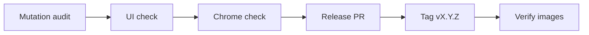

# Cutting a release

How-to for the maintainer. `main` is protected (required checks, enforced for
admins), so the release commit goes through a pull request like everything else.



## 1. Mutation audit — before the release PR

A test pins a guard only if breaking the guard turns it red. List every guard
the release added in `docs-tech/mutations/vX.Y.Z.json` (exact text, replaced
once) and run:

```bash
python scripts/mutation_audit.py docs-tech/mutations/vX.Y.Z.json
```

Every line must read `RED`. For a `GREEN` one, either write the test that
catches it, or show the mutation cannot change behaviour and record why in
[invariants](invariants.md). Read *which* test fired: a guard caught by an
unrelated test is caught by luck.

## 2. UI check

`tests/e2e/test_ui_check.py` visits every public and admin page in both themes
at 390 px and 1440 px and fails on an axe violation of impact *serious* or
*critical*, a console error, or sideways scrolling. It runs in the E2E job; run
it locally against a demo instance when the interface changed.

```bash
docker compose -f docker-compose.e2e.yml up -d --build
uv run pytest tests/e2e -m e2e --base-url http://localhost:4009
docker compose -f docker-compose.e2e.yml down -v
```

## 3. Chrome check

Every public and admin page, plus the `docs/` website, visually reviewed in
the Claude-in-Chrome extension — an agent can sign in by itself, so this is
not "run the axe suite again," it is looking at the rendered page. Full
page matrix, traps, and start/stop commands: `docs-tech/local-review.md`.
`tests/test_local_review.py::test_local_review_page_matrix_covers_every_app_page`
and `..._covers_every_docs_site_page` fail when a page exists that the matrix
does not list, so a new route or a new `docs/` page cannot be reviewed by
accident being skipped.

For each page: light and dark theme, 1440px and 390px, `en` and `de`; the
interactive paths (wizard steps, identity-reveal form, filters, theme
toggle); the console, for any error and specifically any CSP violation. Fix
every finding now — nothing here is carried forward to a later task.

## 4. Release PR

On `release/vX.Y.Z`:

- `CHANGELOG.md`: `[Unreleased]` → `[X.Y.Z] — <date>`, add its compare link and
  repoint `[Unreleased]`.
- Version in `app/config.py`, `pyproject.toml`, `charts/openwhistle/Chart.yaml`
  (`version` and `appVersion`), `docs/docs.html` ("Current version"),
  `docs/index.html` (`softwareVersion` and hero), and the `OPENWHISTLE_VERSION`
  default in `docker-compose.prod.yml`. `test_every_published_version_string_matches`
  fails on any mismatch.
- Move the released version off `docs/roadmap.html` (it holds only what's still ahead).

Merge once the checks are green.

## 5. Tag and verify

Tag `vX.Y.Z` on the merge commit and push it. The publish workflow builds once,
writes one signed index to GHCR, Docker Hub and Quay.io and fails unless every
tag and platform manifest behind it is pullable. Read its log, then check from
outside:

```bash
skopeo inspect --raw docker://ghcr.io/openwhistle/openwhistle:X.Y.Z
cosign verify ghcr.io/openwhistle/openwhistle:X.Y.Z \
  --certificate-identity-regexp '^https://github.com/openwhistle/OpenWhistle/' \
  --certificate-oidc-issuer https://token.actions.githubusercontent.com
```

Then create the GitHub release from the changelog section.
