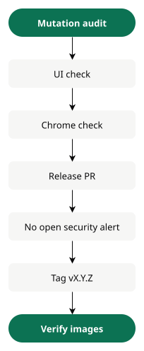

# Cutting a release

How-to for the maintainer. `main` is protected (required checks, enforced for
admins), so the release commit goes through a pull request like everything else.

<picture>
  <source media="(prefers-color-scheme: dark)" srcset="img/diagrams/release-gates-dark.svg">
  
</picture>

## 1. Mutation audit — before the release PR

A test pins a guard only if breaking the guard turns it red. List every guard
the release added in `docs-tech/mutations/vX.Y.Z.json` (exact text, replaced
once) and run:

```bash
python scripts/mutation_audit.py docs-tech/mutations/vX.Y.Z.json
```

A guard against an extra file takes `"create": "<content>"` in place of
`old`/`new`: the audit writes the file, runs the tests, and deletes it.
Every line must read `RED`. A mutation that removes a timeout hangs its
test: put it in a spec with `"timeout_seconds"` (a hang past it counts as
red). For a `GREEN` one, either write the test that catches it, or show
the mutation cannot change behaviour and record why in
[invariants](invariants.md). Read *which* test fired: a guard caught by an
unrelated test is caught by luck.

## 2. UI check

`tests/e2e/test_ui_check.py` visits every public and admin page in both themes
at 390 px and 1440 px and fails on an axe violation of impact *serious* or
*critical*, a console error, or sideways scrolling. It runs in the E2E job; run
it locally against a demo instance when the interface changed.

```bash
docker compose -f docker-compose.e2e.yml up -d --build
uv run pytest tests/e2e -m e2e --base-url http://localhost:4009
docker compose -f docker-compose.e2e.yml down -v
```

## 3. Chrome check

Every public and admin page, plus the `docs/` website, visually reviewed in
the Claude-in-Chrome extension — an agent can sign in by itself, so this is
not "run the axe suite again," it is looking at the rendered page. Full
page matrix, traps, and start/stop commands: `docs-tech/local-review.md`.
`tests/test_local_review.py::test_local_review_page_matrix_covers_every_app_page`
and `..._covers_every_docs_site_page` fail when a page exists that the matrix
does not list, so a new route or `docs/` page cannot be skipped by accident.
`tests/e2e/test_docs_diagrams.py` measures every site diagram in a browser, without the app:
one twin per theme, on the canvas, at ≥ 0.85 of its size at 1280–1920 px and at its size at 390 px.

For each page: light and dark theme, 1440px and 390px, `en` and `de`; the
interactive paths (wizard steps, identity-reveal form, filters, theme
toggle); the console, for any error and specifically any CSP violation. Fix
every finding now — nothing here is carried forward to a later task.

## 4. Release PR

On `release/vX.Y.Z`:

- `CHANGELOG.md`: `[Unreleased]` → `[X.Y.Z] — <date>`, add its compare link and
  repoint `[Unreleased]`.
- Version in `app/config.py`, `pyproject.toml`, `charts/openwhistle/Chart.yaml`
  (`version` and `appVersion`), `docs/en/docs/index.html` ("Current version"),
  `docs/en/index.html` (`softwareVersion` and hero), `docs/de/index.html` ("Aktuelles Release"),
  `docs/en/compare/index.html` ("Latest release" cell), and the `OPENWHISTLE_VERSION`
  default in `docker-compose.prod.yml`. `test_every_published_version_string_matches`
  fails on any mismatch.
- Move the released version off `docs/en/roadmap/index.html` (it holds only what's still ahead).
- `test_every_new_setting_is_in_the_changelog` compares `Settings` with the
  previous release's fields in `tests/data/previous_release_settings.txt`. After
  the tag, refresh that list from it (CI checkouts have no tags, so the test
  cannot ask git):

  ```bash
  git show vX.Y.Z:app/config.py | python3 scripts/list_settings.py > tests/data/previous_release_settings.txt
  ```

Merge once the checks are green.

## 5. No open security alert

Before the tag, the repository has **no** open code-scanning, Dependabot or
secret-scanning alert, not only none in the release PR's diff:

```bash
for kind in code-scanning dependabot secret-scanning; do
  echo "$kind: $(gh api "repos/openwhistle/OpenWhistle/$kind/alerts?state=open" -q length)"   # each 0
done
```

An alert is fixed, or dismissed with its reason and the test that shows it cannot
be exploited. v2.1.0 was tagged with three open ones, found only after the tag:
the PR's CodeQL check reports the alerts in the diff, and these were older.

## 6. Tag and verify

Tag `vX.Y.Z` on the merge commit and push it. The publish workflow refuses a
tag that is not on `main`, runs CI, E2E and the security scans on that exact
commit, then builds once and writes one signed index to GHCR, Docker Hub and
Quay.io. It fails unless
every GHCR and Docker Hub tag, and every platform manifest behind it, is
pullable; a release without `DOCKERHUB_TOKEN` fails. Quay is best-effort: a
failure there is a `::warning` in the run summary, so read the log. Then check
from outside:

```bash
skopeo inspect --raw docker://ghcr.io/openwhistle/openwhistle:X.Y.Z
cosign verify ghcr.io/openwhistle/openwhistle:X.Y.Z \
  --certificate-identity-regexp '^https://github.com/openwhistle/OpenWhistle/' \
  --certificate-oidc-issuer https://token.actions.githubusercontent.com
```

Until the site moves off GitHub Pages (website P5), Pages keeps its last workflow deployment (the workflow is gone)
and must never switch to `main:/docs`: after P1 the legacy setting served the raw sources for 15 minutes.

```bash
gh api repos/openwhistle/OpenWhistle/pages -q .build_type     # workflow
curl -s -o /dev/null -w '%{http_code}\n' https://openwhistle.net/en/   # 200
```

Then create the GitHub release from the changelog section.
