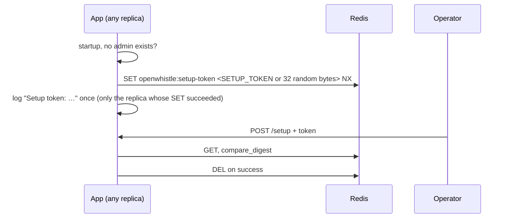
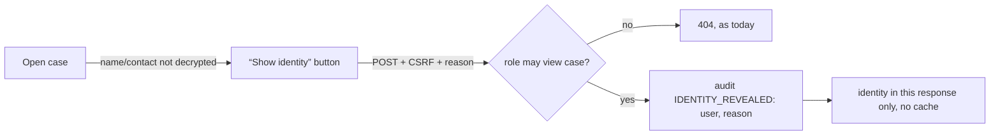

# v1.6.0 "Hardening": design

Type: explanation + scope. Source: the v1.5.0 assessment of 2026-09-24 (security 7, privacy 8).
Every finding is fixed in this release, whatever its size: packages A–E, the items formerly listed as out of
scope, and the limits formerly kept in `docs-tech/carried-forward.md`. There is no carried-forward list.

## Delivery

One PR per package, like v1.5 (`fix/v1.6-security`, `fix/v1.6-privacy`, `chore/v1.6-process`), then a
release PR per `docs-tech/release.md`: every new guard goes through `scripts/mutation_audit.py` and must go
RED, UI check, tag, verify the published images from outside.

New env vars (`SETUP_TOKEN`, `SESSION_MAX_HOURS`) land in `app/config.py`, `docs/docs.html`, `README.md` and
`docker-compose.prod.yml` in the same commit.

## A: Security

| # | Change | Where | Test that fails without it |
|---|---|---|---|
| A1 | Setup token (below) | `app/api/wizard.py`, `app/main.py` lifespan, `app/config.py` | POST `/setup` without or with a wrong token → 403; right token → admin created, token deleted |
| A2 | TOTP secret stored encrypted via `crypto.encrypt`; Alembic `004` widens `admin_users.totp_secret` and encrypts existing rows (downgrade decrypts) | `app/models/user.py`, `app/services/mfa.py`, `migrations/versions/004_*` | stored value ≠ base32 secret; login with an authenticator still passes after upgrade |
| A3 | `/admin/session/refresh` validates `X-CSRF-Token` (`validate_csrf_header`); `site.js` sends it. Absolute lifetime `SESSION_MAX_HOURS` (default 12) counted from login, carried in the JWT as `auth_time` and kept across refreshes | `app/api/auth.py:409`, `app/static/js/site.js:170`, `app/services/auth.py` | refresh without header → 403; refresh after 12 h → 401 |
| A4 | Unknown role in create-user → 422, no fallback to `admin` | `app/api/admin.py:773` | invalid role → no user row |
| A5 | `is_active` checked before the TOTP step and before a session is issued, on every login path | `app/api/auth.py:185` | deactivated user never reaches the TOTP page |
| A6 | Only admin/superadmin may dismiss the IP-leak warning | `app/api/admin.py:1121` | case_manager → 403 |
| A7 | Container hardening (below) | `docker-compose.prod.yml`, `charts/`, `Dockerfile`, `.dockerignore` | `tests/test_build_pins.py`: flags present, base image pinned by digest, no `curl` in the runtime stage |

### A1: setup token

- `SETUP_TOKEN` set → used instead of a random one (automation). Unset → random, logged at WARNING.
- Token missing while no admin exists (Redis restarted without persistence) → `GET /setup` creates and logs
  it again the same way, so no restart is needed.
- Once an admin exists, no token is created and `/setup` stays closed as today.
- Demo is unaffected: `app/services/demo_seed.py` creates the admin itself.
- The token is not whistleblower data; logging it breaks no privacy invariant.

### A7: container

| Target | Change |
|---|---|
| compose `app` | `read_only: true`, `tmpfs: /tmp`, `cap_drop: [ALL]`, `security_opt: [no-new-privileges:true]`, image tag `${OPENWHISTLE_VERSION:-1.6.0}` instead of `:latest` |
| Helm | `readOnlyRootFilesystem`, `allowPrivilegeEscalation: false`, `capabilities.drop: [ALL]` |
| Dockerfile | base image pinned by digest (Renovate keeps it current), healthcheck in Python, `curl` removed |
| `.dockerignore` | add `ansible/` (keeps a local `vault.yml` out of a local build) |

## B: Privacy

| # | Change | Test that fails without it |
|---|---|---|
| B1 | Identity of a **confidential** report hidden by default (below) | case page HTML has no name/contact; reveal without reason → 422; reveal → name shown + audit row |
| B2 | Opening a case writes `REPORT_VIEWED` (already defined, `app/services/audit.py:29`, never written) | one audit row per view |
| B3 | `.doc` and `.xls` rejected: they cannot be stripped of the author field. **Breaking**: CHANGELOG, upload help text, `docs/docs.html` | upload → rejected with a message naming `.docx`/`.xlsx` |
| B4 | Slack/Teams/generic webhooks carry counts only ("2 new reports, 1 new message", "1 case due within 2 days") and a dashboard link; no case number, no deadline date. Email to admins is unchanged | no payload contains `OW-` |
| B5 | Identity may be shown only to the assigned handler; an unassigned case only to admin/superadmin | admin not assigned → 403 on reveal |

Anonymous reports store no identity; B1 does not touch them.

### B1: showing a confidential identity

HinSchG §8 allows the identity to be known to whoever handles reports. The change narrows *when* it is
shown and makes every showing traceable.

- Reason: required free text, 10–500 characters, stored encrypted in the audit detail.
- Nothing is persisted as "revealed": the next page load hides it again.
- PDF export: identity omitted by default; an "include identity" option takes the same reason field and
  writes the same `IDENTITY_REVEALED` row.

### Not changed, on purpose

- `report.auto_deleted` keeps the case number: it is the record that deletion happened. All other audit
  rows of a case already go with it (`ondelete="CASCADE"`, `app/models/audit.py:31`).

## D+E: Process and housekeeping (from easywall)

| # | Change | Proof |
|---|---|---|
| D1 | `.github/workflows/security.yml`: `uv export` → `pip-audit`, Trivy image scan; on PRs and Mondays | workflow run green on the release PR |
| D2 | Every locale has every key of `en` (parametrised; replaces the en→de-only test) | missing key in `fr` → red |
| D3 | `docs-tech/threat-model.md`: attackers, assets, defended (separate `SECRET_KEY` for JWT and `ENCRYPTION_KEY` for encryption, key rotation via `scripts/rotate_encryption_key.py`), **not** defended (root on the host; operator TLS) | — |
| D4 | `codespell` in `ci.yml` + `.codespellrc` | CI step |
| D5 | `tests/e2e/test_ui_check.py` adds 900 px and locale `de` | e2e run |
| D6 | `SECURITY.md` response times (48 h / 7 d / 14 d); CLAUDE.md table "rule → what happened without it" | — |
| E1 | `pyproject.toml` `version` = `app_version`, with a test | mismatch → red |
| E2 | `ROADMAP.md`: remove the duplicate v1.4/v1.5 sections, add v1.7 (design + responsive) | — |

## Formerly out of scope, now in

| Item | Task in the plan |
|---|---|
| Separate keys for JWT and encryption, rotation | 7 |
| Whistleblower-originated timestamps rounded to the day | 15 |
| TLS on by default in the bundled nginx | 9 |
| ldap3 (unmaintained) replaced by python-ldap; ldap/s3 as extras | 10 |
| Design and responsiveness (package C) | 21–29 |
| Excel comment author inside the comment text | 16 |
| S3 objects stored before v1.5.0 under filename keys | 17 |
| Search limited to case numbers | 18 |
| Employer network sees the site was visited (Tor onion address) | 19 |
| Per-case identity access (only the handler) | 11 |
| Virus scan of uploads (ClamAV) | 20 |
| Audit rows never carried `org_id` (found while planning) | 6 |
